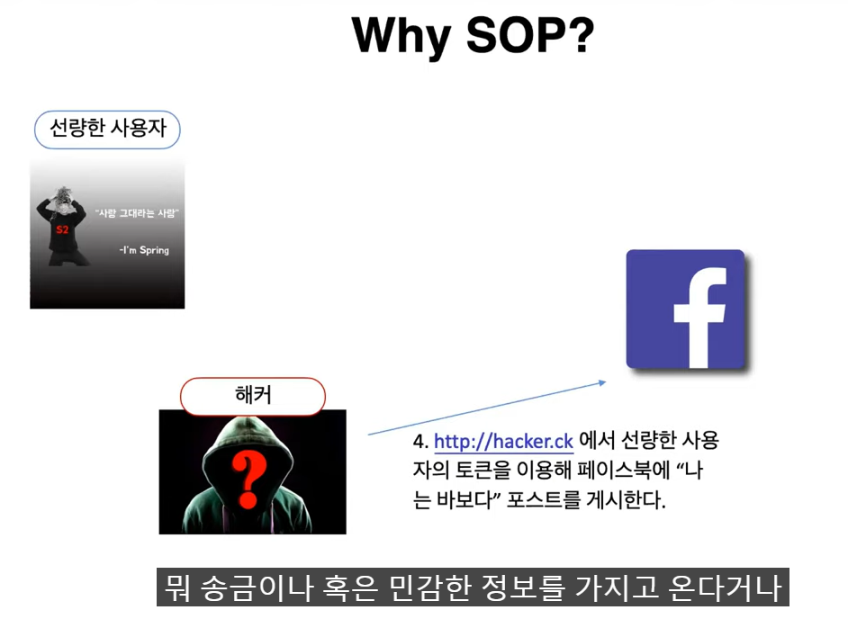
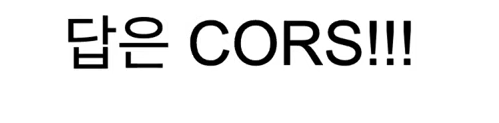

### CORS란?

> Protocol, host, port 무엇 하나 다르면 다른 출처라고 판단

- 인터넷 익스플로러는 포트가 달라도 같은 출처로 인식

1. protocol이 다르다
2. http 기본 포트가 80포트이다
3. 127.0.0.1이 localhost가 맞지만 브라우저 입장에서는 string value로 판단하기 때문에 다른 출처로 판단한다

4. 포트까지만 비교하고 뒤에 붙는 쿼리스트링이나 path는 판단하지 않는다

---

왜 SOP를 사용해야 보안에 도움이 될까요?

> 페이스북은 origin을 확인을 한다. 다른 출처이면 즉 cross origin이라고 판단하기 때문에 SOP에 위반되어 요청을 받아들일 수 없다 라고 한다.

> `브라우저`에 알려주는 체제이다.

> 본 요청을 보내기 전에 미리 서버에 물어봄
>
> Request Method는 OPTIONS를 사용한다

총 두 번 보내게 되는데 첫 번째가 preflight 요청을 보내서 보내도 되는지 확인 작업을 하고

실제 요청이 가능하다면 요청을 보낸다

> 어디서 보내는지 요청 출처가 적혀있고
>
> 요청 메서드가 어떤 것인지 보내주고
>
> 헤더에 어떤 것을 보낼 수 있는지 물어보는 것

> 이 origin은 허가가 되어 있어를 보내줌
>
> 어떤 메서드가 허가가 되어 있는지
>
> 허가 헤더
>
> preflight 응답 캐시 기간을 말함 -> 보낼 때 마다 2번씩 요청을 보내면 비효율적이기 때문에 브라우저가 preflight 응답에 대해서 캐싱을 해두고 똑같은 요청 시 캐싱을 확인하고 바로 본 요청을 보내게 된다.

---

> 바로 본 요청을 날리면서 그 즉시 이것이 cross origin인지 확인 하는 절차이다
>
> 아래 조건들이 모두 만족되어야만 preflight 요청없이 바로 simple request가 날려진다

> `*`는 와일드카드로 모든 origin을 허가해주겠다는 의미이다.

> 서버 입장에서는 CORS 설정이 없기 때문에 당연히 allow-origin 정보가 없다. 브라우저는 그것을 확인하고 CORS 에러라고 이야기해준다. 서버는 모든 것을 다 해결함. 하지만 브라우저에서 CORS 내뱉음. 만약 Delete 메소드 이면 DB를 지우고 에러를 내뱉는다.

---

> 쿠키나 jwt 를 활용을해서 토큰을 담아서 보낸다. 내 credentials를 include해서 보낸다
>
> 서버측에서도 Access-Control-Allow-Credentials를 true해주어야 한다.

---

웹사이트를 여는 곳, 크롬이나 엣지, 사파리 같은 브라우저에서 막는다(Postman이나 스프링은 CORS를 막지 않는다.)

CORS는 막는 것을 풀어주는 역할이고, 막는 것은 SOP이다. same-origin-policy

똑같은 url에만 데이터 정보가 교환되는 것을 허용한다.

요청을 받은 서버의 답장 헤더에 Access-control-allow-origin 정보를 실어서 보낸다. origin에서 보낸 출처값이 서버의 답장 헤더에 담긴 Access-control-allow-origin에 똑같이 있으면 안전한 요청으로 간주하고, 응답 데이터를 받아오게 된다. 

토큰 등 사용자 식별 정보가 담긴 요청데 대해서는 보다 엄격하다. 일단 보내는 측에서 요청의 옵션에 credentials 항목을 true로 세팅해야 하고 받는 쪽에서도, 아무 출처나 다 된다는 와일드카드가 아니라 보내는 쪽의 출처 - 웹페이지 주소를 정확히 명시한 다음 Access-control-credentials 항목을 true로 맞춰줘야 한다. 

GET은 단순 요청

PUT이나 DELETE등 이와 다른 요청들은 본 요청을 보내기 전에 Preflight 요청이란 것을 먼저 보내서 본 요청이 안전한지 확인하고 여기서 허락이 떨어져야 본격적으로 요청을 보낼 수 있다.