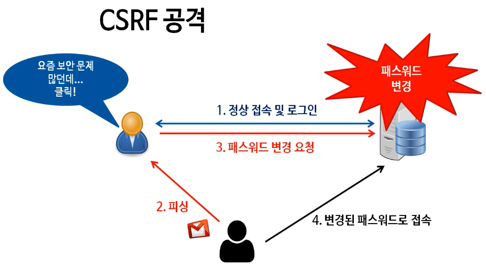
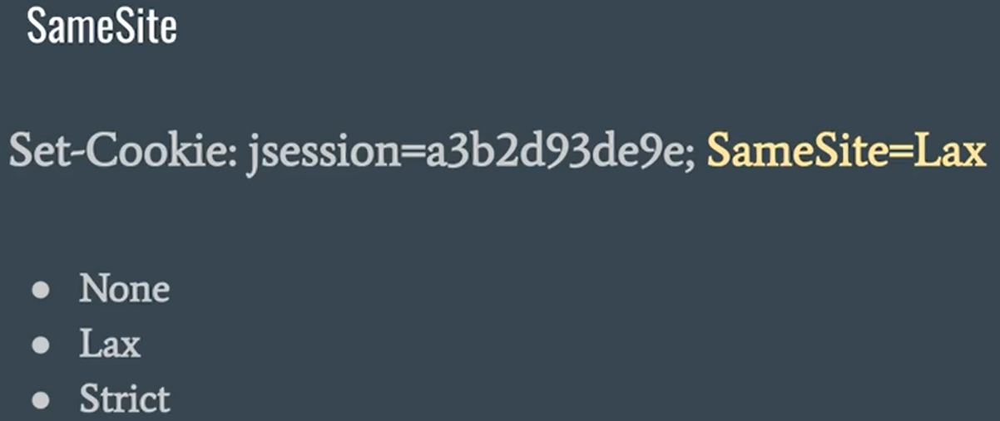

Cross Site Request Forgery의 약자로 사이트 간 요청 위조로 변역이 된다.

해커들이 사용자들에게 피싱을 해서 링크를 누르게 하고 사용자도 모르게 어떤 사이트의 기능을 수행하도록 한다. 주로 패스워드를 변경하는데 사용한다. 

옥션에 1080만건의 데이터 유출이 발생

---

1. 사용자가 정상 로그인을 한다.
2. 해커가 피싱 메일을 보낸다.
3. 비밀번호를 바꾸는 로직을 수행한다.
4. 해커가 접속

> 해당 공격이 가능하려면 사용자가 사이트에 로그인이 되어 있어야 한다.

---

SameSite는 쿠키에 부여하는 속성 값이다.

