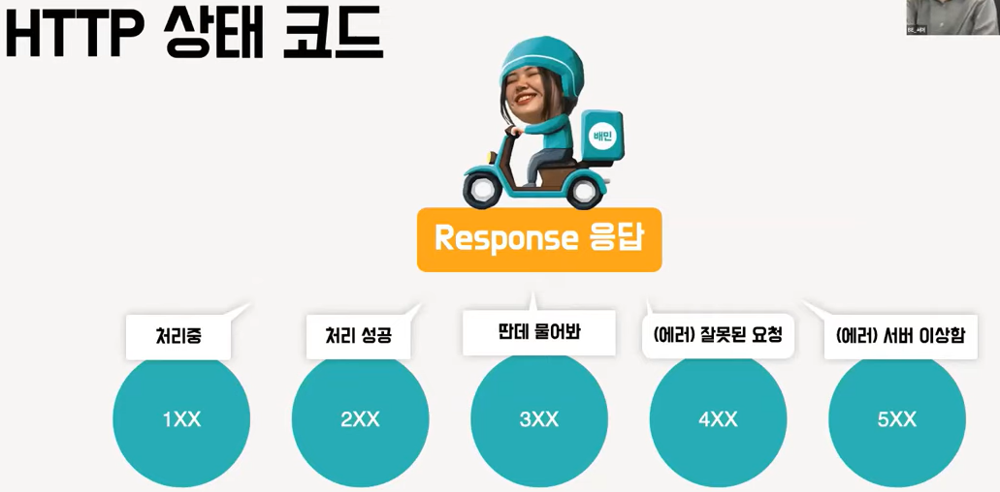

> 서버와 클라이언트 간의 TCP/IP 통신 위에서 메시지를 전달하기 위해 사용하는 프로토콜

> TCP/IP는 수많은 네트워크 기기들이 인터넷으로 통신하는 데 있어서 가장 기반이 되는 프로토콜

> 바이트 스트림은 큰 데이터를 잘게 쪼갠 뒤 전송하는 서비스
>
> 이때 정확하게 전송되었는지 확인하는 기술이 있다.

> TCP 프로토콜은 신뢰성을 담당한다.

> Ip가 계층형 주소이기 때문에 가고자 하는 방향을 알 수 있음

> 수신자의 IP주소로 수소문 하고 도착한 곳 기기의 MAC 주소를 조사하고 이를 통해 배송지의 루트를 찾아냄

> 도메인 이름 및 IP 주소를 확인하는 기능을 제공

> 리소스를 요청하는 쪽이 클라이언트, 리소스를 제공하는 쪽이 서버입니다.

HTTP는 Stateless 특성을 가진다

> HTTP 프로토콜은 과거 정보를 남기지 않고 새로운 요청에 새로운 응답을 보낸다. 상태와 무관하니 확장이 쉽다. 상태가 필요한 경우 쿠키와 세션 기술을 활용한다.

> 여러번 요청한 결과 서버의 상태가 항상 동일할 때를 뜻한다.
>
> GET은 멱등성이 보장되지만, POST는 보장되지 않음

> PUT은 대상 리소스가 없다면 생성하고, 있다면 리퀘스트의 본문대로 교체

> GET으로 요청했을 때 응답 헤더만 가져오는 HEAD
>
> 해당 리소스의 통신 옵션을 알려주는 OPTIONS등이 있다.

> 5가지 클래스로 구성되고 뒤에 두자리는 해당 클래스의 구체적인 상태들에 할당된 코드입니다.
>
> 100번대 코드는 요청을 받았고, 해당 요청에 대한 프로세스를 진행중이라는 뜻입니다.

> 304는 리다이렉트 되지 않고 마지막 요청 이후 요청한 페이지는 변경되지 않았다는 뜻의 상태 코드입니다.

> 400 BAD Request 잘못된 요청, 401 Unauthroized 인증이 필요

> 403은 인증은 됐지만 사용자의 권한은 없다는 뜻이다.

> 501 Not Implemented 요청을 수행할 수 있는 기능이 없을 때
>
> 503 Service Unavailable 서버를 사용할 수 없다는 의미