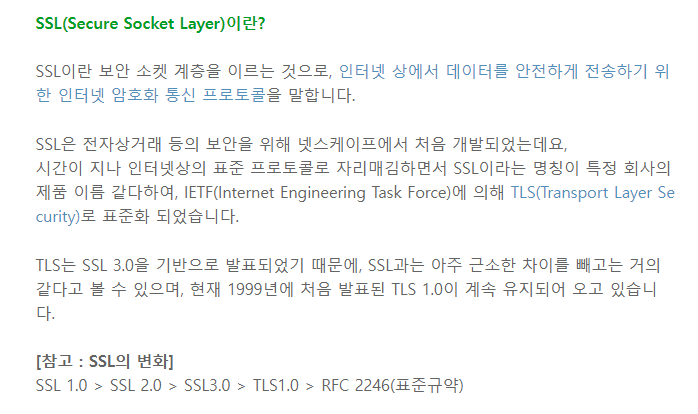

HTTP는 데이터 전송 프로토콜

- 암호화가 되어 있지 않다
- 클라이언트와 서버 사이에 제 3자가 있다면 메세지를 도청당한다.

- 금융과 결제 프로세스에 http가 적용되면 위험하다
- 웹 브라우저에서 HTTP를 사용하면 경고 문구가 발생

> TLS가 SSL의 업그레이드 버전

> 전송되는 데이터를 암호화하는 계층
>
> 클라이언트 측 SSL 계층에서 암호화를 하고 서버측 SSL 계층에서는 복호화를 한다
>
> HTTP메시지

> 서버는 인증기관으로 본인의 정보를 주면서 인증서를 발급해달라고 요청한다
>
> 인증기관은 인증기관이 가지고 있는 비밀키를 사용해서 정보에 대한 인증서를 발급해준다.
>
> 서버 도메인, 서버측 공개키, 인증 기관등의 정보가 들어감

> 서버는 클라이언트에게 인증서를 발급한다
>
> 인증서 내에는 공개키가 있어서 클라이언트는 공개키를 받음
>
> 인증서는 인증기관의 비밀키로 암호화가 되어 있음
>
> 클라이언트는 인증기관의 공개키가 있어야 한다.
>
> 웹 브라우저의 인증기관의 공개키를 사전에 가지고 있다
>
> 이를 통해 서버의 인증키를 얻을 수 있고
>
> 클라이언트는 대칭키를 만들어낸다.
>
> 대칭키 암호화 방식이 공개키 암호화 방식에 비해 빠르다
>
> 대칭키를 공개키로 암호화해서 전달
>
> 암호화된 대칭키를 비밀키를 이용해 복호화

