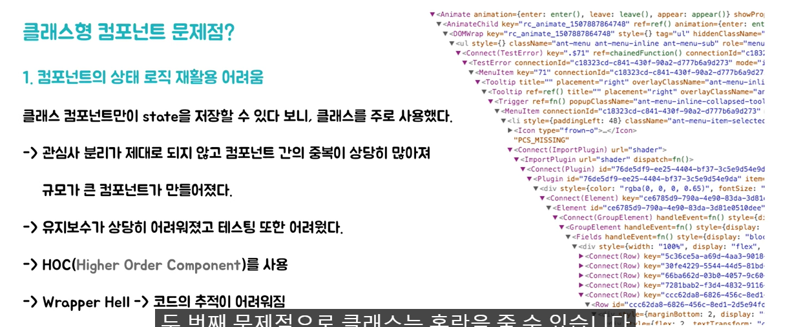

이로 인해 관심사 분리가 제대로 되지 않고 컴포넌트간 중복이 많아져 규모가 큰 컴포넌트가 만들어졌다.

컴포넌트 안에 컴포넌트를 넣게 되면서 문제점이 많이 발생함.

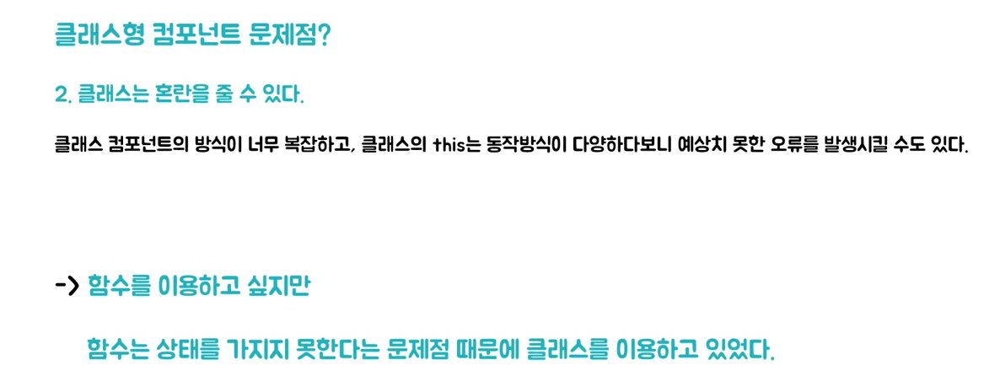

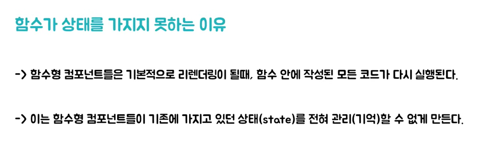

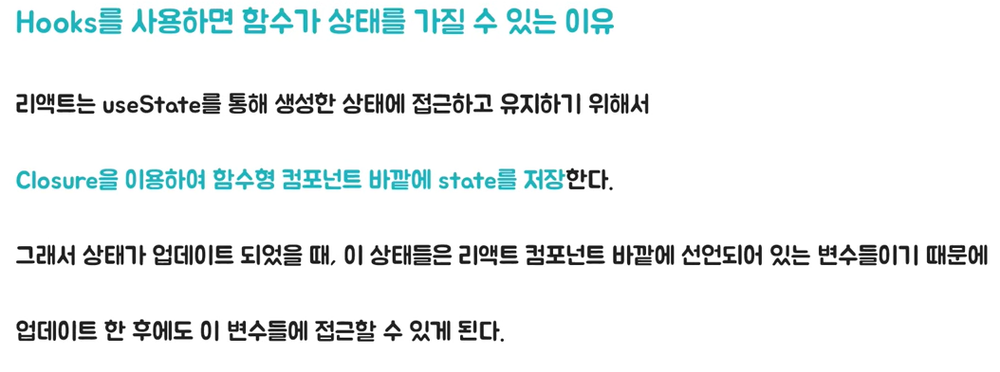

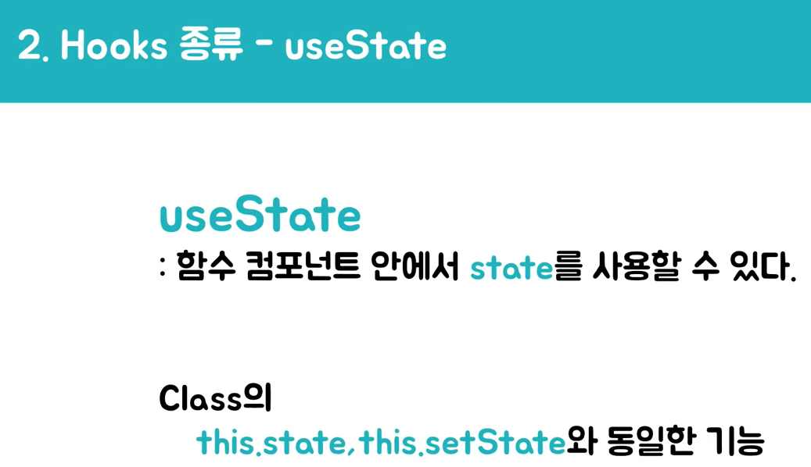

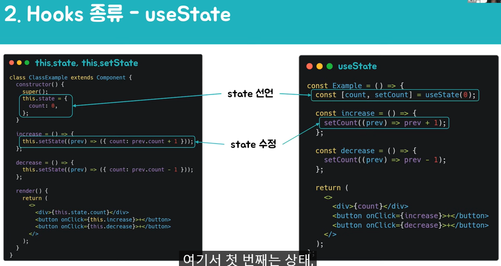

useState의 인자에 initial state를 준다. useState가 반환한 것을 배열 구조 분해 할당을 이용하여 원하는 이름으로 설정할 수 있다. 여기서 첫 번째는 상태, 두 번째는 상태를 변경하는 함수가 들어가게 된다. 

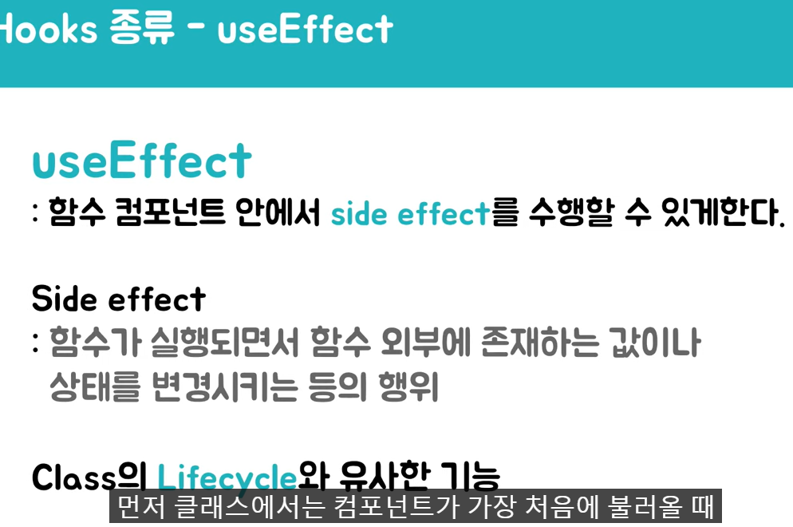

useEffect는 함수 컴포넌트 안에서 side effect를 수행할 수 있게 하는 hook입니다. 이는 class의 Lifecycle과 유사한 기능을 한다. 

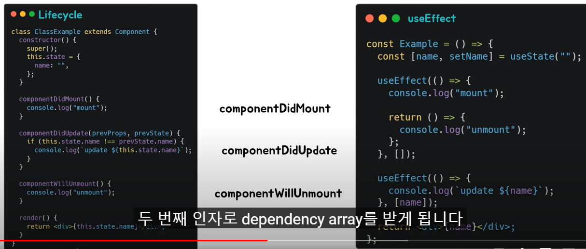

먼저 클래스에는 컴포넌트가 가장 처음에 불러올 때 실행되는 componentDidMount, 어떤 상태가 업데이트 될 때마다 실행되는 componentDidUpdate, 컴포넌트가 없어질 때 실행되는 componentWillUnmount가 있습니다.

useEffect에서는 이 하나의 hook으로 3개의 라이프사이클을 대체할 수 있습니다.

useEffect는 첫 번째 인자로 callback, 두 번째 인자로 dependency array를 받게 됩니다.

먼저 componentDidMount의 기능은 useEffect의 dependency array에 빈 배열을 넣었을 때와 동일합니다.

다음 componentDidUpdate는 useEfeect의 dependency array에 상태들을 넣으면 그 상태들이 변경 될 때마다 실행되어 동일한 동작을 합니다.

마지막으로 componentWillUnmount의 기능은 useEffect 내의 return에 콜백함수 형식으로 넣으면 컴포넌트가 없어질 때 이 콜백을 실행하며 동일한 동작을 하게 된다.

useEffect 안에서 사용되는 상태나, props가 있다면, 규칙적으로 useEffect의 dependency array에 넣어 주어야 합니다. 만약, 사용되는 상태나, props를 dependency array에 넣지 않게 된다면 useEffect에 등록한 함수가 실행될 때 최신 props, 상태를 가리키지 않게 됩니다

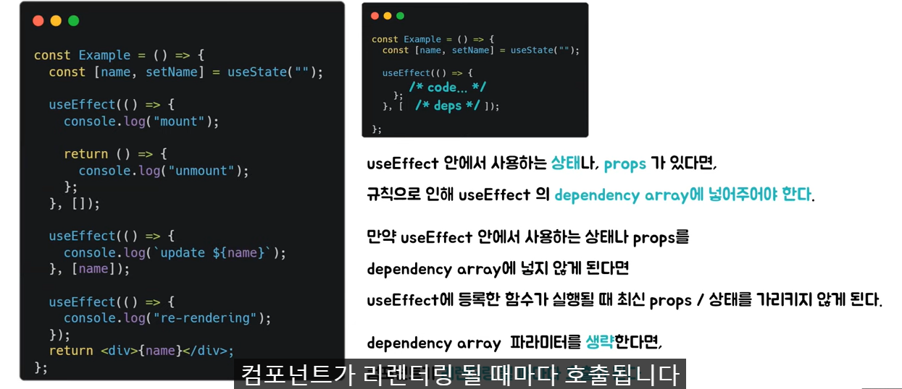

dependency array의 파라미터를 생략한다면 컴포넌트가 리렌더링 될 때마다 호출됩니다.

그렇다면 useEffect는 클래스형 컴포넌트에 있는 모든 생명주기를 표현하는 것이 가능할까요?

오른쪽 코드는 리액트에서 사용되는 ErrorBoundary 코드입니다

이 코드는 하위 컴포넌트에서 발생한 에러를 ErrorBoundary에서 캐치해서 에러가 있다면 에러 UI를 보여주고 에러가 없다면 하위 컴포넌트들을 그대로 보여주는 것입니다.

여기서 getDerivedStateFromError와 componentDidCatch가 사용되는데 이것은 에러가 발생할 때 캐치하는 생명주기입니다. 하지만 이런 생명주기는 아직 hooks로 구현되어 있지 않습니다. 그래서 ErrorBoundary 코드는 class형으로 밖에 구현할 수 없습니다. 

그래서 class형 컴포넌트들의 모든 것을 hooks로 대체할 수 있는 것이 아니라 class형 컴포넌트를 써야 할 때도 있습니다. 

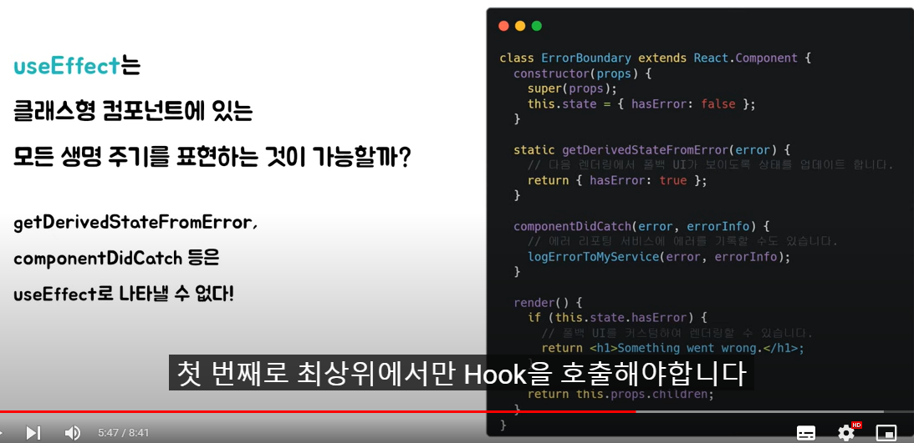

### hooks 규칙

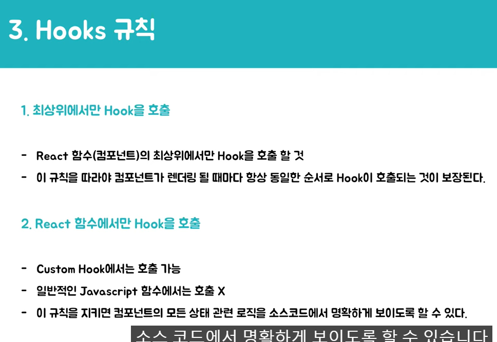

- 최상위에서만 Hook을 호출해야 한다.
  - hook은 react 함수 내의 최상위에서만 호출을 해야하고 이 규칙을 따라야지만 컴포넌트가 렌더링될 때마다 항상 동일한 순서로 hook이 호출되는 것이 보장된다. 

- 세 번째로 hook을 만들 때 앞에 use를 붙여야 한다.

- 이렇게 하면 한눈에 보아도 hook 규칙이 적용되는지 파악할 수 있다. 이를 따르지 않으면 특정한 함수가 그 안에서 hook을 호출하는지 알 수 없다. 그래서 hook 규칙의 위반 여부를 체크할 수 없다.

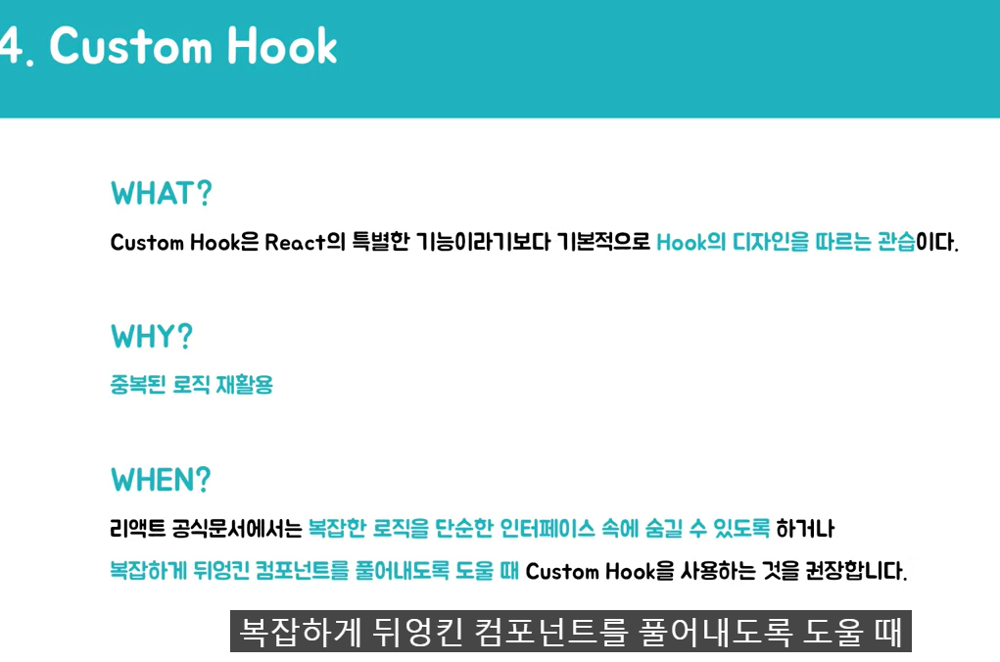

custom hook은 react의 특별한 기능이라기보다 기본적으로 hook의 디자인을 따르는 관습이다. 이 custom hook을 쓰는 이유는 중복되는 로직을 재활용하기 위해서입니다. 그렇다면 custom hook은 언제 사용해야 할까요

리액트 공식 문서에 복잡한 로직을 단순한 인터페이스 쪽에 숨길 수 있도록 하거나 

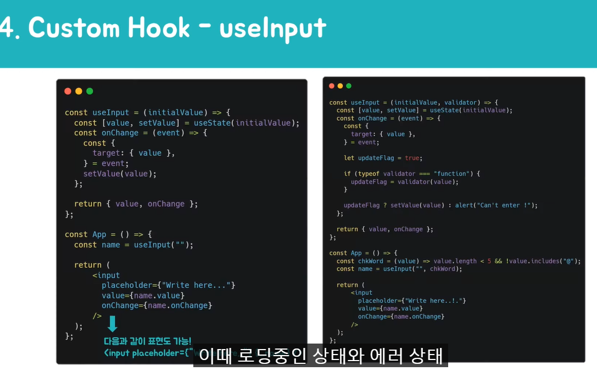

가장 범용적으로 사용되는 useInput, useFetch 두 개의 예시로 한번 알아보자

React에서는 제어 컴포넌트를 이용하기 위해서 input의 value에 state를 주고 onChange를 이용하여 setState를 해주어야 합니다. 그래서 input이 여러 개라면 이 로직을 계속 반복해서 사용하게 된다. 이때 useInput을 이용하면 하나의 hook으로 모든 input을 제어 할 수 있다.

비동기적으로 데이터를 받아올 때 fetch를 이용하는데 