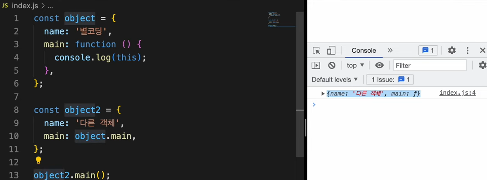
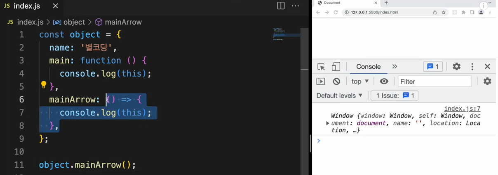

> 함수 선언식은 function이라는 키워드를 붙여주고, 그 다음에 함수 이름을 넣어준다. 그리고 함수 블럭 안에다가 우리가 원하는 내용을 채워준다. 함수의 선언은 호이스팅이 일어나서 코드의 최상단으로 불러 올라간다. 일반 함수는 함수의 이름을 무조건 적어줘야하기 때문에 익명 함수를 사용할 수 없다. 

> 함수 표현식은 이름이 없는 익명 함수를 만들 수 있다. main이라는 변수에 익명 함수를 할당했다. 함수 표현식은 함수 선언식과 달리 호이스팅이 되지 않는다. 함수를 정의하기 이전에 함수를 호출하면 에러가 발생한다. 

> 화살표 함수는 ES6버전에서 등장한 문법, 함수를 정의할 때 사용. 화살표함수는 이름이 없는 익명함수이다. 함수블럭 안에 코드가 단 한줄 밖에 없으면 중괄호를 생략할 수 있다. 

화살표 함수의 장점은 문법의 간결함.

### Arguments와 가변인자

> 일반 함수는 매개 변수를 지정해주지 않아도 인자가 배열의 형태로 들어온다. 완전한 배열은 아니고 배열처럼 표현된 객체이다. 

> 화살표 함수에서 가변인자를 처리하고 싶다면, 나머지 매개변수 구문을 표현해줘야한다.

> 1, 2, 3이 배열로 들어온다. 매개변수 이름은 자유롭게 설정이 가능하다.

가변인자: 인자의 개수가 변하는 인자를 말한다.

일반함수의 this는 함수가 호출된 위치에 따라 변경이 된다.

> 화살표 함수의 this는 함수가 선언된 시점에서의 this를 가져온다. 

> 다른 객체가 mainArrow를 호출해도 this는 변경되지 않음. 함수가 호출된 방법과는 무관하다. 

> 객체의 메서드로 화살표 함수를 이용한다. this를 통해 객체의 속성에 접근할 수 없다. 사용하지 않는 게 좋다.

> innerFunction을 호출한 객체가 없으므로 window를 가리키게 된다. 

> 화살표 함수를 쓰면, 화살표 함수를 감싸는 외부 스코프를 가져와서 사용한다.

> 확인이 어려우면 화살표 함수를 감싸는 스코프를 this로 확인해보면된다.

> bind를 통해 원하는 객체를 지정해 줄 수 있다. 화살표 함수는 bind를 사용할 수 없다. 함수를 호출해줄 자신만의 this를 가지고 있지 않기 때문이다. this는 호출해준 시점에서 결정되어 버리고 bind는 의미가 없어진다. 

> 호출해준 setTimeout에 달려있다.

> Object 객체가 나옴.

