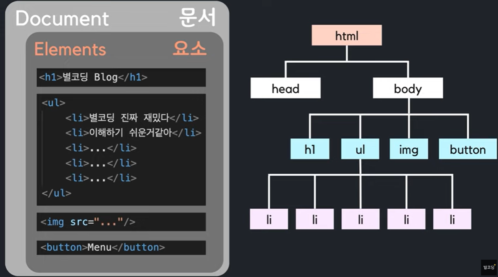
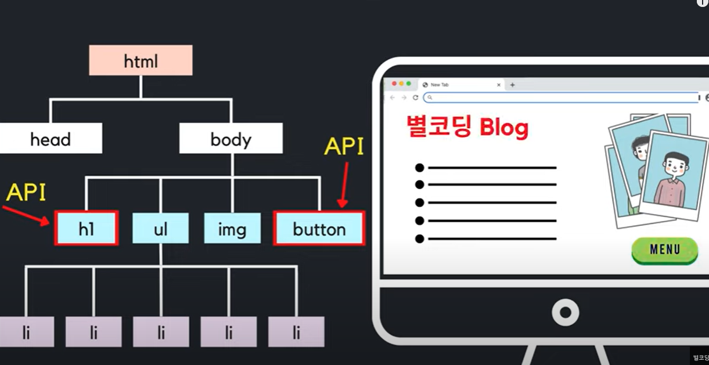
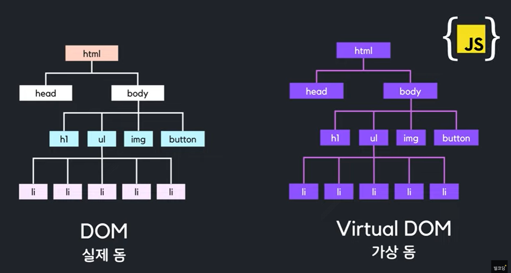
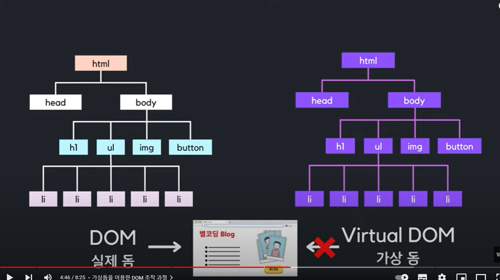
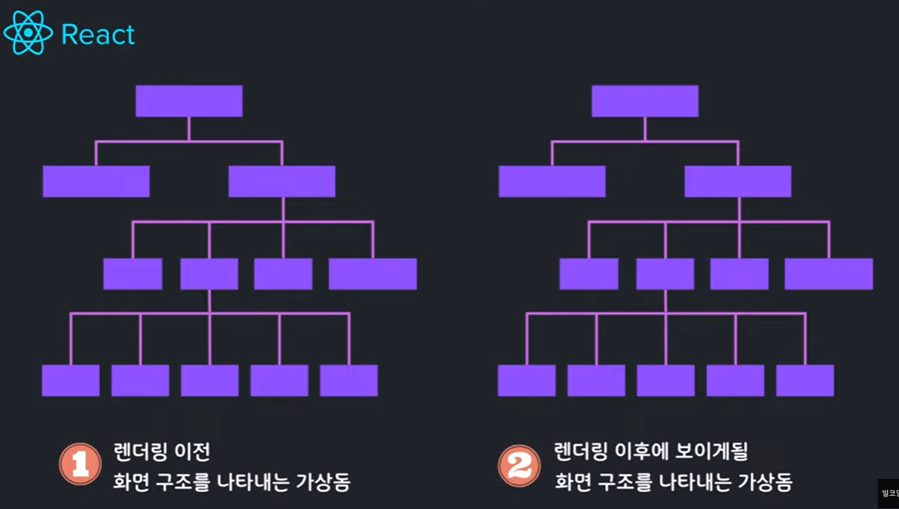
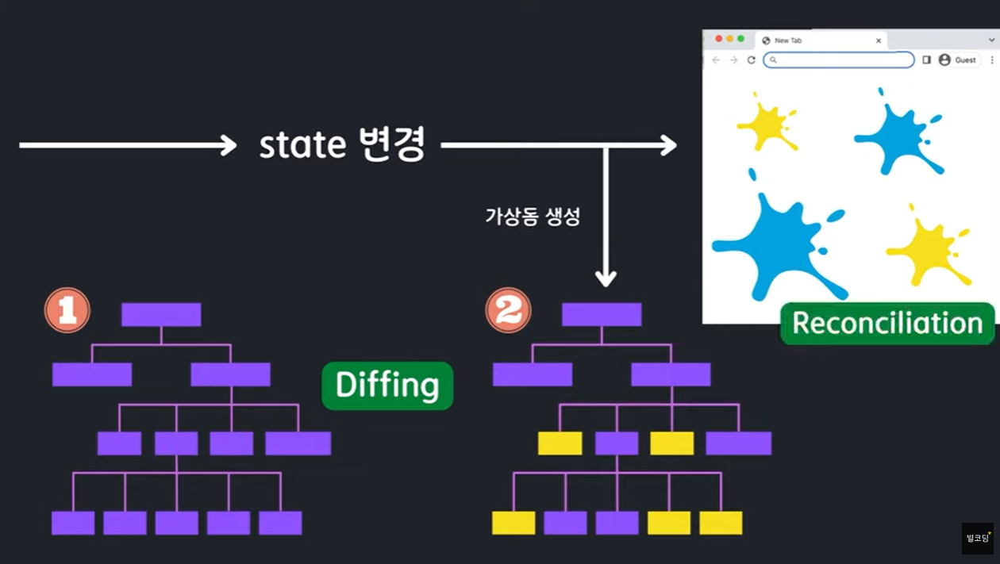
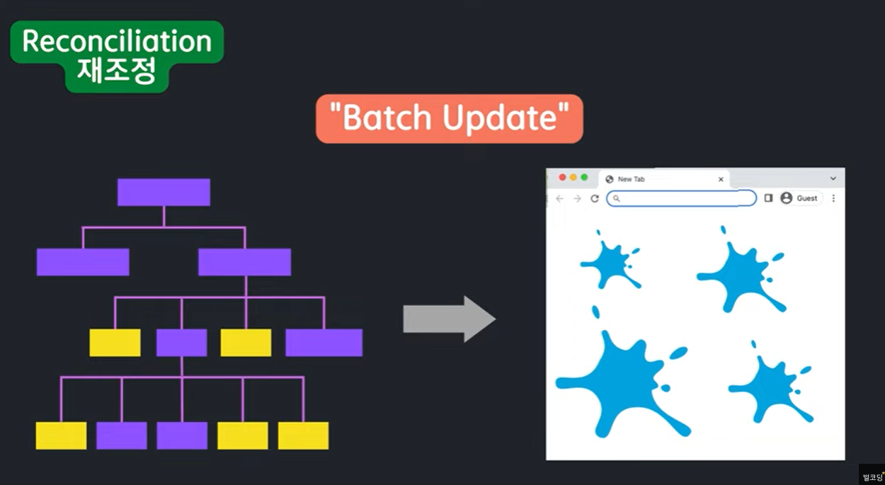
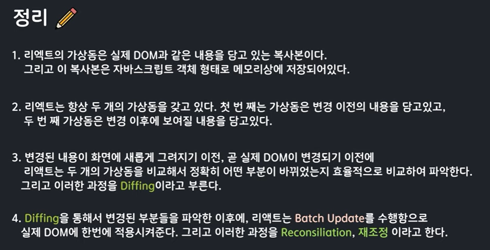

React는 Virtual DOM을 활용해서 보다 효율적으로 브라우저에서 그려준다.

DOM(Document Object Model)

브라우저를 통해 웹사이트를 들어가면 하나하나의 요소들을 확인할 수 있다. 이 모든 것을 담고 있는 최상위를 문서라고 한다.

DOM은 HTML에 들어간 element들을 트리 형태의 구조로 표현한 것

> 개발자들은 해당 element에 접근해서 내용, 스타일, 레이아웃 등을 변경한다. -> DOM 조작
>
> JS를 사용한다면 getElementById나 querySelector를 활용하여 요소에 접근한다.

> 가상 돔은 JS객체 형태로 메모리에 저장되어 있다. 모든 element들과 속성을 똑같이 갖고 있다. 

브라우저가 현재 페이지의 HTML을 탐색해서 해당 element를 찾고 해당 element와 자식을 해당 DOM에서 삭제한다. 새롭게 수정된 element들로 교체한다. 그리고 CSS를 다시 계산하고 레이아웃 정보를 알맞게 수정하고, 새롭게 계산된 내용에 따라서 브라우저에 다시 그려준다. 

> 실제 화면을 조작하는 API는 존재하지 않는다. 

> state의 변화가 생기면 리렌더링이 되는데 그때 새로운 가상돔을 만들어주고 이전 가상돔과 비교하는 과정을 한다. 그 과정을 Diffing이라고 하고 효율적인 알고리즘을 사용하기 때문에 매우 빠르다. 바뀐 부분만 변경해주는데 이과정을 재조정 과정이라고 한다.

> 재조정할 때 Batch Update를 해줘서 굉장히 효율적으로 처리한다. 변경된 내용을 한꺼번에 적용해줘서 효율적이고 빠르다. 

