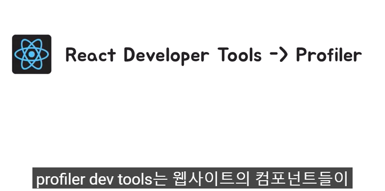
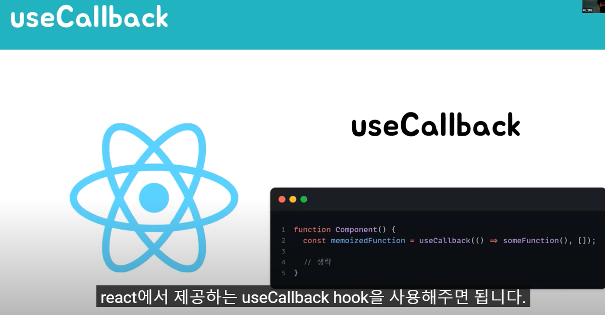

> Parent 컴포넌트가 렌더링 되고 난 후 useEffect 내부의 로직들이 실행이 됩니다. setTimeout을 통해 state에 변화를 주었고 state 변화가 생겼으니 Parent 컴포넌트가 리렌더링 됩니다. 렌더링은 함수를 호출하는 것이기 때문에 Parent 컴포넌트가 호출이 된다. Parent 컴포넌트의 return 문을 실행하면서 FirstChild와 SecondChild 컴포넌트도 리렌더링이 됩니다. 

> Parent 컴포넌트와 FirstChild 컴포넌트 입장에서는 본인들이 사용하는 값(state와 props)에 변경이 생겨서 변경이 된 값을 보여줘야 하므로 리렌더링이 되는 것이 당연하지만 Secondchild입장에서는 변경되는 사항이 없다. 

profiler dev tools는 웹사이트의 컴포넌트들이 어떻게 렌더링이 되고 있는지를 보여주는 도구이다. profiler를 이용해서 렌더링에 대한 정보를 수집할 수 있는데, 특히 어느 부분에서 렌더링이 오래 걸리고 불필요한 렌더링이 걸리는지를 확인해야 한다면 이 profiler가 용이하게 사용될 수 있을 겁니다. 

> SecondChild는 변하는 값들이 없지만 리렌더링이 된다. 그 이유는 매번 Parent 컴포넌트가 리렌더링 될 때마다 handleClick이라는 함수가 재생성이 되고 이전 handleClick과 현재 handleClick 함수는 서로 다른 참조 값을 가지게 되고 이 둘은 서로 다른 함수입니다. 이는 함수가 참조 타입의 데이터이기 때문이다. 즉 handleClick함수가 매번 재 생성되기 때문에 props가 달라지면 컴포넌트가 리렌더링 된다 라는 조건이 충족되면서 secondChild 컴포넌트가 리렌더링이 된다. 

> useCallback은 함수를 메모이제이션 해주는 hook이다. 메모이제이션이란 기존에 수행한 연산의 결괏값을 어딘가에 저장해 두고 필요할 때 재사용하는 기법입니다. useCallback으로 함수를 감싸주게 된다면, 의존성 배열이 변하지 않는 이상 컴포넌트가 리렌더링 될 때마다 변수에 같은 함수가 할당이 됩니다. 

> jsx 문법을 활용해서 개발자가 보기 편하게 왼쪽과 동일한 역할을 하는 코드를 작성해 줄 수 있다. 

> render phase에서는 컴포넌트를 호출하여 리액트 엘리먼트를 반환하고 새로운 virtual DOM을 생성해준다. 만약, 이번이 첫 번째 렌더링이 아니라면, 재조정 과정을 거친 후 Real DOM에 변경이 필요한 목록들을 체크한다. 재조정이란, 이전 virtual DOM과 현재 virtual DOM을 비교하는 과정

> render phase에서 체크해놓았던 변경이 필요한 부분들을 Real DOM에 반영해 주는 단계입니다. 만약 변경이 필요한 부분이 없다면 commit phase는 skip이 됩니다. 

> 정리를 해보면, 리엑트에서 렌더링이 일어날 때마다 재조정 과정이 포함된 render phase와 commit phase로 구성된 렌더링 프로세스를 거치게 된다. 

> useCallback을 사용해서 props를 동일하게 유지해주기 때문이다.

> 전달받은 props가 이전 props와 비교했을 때 같으면, 컴포넌트의 리렌더링을 막아주고 마지막으로 렌더링 된 결과를 재사용하는 고차 컴포넌트입니다. react.memo가 props를 비교할 때는 기본적으로 얕은 비교를 통해서 진행한다. 참고로 얕은 비교란, 원시 타입의 데이터인 경우는 값이 다른지 비교하고, 참조 타입의 데이터는 참조 값이 같은지를 비교하는 것임을 알려드립니다. 여기서 두 번째 인자로 비교 함수를 넣어주게 되면 해당 함수를 활용해서 비교를 해주도록 해줄 수도 있습니다. 

> SecondChild 컴포넌트가 렌더링 과정에 진입하기 전에 props값인 onClick에 대해서 이전 값과 현재 값이 다른 지를 비교해 줍니다. 같은 값이면 렌더링 미진행하게 됩니다. 이렇게 Reactmemo를 활용해서 secondChild가 renderphase조차 발생하지 않도록 방지해 주었다. 

> 만약 secondChild 컴포넌트에 변하지 않는 item에 대한 정보가 필요하다는 새로운 기획이 추가되었다고 가정해봅시다.

> 객체도 참조 타입의 데이터이기 때문에 매번 다른 참조값을 가지게 되는 거죠. 그래서 이전의 props와 현재의 props를 비교해서 같으면 컴포넌트의 렌더링을 방지해주는 React.memo가 정상적으로 작동이 되지 않습니다. 

> useCallback은 함수에 대한 메모이제이션을 제공하는 hook이었다면,
>
> useMemo는 값에 대한 메모이제이션을 제공하는 hook입니다. 
>
> 의존성 배열에 들어있는 값이 변경되지 않는 이상 매번 리렌더링 될 때마다 같은 값을 반환해주게 됩니다. 

저 3개도 결국 하나의 코드이고 내부적으로 특정한 동작을 실행시켜줘야 하기 때문에 하나하나가 비용이라고 생각하면 됩니다. 예를 들어, 리렌더링이 자주 되는 컴포넌트라고 해서 컴포넌트 내부의 함수를 무작정 useCallback으로 감싸주는 경우도 있을 것이고, 부모로부터 전달받는 props가 매번 바뀔 수밖에 없는 상황에서 자식 컴포넌트에 React.memo를 적용해주는 경우도 있을 것입니다. 

> 부모 컴포넌트 내부에서 consoler 컴포넌트를 사용해주었다면, 지금은 children을 활용해서 consoler 컴포넌트를 주입해주었습니다. 오른쪽 코드는 부모 컴포넌트를 바벨로 컴파일한 코드인데요. 부모 컴포넌트 return문에는 Consoler 컴포넌트에 대한 react.createElement가 존재하지 않기 때문에 부모 컴포넌트가 렌더링 즉, 호출되더라도 Consoler 컴포넌트는 호출되지 않습니다. 