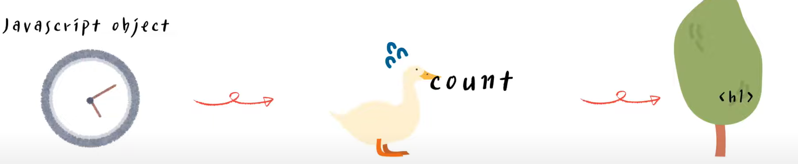
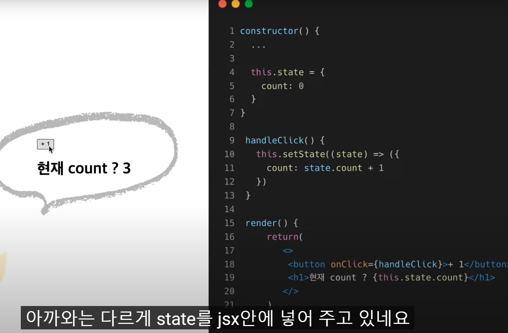
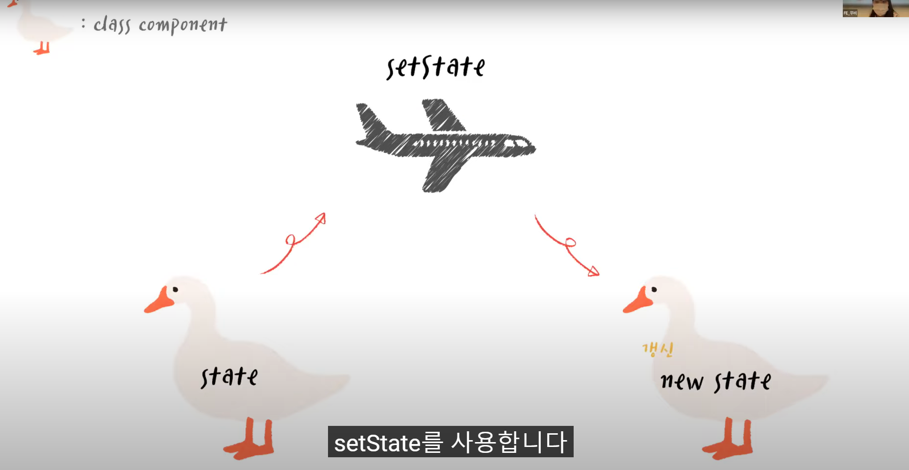
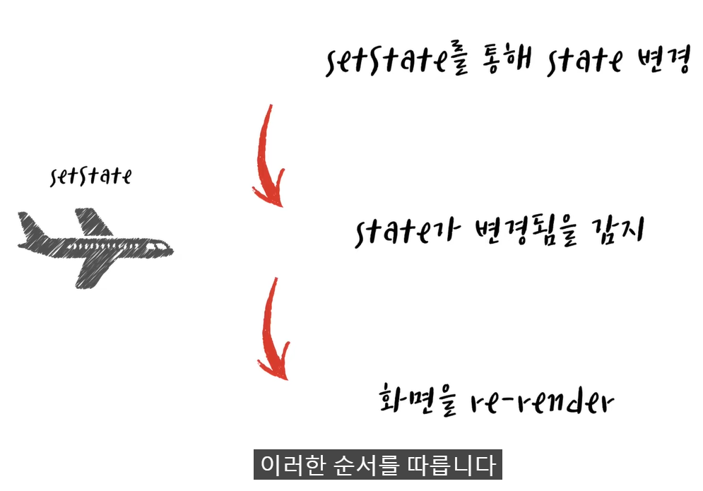
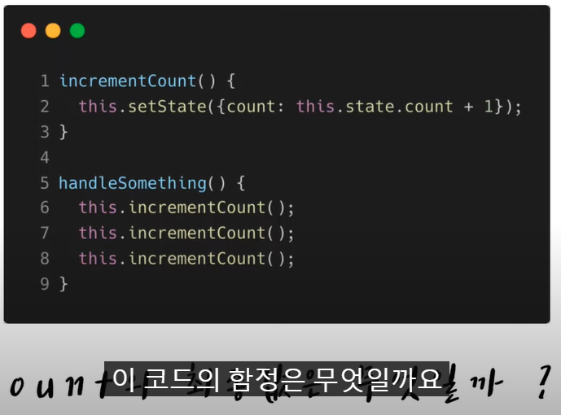
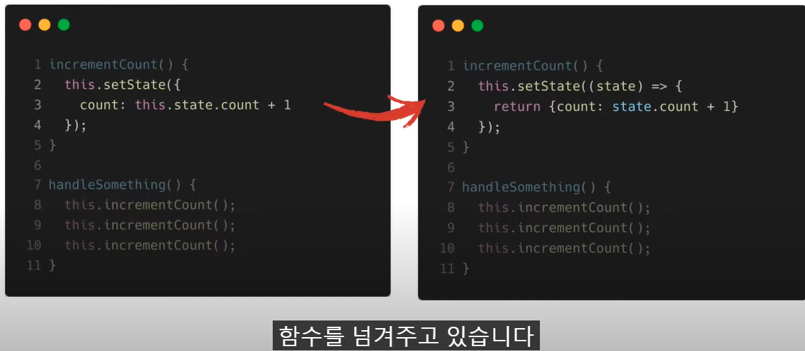
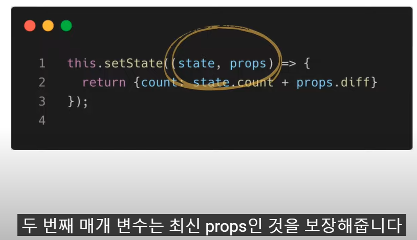
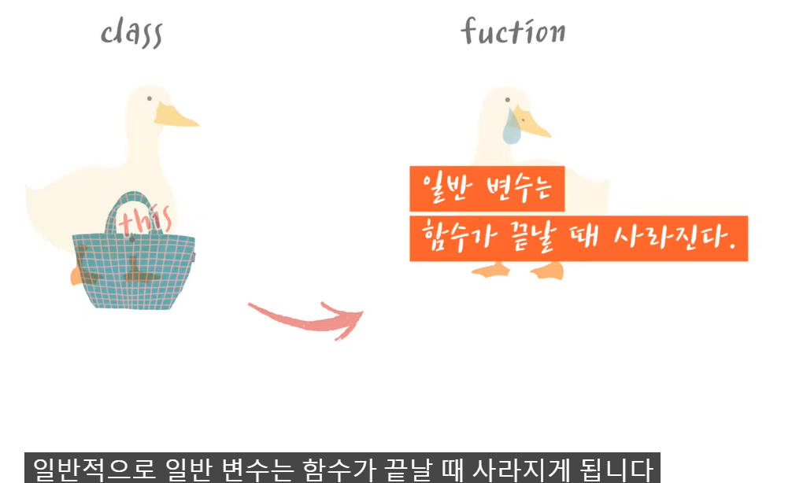
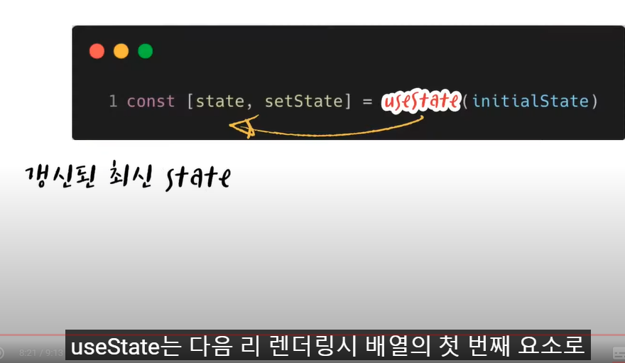
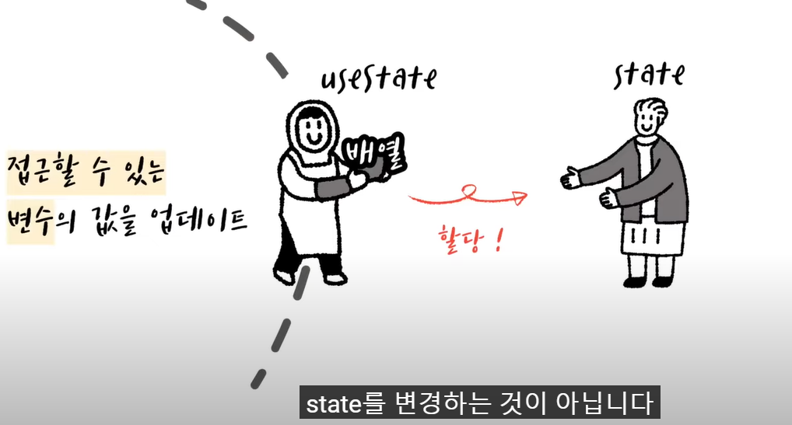

바닐라스크립트 때로 개발했던 때에는 직접 DOM에 접근하여 상태를 변경해줌

여러 개의 자바스크립트 객체와 화면에 있는 데이터를 직접 일치 시켜주어야 했다.

React를 사용할 때에는 state를 jsx에 넣어준다.

react가 데이터 바인딩을 대신 해준다

데이터 바인딩이란 제공자와 소비자로부터 데이터 원본을 결합시켜 이것들을 동기화 시키는 방법

쉽게 말해 데이터를 view에 쏙쏙 넣어주는 작업을 뜻함

react는 단방향 데이터 바인딩을 지원한다.

이는 데이터와 템플릿을 결합하여 화면을 생산한다.

React 에서는 하향식으로 데이터가 흐른다.

컴포넌트는 자신의 state를 자식 컴포넌트에게 props로 전달해 줍니다

자식 컴포넌트를 설계할 때 자식은 props가 누구로부터 어떤 방식으로 전달되는지 전혀 알 필요가 없다.

이 때문에 state는 종종 캡슐화라고 불린다.

state를 가진 컴포넌트 외에는 접근을 할 수 없다.

state는 state를 갖고 있는 해당 컴포넌트에서 관리가 된다

state를 자식 컴포넌트에게 넘겨주면 props가 된다.

props는 읽기 전용 데이터로서 immutable하다

클래스 컴포넌트에서 state를 갱신하기 위해 setState를 사용한다

왜 변경되는 데이터를 표현하기 위해 state를 사용할까요?

state가 변경될 시 화면이 리 렌더링 되기 때문입니다.

그냥 state를 변경할 경우 새로운 state로 화면이 업데이트 되지 않는다.

화면이 업데이트 되기 위해서는 render 함수가 실행되어야 한다.

setState는 컴포넌트 업데이트 프로세스를 trigger한다.

즉 setState를 사용해서 데이터를 변경해야 React가 state가 변경된 것을 감지할 수 있다.

업데이트 프로세스 라이프 사이클 중 shouldComponentUpdate는 state가 변경 되었는지 비교 연산을 진행한다.

shouldComponentUpdate는 퓨어 컴포넌트를 사용하지 않았다면 기본값으로 true를 반환하기 때문에 setState를 사용한다면 항상 re-render가 된다.

setState는 state를 변경하려는 즉각적인 명령이 아닌 요청이다.

즉, setState는 비동기적으로 작동한다. 

setState의 객체를 넘겨주는 것이 아닌 함수를 넘겨주고 있다.

이를 업데이트 함수라고 하는데요

업데이트 함수를 사용하면 state가 갱신된 이후에 다시 업데이트 해주는 것이 보장된다.

첫 번째 매개 변수는 최신 state를 두 번째 매개 변수는 최신 props를 보장

이는 성능 저하를 가져온다.

setState를 연속적으로 호출하면 setState를 모아서 배치처리한 후 re-render한다

함수형 컴포넌트는 stateless이다. 함수가 끝나면 변수가 같이 사라지기 때문이다

state를 저장하기 위해 우리는 훅의 useState를 활용한다. 

useState는 다음 리렌더링시 배열의 첫 번째 요소로 갱신된 최신 state를 반환한다.

우리는 const를 사용하는 setState를 통해 state를 변경하는 것이 아니다. useState함수 안에서 접근할 수 있는 변수 값을 변경한다. useState 내부에는 접근할 수 있는 변수의 값을 업데이트해주고 이를 배열에 나눠 반환해 준다. 함수형 컴포넌트가 실행이 될 때 state 변수는 사실상 계속 할당이 되는 것이죠.