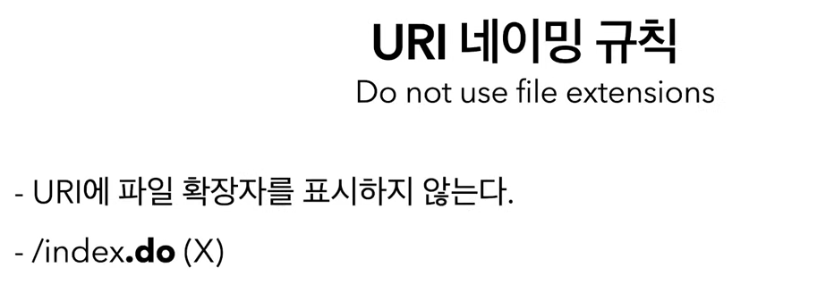

> SOAP는 느리고 복잡해서 안 쓴다

> URI를 잘 네이밍할수록 API가 직관적이고 사용하기 쉽다.

> Singleton은 단수로 표현된 자원, Collection은 복수로 표현된 자원

> HTTP 메서드를 이용해서 구분이 가능하다.

> 쿼리 스트링은 특정 주소를 접근할 때 페이지에 대한 옵션으로 활용

---

자원의 상태를 주고 받는다

> 같은 URI를 사용하되 다른 동작이 가능

### REST API란?

> URI를 통해 자원을 지정하고 HTTP 메서드를 통해 해당 자원에 대해 어떠한 행동을 할 것인지를 명시하는 API다

> URI를 통해 식별된 자원은 마치 객체와 같고 시간에 따라 그 상태, State가 변화할 수 있다. 특정 시점에 자원이 지니고 있는 상태를 특정한 형식으로 표현하고 그 표현을 클라이언트와 서버가 서로에게 전송하는 것이바로 REpresentational State를 Transfer한다는 뜻이다.

HATEOAS란 HTML과 같은 하이퍼미디어를 통해 클라이언트가 애플리케이션의 상태를 변경할 수 있어야한다. 