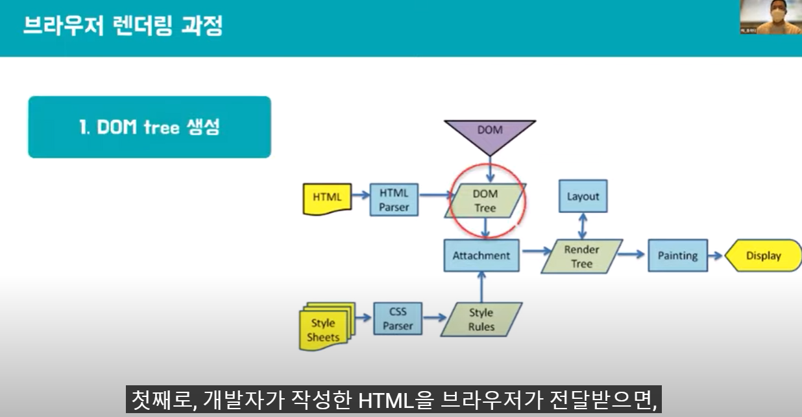

> 개발자가 작성한 HTML을 브라우저가 전달받으면, 브라우저의 렌더 엔진이 이를 파싱하고 DOM node로 이루어진 트리를 생성합니다. 이후 CSS 파일과 각 엘리먼트의 inline 스타일을 파싱하고 스타일 정보를 추가하여 렌더트리를 생성합니다. 렌더트리가 만들어지고 나면 레이아웃 과정을 거칩니다. 이 과정에서 각 노드들은 스크린의 좌표가 주어지고 정확히 어디에 위치해야 할 지가 정해집니다. 마지막으로 painting과정이 실행된다 . 앞선 과정에서 얻을 수 있는 정보들로 모든 요소들에 색을 입히는 과정입니다. 이 과정을 거치고 나면 화면에 UI가 렌더됩니다. 

```
DOM을 직접 조작하여 화면을 업데이트하려면 앞서 설명했던 HTML, CSS 파싱부터 화면에 Painting하는 과정까지 전부 진행하게 되어 비효율적인 부분이 발생한다. 실제로 많으 연산을 수반하고 비용이 많이 드는 작업이어서 프로그램 성능이 저하된다.
```

### SSR


> 예전에는 서버에서 데이터와 함께 완전한 페이지를 렌더해주는 서버사이드렌더링 방식을 많이 사용했습니다. 원래 DOM은 정적인 페이지를 보여주는데 많이 사용됐기 때문에  DOM의 동적인 변화가 그렇게 큰 문제가 되지 않았다.


> 하지만 SPA


> Virtual DOM은 실제 DOM node tree를 복제한 자바스크립트 객체입니다. 


> virtual DOM은 실제 DOM과 같은 class, style 등의 속성들을 갖고 있지만 화면에 변화를 직접 줄 수 있는 기능인 getElementById 등과 같은 DOM api들은 갖고 있지 않다. 


> 최초에 브라우저가 실제 DOM 트리를 생성하고 브라우저 화면에 우리의 애플리케이션 UI가 렌더됩니다. 이때 virtual DOM은 DOM 트리를 가벼운 버전으로 복사를 한다. 


> 그리고 DOM 노드에 변화가 생기면 Virtual DOM은 다시 새로운 가상의 DOM 트리를 처음부터 다시 만들게 됩니다. 이 과정에서 변화가 생길 때마다 새로운 DOM트리를 만드는 것이 비효율적이라고 생각이 들 수 있다. 하지만 DOM 노드를 조작하는 것의 비효율성은 DOM 트리를 업데이트하는 과정에서 발생하는 것이 아니라 렌더링하는 과정에서 비싼 비용이 드는 것이다. 하지만 virtual DOM은 렌더링을 하지 않고 메모리 상에서 트리를 변경하는 일이기 때문에 상당히 빠르게 작업이 진행될 수 있습니다. 


> diff 함수에서 매개변수로 이전 상태의 DOM트리와 새롭게 만들어진 DOM트리를 각각 previous, current라는 이름으로 받아온다. 이 함수를 통해서 변경 전의 돔트리와 변경 후의 돔트리의 변화된 부분만을 확인하게 됩니다. 


> 이렇게 변경된 부분을 확인한 이후에는 실제 DOM에 변경된 부분을 적용합니다. Virtual DOM의 구현체에서 Patch함수를 보면 rootNode와 이전 단계에서 diff함수를 통해 얻을 수 있었던 변경된 부분만 담겨있는 patches를 인자로 받는 것을 볼 수 있습니다. 이 함수는 변경된 사항만을 실제 DOM 노드에 적용하여 렌더링 과정을 수행하게 합니다. 이 일련의 과정을 봤을 때 Virtual DOM은 사실상 버퍼링 또는 캐싱의 역할을 한다고 볼 수 있습니다. DOM 조작을 할 때마다 브라우저 렌더링 과정을 계속해서 반복하는 것이 아니라 변화들을 전부 Virtual DOM에 반영한 후에 변경된 부분만을 모아서 실제 DOM에 적용하여 한 번만 렌더링 하도록 함으로써 성능을 최적화합니다. 

---

### REACT 에서의 Virtual DOM


> React 컴포넌트를 정의할 때 JSX 문법을 많이 사용한다. JSX는 자바스크립트를 확장한 문법이기 때문에 자바스크립트 문법이 아닙니다. 이러한 JSX는 바벨과 같은 툴에 의해 자바스크립트로 변환되는데 이때 createElement 함수를 호출하게 됩니다. 함수를 통해 JSX는 다음과 같은 객체로 변환됩니다. 이 객체에는 type과 props라는 키가 존재하는데요. type은 DOM 노드의 태그 이름이고 props는 JSX에 포함된 모든 속성들을 포함합니다. props의 children에는 하위 노드들이 포함됩니다. 이렇게 생성된 자바스크립트 객체를 활용하여 Virtual DOM 트리를 구성하게 됩니다. 이러한 객체를 이용하여 render 함수를 호출하면 비로소 실제 DOM 요소가 됩니다. 


> 리액트는 변경 전의 Virtual DOM과 변경 이후의 Virtual DOM 두 가지 트리를 모두 유지하고 있습니다. 이 두 트리의 스냅샷을 비교하여 변화된 부분만을 감지한 후에 변겨오딘 부분만을 실제 DOM에 적용합니다. 비교하는 과정에서 Diffing 알고리즘이 사용됩니다. 


> 변경 전 React 엘리먼트의 타입과 변경 후 React 엘리먼트의 타입을 비교하여 두 가지 다른 유형의 행동을 하게 됩니다. 첫째로, 엘리먼트의 타입이 같은 경우에는 변경 전의 엘리먼트의 속성과 변경 후 엘리먼트의 속성을 비교하여 동일한 내역은 유지하고 변경된 속성들만 갱신합니다. 타입이 달라진 경우 React는 이전 트리를 삭제하고 완전히 새로운 트리를 만듭니다. 


> 리스트를 렌더할 때 key prop이 있어야 한다는 메세지입니다. 리액트 엘리먼트가 변화할 때 재조정 과정에서 이전의 Virtual DOM과 새로 생성된 Virtual DOM을 비교한다. 


> 새로 추가된 third만 추가적으로 그린다.


> 모두 제자리에 있지 않다고 판단하고 자식 노드를 전부 새로 그리게 됩니다. 이러한 문제를 해결하기 위해 리액트는 식별자로서 key prop을 제공합니다. 자식 노드들이 key prop을 갖고 있으면 리액트는 key값으로 이전 트리와 변경 이후 트리를 비교합니다. 대신 key값은 변경되지 않는 유일한 값을 넣어줘야 합니다. 배열의 index는 배열이 바뀔때마다 0부터 n까지 새롭게 할당됩니다. 


> 새로운 값이 추가되어 리스트의 맨 앞에 새로운 노드가 추가 될 때 


> Angular는 실제 DOM을 사용하여 변경 사항을 찾는 Incremental DOM 방식으로 렌더링 합니다. 