자바스크립트에서 this는 어떤 객체를 가리키는 키워드이다. this는 함수를 호출한 객체이다.

### 전역 문맥

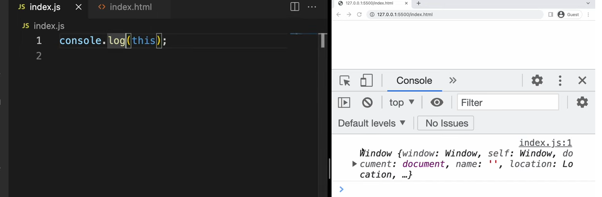

> 브라우저에 대한 정보를 가지고 있는 전역 객체이다. 전역 문맥에서 this 호출. window가리킴

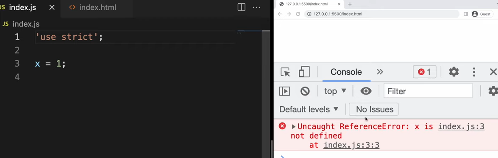

> 'use strict'를 적어서 엄격 모드를 활성화시키면 에러를 발생시켜준다. 변수를 선언하지 않고 사용을 해도 에러가 발생하지 않는다. 조금더 엄격하게 js 문법을 검사해준다.

### 함수 문맥

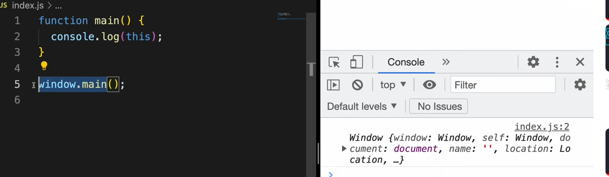

main함수는 window 객체에 선언이 되어 있기 때문에, this를 부르면 window가 나타난다. window를 생략해도 결국 똑같이 호출된다.

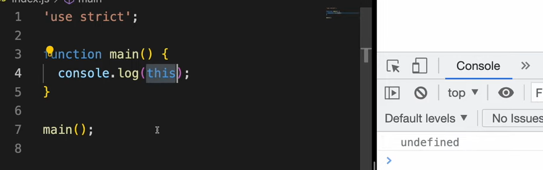

> 엄격 모드에서는 window를 쓰지 않으면 undefined가 나온다.

### 객체의 메서드

메서드는 객체의 속성으로 넣어진 함수를 의미한다.

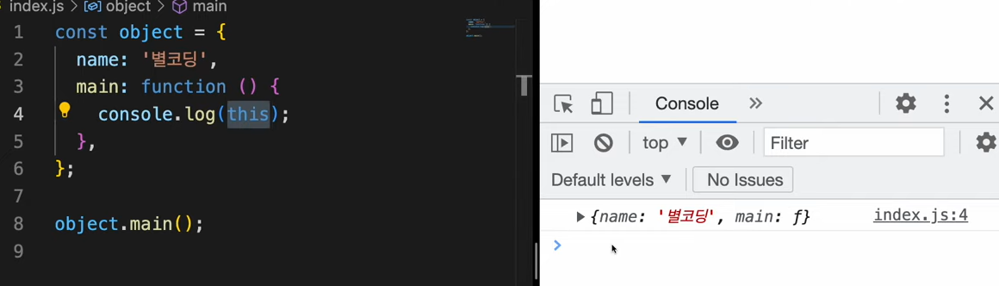

> object라는 객체를 호출한다. this는 객체의 다른 속성을 가리킬 때 유용하다. 

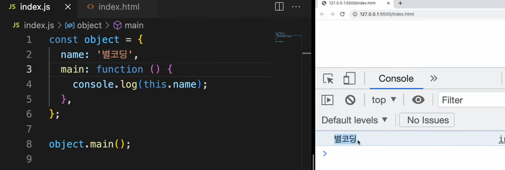

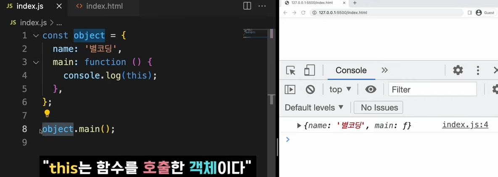

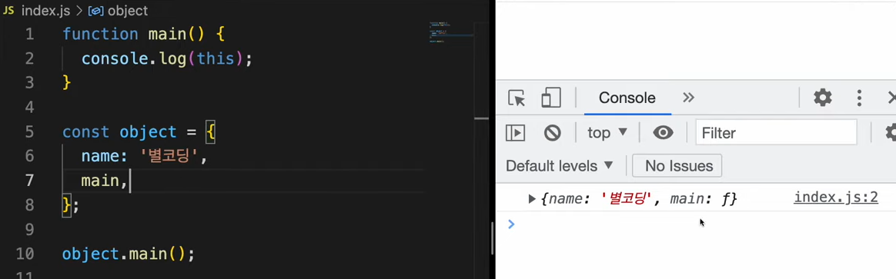

> 함수가 객체 밖에서 정의되어도 함수를 호출한 객체를 호출한다.

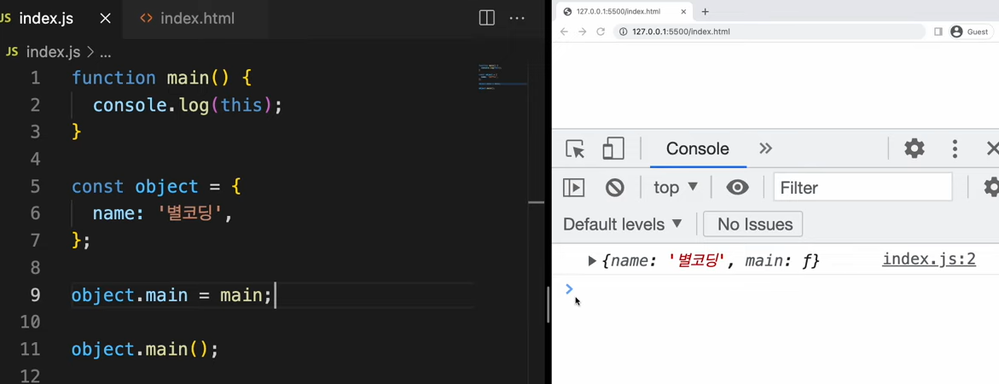

> 이후에 호출해도 가능

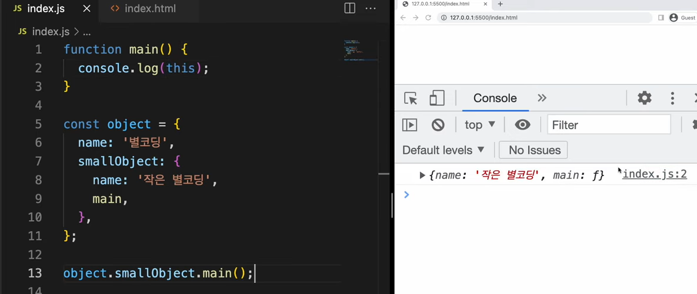

### bind

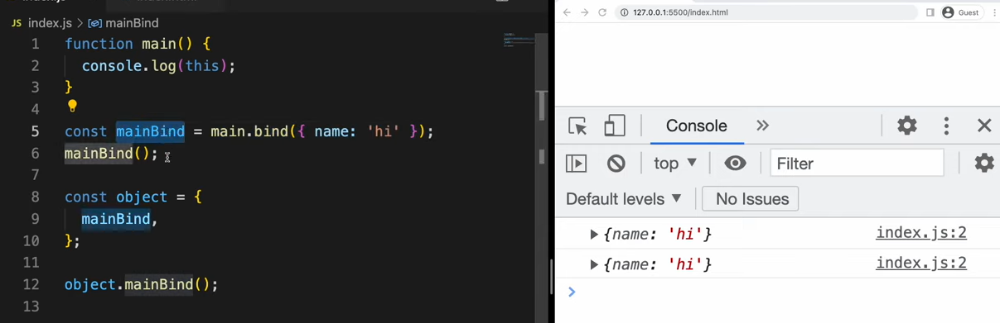

> this가 가리키는 객체를 직접 설정해줄 수 있다. 단, bind를 두 번 사용할 수는 없다. 한번 더 bind해준 것은 무시해버린다. 가장 처음 객체를 호출한다.

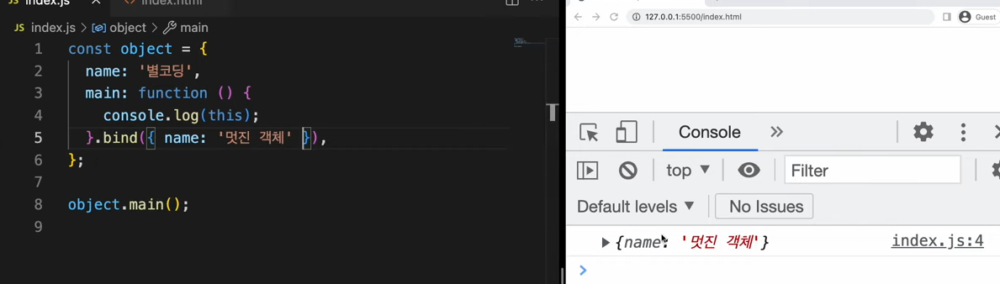

### 이벤트 처리기

버튼 클릭이나 스크롤같은 것들을 처리할 때 이벤트리스너를 활용한다.

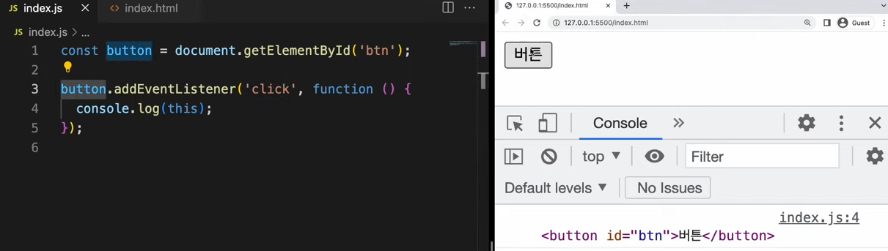

해당 이벤트를 발생한 요소를 호출해준다.

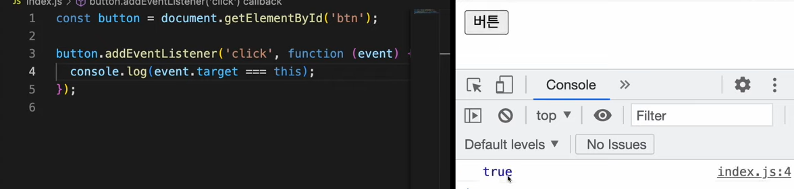