var, let, const는 변수를 선언하는 데 사용됩니다. 

하지만 매번 값을 저장할 때마다 그 값에 저장되는 메모리의 주소 값을 알아내고 기억하기에는 많은 어려움이 따릅니다. 

메모리 주소2로 사과 값을 가져올 필요 없이 apple이라는 이름으로 사과 값에 접근이 가능하게 됩니다. 

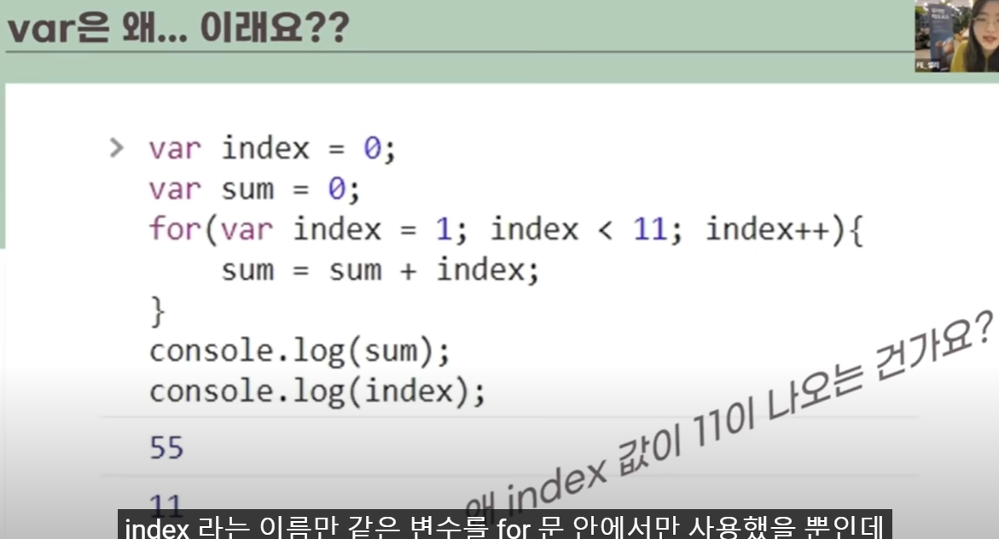

자바스크립트 변수 선언의 역사 

자바스크립트는 2015년 전까지는 ES5 문법을 사용했습니다.  -> var의 전성기

지금은 ES6를 사용하고 있다. -> let과 const의 도입

var도 소규모의 애플리케이션을 개발할 때는 편합니다. 

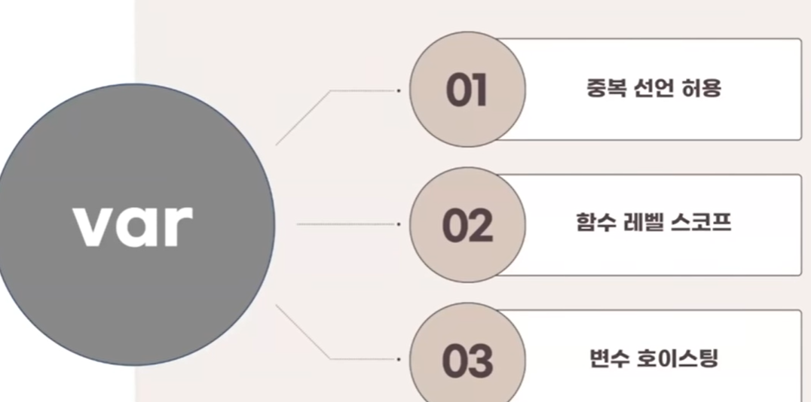

### 문제점

1. 중복 선언이 허용된다.

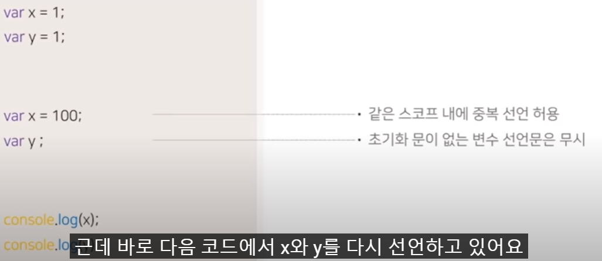

> x는 100 y변수는 재선언할 때 값을 할당하지 않았으므로 1이 나온다. 

나중에 A가 다시 사용하려 할 때 다른 값이 나온다. 

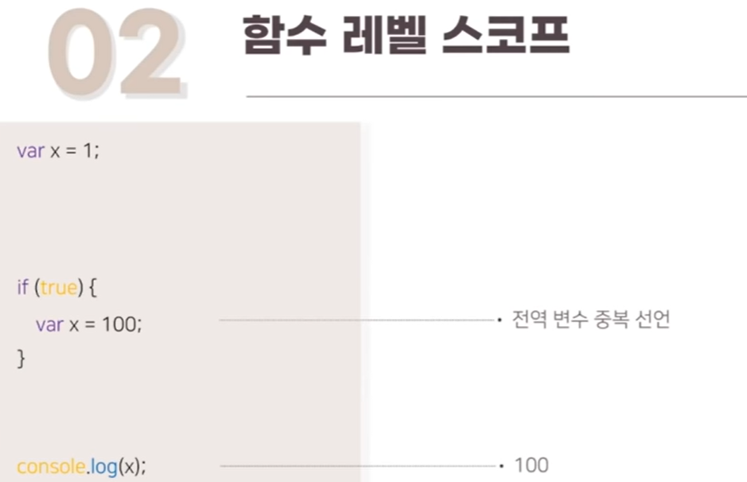

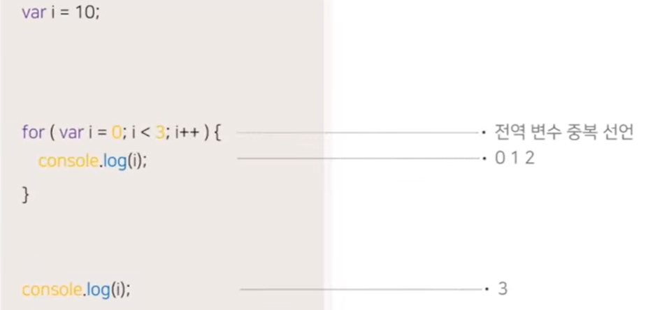

> if문 뿐만 아니라 for문 등 함수의 코드 블록이 아닌 다른 블록에서 var로 변수를 선언하면 전역 변수가 됩니다.  이렇게 var는 함수 레벨의 스코프를 가진다는 점에서 의도치 않게 전역변수를 중복해서 선언할 가능성이 높아진다.

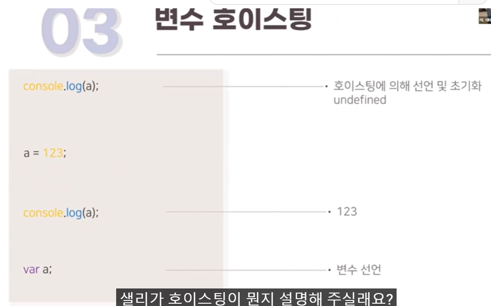

> 자바스크립트 엔진은 코드를 실행하기 전 코드를 위에서부터 한 줄 한 줄 살펴보면서 소스평가 과정을 거친 후에 소스코드를 실행합니다. 

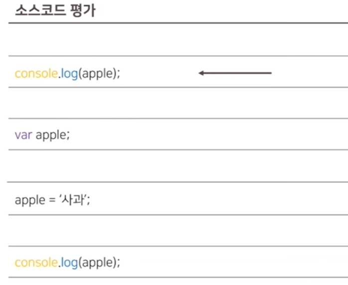

> 자바스크립트 엔진은 맨 앞에 있는 콘솔 로그부터 시작하여 하나하나씩 내려가면서 변수 선언문 또는 함수 선언문 등을 찾아내어 먼저 실행을 합니다. 

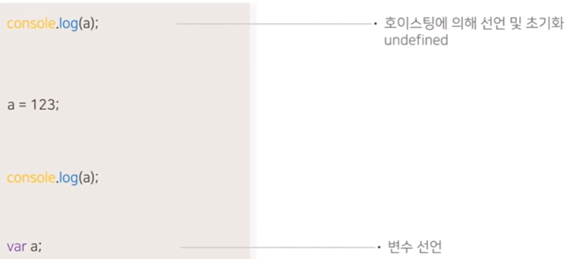

> 자바스크립트에서는 이미 호이스팅에 의해 a가 선언되고 undefined로 초기화된 상태입니다. 
>
> undefined
>
> 123
>
> 이 반환된다 

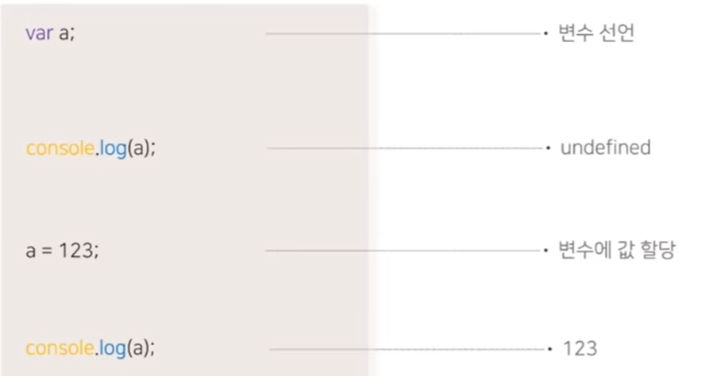

> var의 호이스팅 특성은 가독성을 해치고 선언 전에 호출에도 에러가 잘 나지 않기 때문에 오류를 발생시킬 가능성이 증가합니다. 

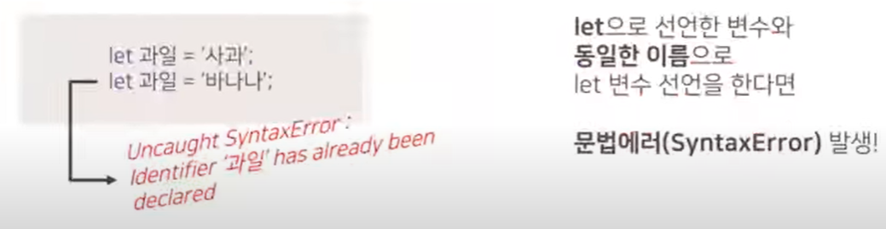

> var는 중복선언을 해도 에러가 발생하지 않음

> 스코프는 식별자를 찾을 때 자바스크립트에서 확인하는 범위입니다. 상위 스코프는 하위 스코프에 접근할 수 있지만 그 반대는 불가능합니다. 

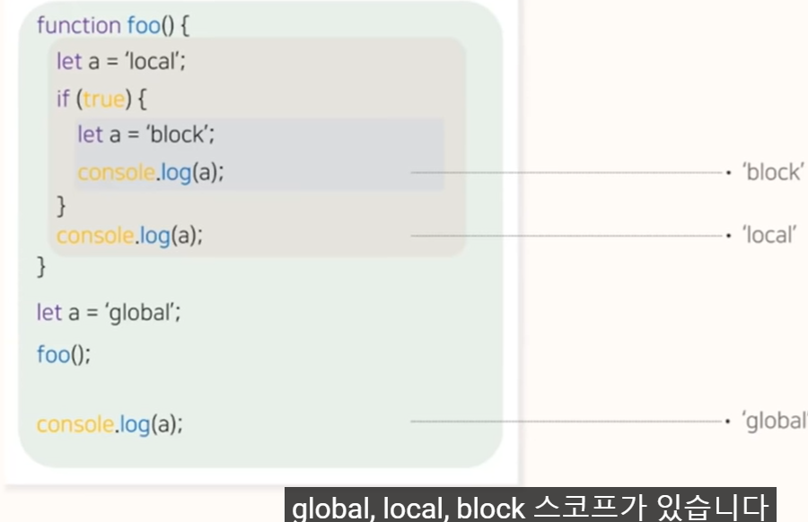

> if문 안에 있는 a가 먼저 block으로 출력된다(블록 스코프)
>
> 그 다음 함수 스코프 실행 
>
> 마지막은 전역 스코프 안의 전역 변수 a를 가리킨다. global 출력
>
> 자바스크립트에는 대표적으로 global, local, block 스코프가 있습니다.
>
> ES5까지 전역스코프와 함수스코프만 사용가능했지만 ES6에서 let과 const가 도입되면서 블록스코프도 가능하게 되었습니다. 

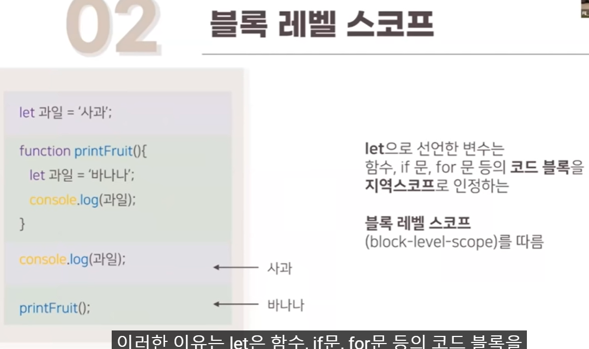

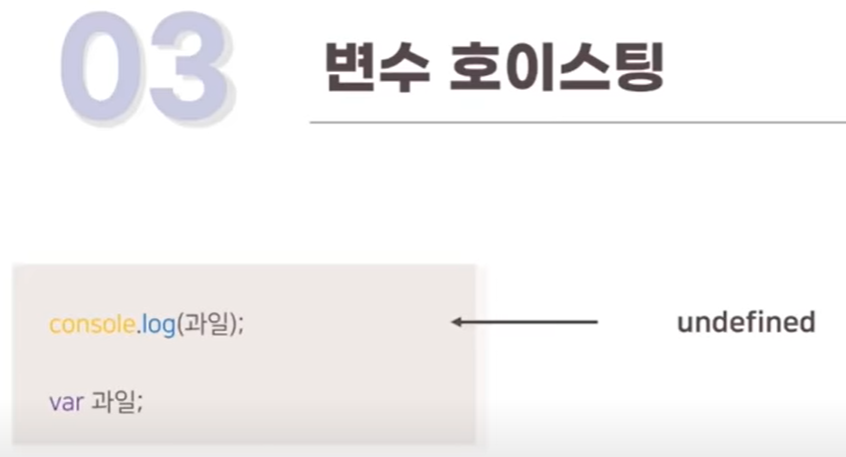

> 아직 변수가 선언되기 전인데도 호이스팅에 의해 에러가 나지 않고 undefinec가 나온다.

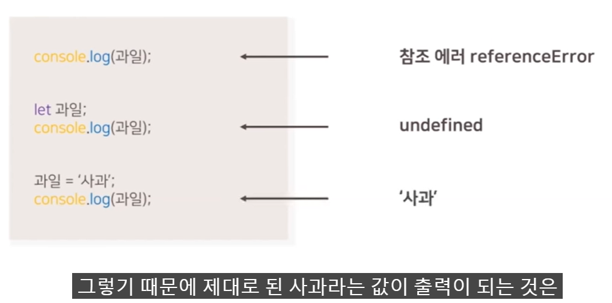

> let은 호이스팅이 일어나지 않는다.
>
> 변수를 선언하기만 하면 undefined이다.

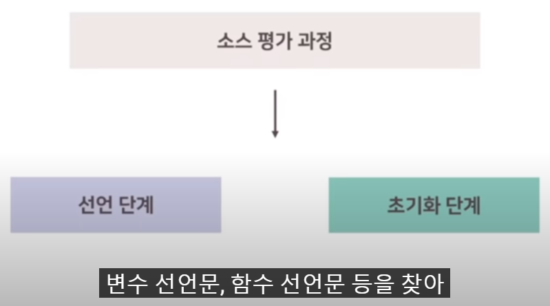

> 자바스크립트 엔진은 코드를 실행하기 전에 변수 선언문, 함수 선언문 등을 찾아 위로 끌어올리는 평가 과정을 가집니다.  

> 선언 단계를 통해서 스코프에 변수 식별자를 등록해 자바스크립트 엔진에 변수의 존재를 알리고 

> 초기화 단계에서 undefined라고 스코프에 등록된 변수 식별자에 값을 초기화하는 단계를 거칩니다. 

그런데 var는 이 과정을 코드 평가 과정에서 모두 이루어지게 되어 var로 선언된 변수에 접근하기 이전에 해당 변수를 호출한다 하더라도 에러가 발생하지 않습니다.

let은 선언단계와 초기화 단계가 분리되어 진행됩니다. 

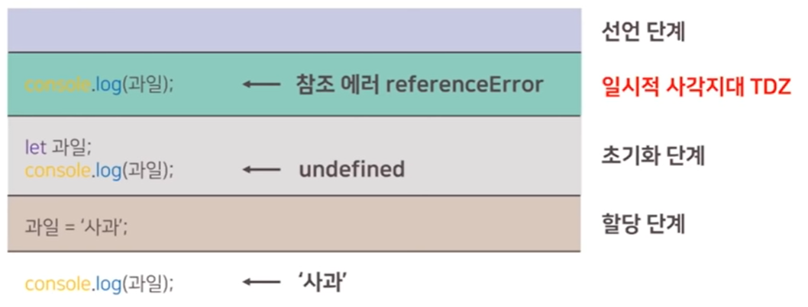

> 선언 단계를 통해 자바스크립트 엔진에게 과일이라는 존재를 알립니다. 하지만 과일이 어떤 값을 가졌는지 자바스크립트 엔진은 초기화 단계 이전에는 알 수 없다. 스코프 시작 시점부터 초기화 시작 지점까지 변수를 참조할 수 없는 구간을 일시적 사각지대 TDZ라고 부릅니다. 초기화 단계는 변수 선언문에서 이루어진다. 

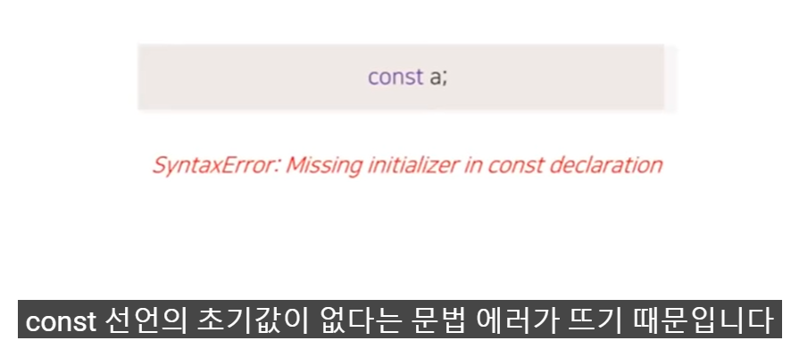

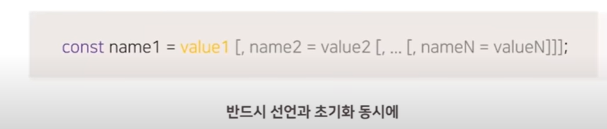

>  const는 선언과 초기화가 동시에 필수이다. 이는 const가 상수를 선언하는 목적으로 만들어졌다.

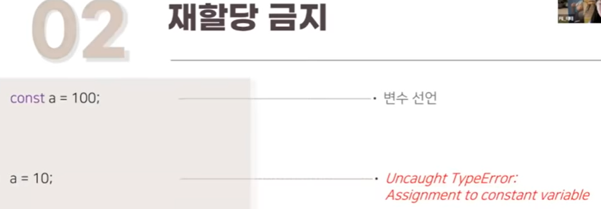

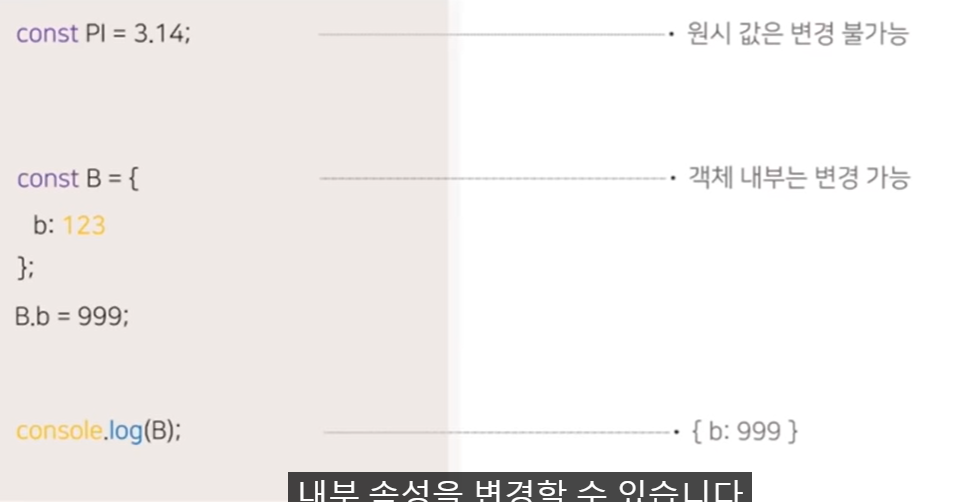

> 원시 값은 내부적으로는 어떤 방법으로도 변경이 불가능하지만 참조 타입으로 선언하면 내부 속성을 변경할 수 있습니다. 물론 새로운 객체를 다시 할당하는 것은 불가능합니다. const로 변수를 선언하면 let과 달리 다른 사용자에게 이건 변하지 않는 값이다. 라는 것을 미리 알려준다. 

> 둘 째, TDZ 구간이 생겨서 변수 값이 할당되기 전 변수 사용할 때의 혼란을 줄여준다 
>
> 셋째,블록 레벨 스코프로 접근을 제한하여 변수 간의 차이를 명확히 한다. 

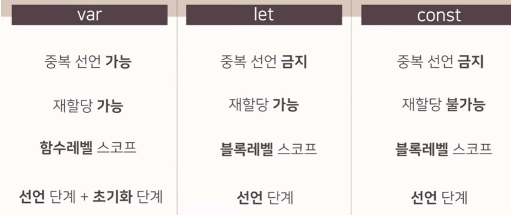

> const는 재할당이 불가능하여 상수값을 표현하는데 쓰이곤 한다. var는 함수 레벨 스코프여서 함수 외부에서 var로 선언한 변수이든 코드 블록 내에서 쓰인 변수이든 모두 전역 변수가 되지만, let과 const는 블록 레벨 스코프로 이를 금하고 있습니다. 마지막으로 var의 경우 자바스크립트 엔진에 의한 코드 실행에 앞선 코드 평가 과정에서 선언단계와 초기화단계가 모두 이루어지지만 let과 const는 선언단계만 이루어져 let과 const를 사용할 때에는 꼭 변수선언을 하고 사용하여야 한다.