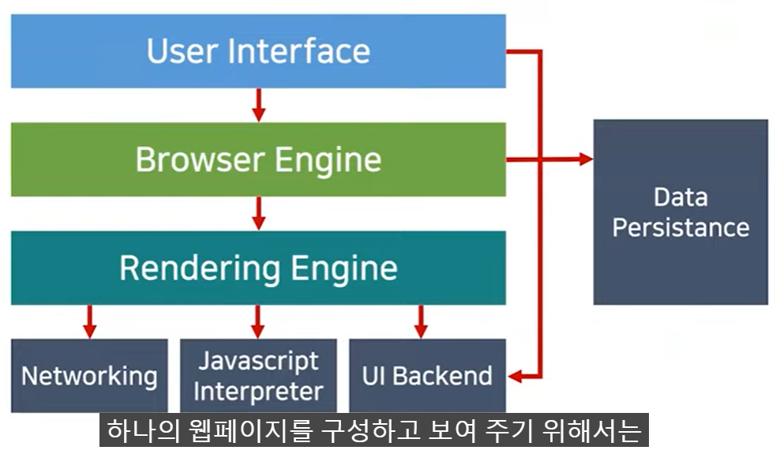
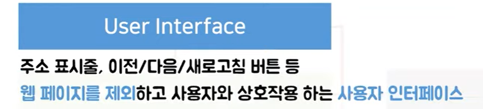
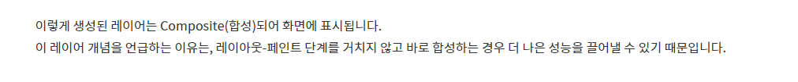

브라우저란 html 문서, 이미지, 폰트 등의 사용자가 선택한 자원을 전송 및 표현하는 소프트웨어입니다.

브라우저의 공통구조는 크게 7가지로 구분된다. 

> 크롬의 경우에는 V8을 사용하는 그 엔진이 인터프리터이다. 컴퓨터는 자바스크립트 언어를 이해할 수 없으므로 기계 코드로 변화하는 컴파일러 또는 인터프리터가 필요하다

> 사파리는 웹킷, 파이어폭스는 겍코, 크롬은 블링크
>
> 크롬도 웹킷을 사용하다가 2013년에 갈라져나온 블링크라는 엔진을 사용하고 있다.
>
> 모든 렌더링엔진이 약간 기본적으로 웹표존을 준수하면서도 엔진마다 조금씩 다르게 동작하는 부분이 있다. 

> 업데이트는 사용자의 입력이 발생하거나 스크롤이 생겼다던가, 애니메이션이 동작하다던가, 비동기 요청으로 인한 데이터로딩 그런 종류가 있다. 

> 이것을 크리티컬 랜더링 패스라고 한다. 

먼저 브라우저에서 사용자가 요청한 웹페이지에 문서를 불러오고 파싱을 한다.

> 해당 코드는 어휘 분석을 통해 HTML5 표준에 지정된 고유한 토큰으로 변환된다. 

> Start Tag html이라는 토큰은 HTML이라는 태그가 열렸다라는 의미를 가진다. 
>
> EndTagbody는 body태그가 닫혔다는 의미를 가진다. 

그리고 브라우저에 렉싱 과정을 통해서 토큰이 해당 속성과 규칙을 정의하는 노드 객체로 변환된다. 그리고 각 노드가 서로 연관성을 가질 수 있도록 트리를 생성한다. 이게 바로 DOM 트리이다.

HTML 문서에 있는 모든 것들은 DOM을 구성하게 되는데 먼저 최상위에는 document 객체가 들어간다.

태그는 element node가 되고, 태그의 요소는 attribute node, 텍스트의 경우에는 text node가 되어 트리 구조를 생성한다. 이외의 주석도 comment node가 되어 생성된다. 

브라우저는 HTML 문서를 파싱하는 과정에서 자바스크립트나 css같이 추가로 필요한 파일들을 불러오도록 요청하기도 한다. 

HTML을 DOM 트리로 만드는 과정과 비슷하게, CSS로는 CSSOM(씨에스에스 오엠) 트리가 만들어진다.

CSSOM은 DOM이 어떻게 화면에 표시될 지를 알려주는 역할을 한다. CSS도 위에서 아래로 스타일 규칙이 정해지기 때문에 이 또한 트리구조를 가지고 있다. 

예를 들어서 스타일 시트에서 body 태그에 test-align이라는 속성을 정해뒀다면 body의 자식 요소들에게도 동일한 속성이 전파되어서 적용되게 된다. 

렌더링 엔진이 DOM 트리와 CSSOM 트리를 합쳐서 렌더 트리(Render Tree)라는 것을 만들게 된다. 

Render Tree가 만들어지는 과정은 document 객체부터 각 노드를 순회하면서 각각에 맞는 CSSOM을 찾아서 규칙을 적용한다. 그러면서 렌더와 관련된 요소들을 렌더 트리에 포함시키게 된다. 이 때, meta 태그나 display:none 속성을 가진 요소들은 렌더와 관계가 없기 때문에 렌더 트리에 포함되지 않는다. 브라우저마다 조금씩 다르게 동작한다. 

> 렌더트리가 완성되면 Layout이라는 과정이 진행된다. Reflow라고도 부르는데, 뷰포트 내에서 요소들에 정확한 위치와 크기를 계산하는 과정이다. 박스 모델에 따라서 텍스트나 요소의 박스가 화면에서 차지하는 영역이나 여백 그리고 이외의 스타일 속성이 계산된다. 이때 CSS에서 %나 em같은 상대적인 단위를 사용했을 때는 뷰포트에 맞춰서 픽셀단위로 변환된다. 레이아웃 과정에서 렌더링 엔진이 각 요소들이 어떻게 생겼고 이를 어떻게 보여 줄지 알게 되면 마지막에 화면에 실제 픽셀로 그려지도록 변환하는 과정을 거치는데 이 과정을 페인트 과정이라고 한다. 이 과정에서 렌더 트리에 포함된 요소들이나 텍스트, 이미지들이 실제 픽셀로 그려진다. 

HTML와 CSS를 가지고 렌더링 엔진이 어떻게 동작하는지 살펴봤다.

사용자의 동작으로 자바스크립트가 실행되어서 css가 변경되거나 애니메이션 재생이 일어났을 때 이때는 크게 3가지 경우로 동작을 한다. 

> 요소의 크기나 위치가 바뀔 때, 혹은 브라우저 창의 크기가 바뀌었을 때 그림의 순서에 따라서 레이아웃이 다시 발생한다. 레이아웃 수치를 다시 계산해서 배치를 해야 하기 때문에  레이아웃 과정이 다시 발생하고 이에 맞춰서 다시 페인트도 해줘야 하고 마지막으로 레이어를 합성하는 과정까지 거친다. 

> 배경 이미지나 텍스트 색상, 그림자와 같이 레이아웃의 수치를 변화시키지 않는 스타일의 변경이 일어났을 때 발생 . 레이아웃이 발생하지 않기 때문에 성능상으로 좀 더 이점을 가진다. 

> 레이어는 포토샵의 레이어와 비슷하게 페인팅할 영역을 나누어 놓는 것을 의미한다. 크롬의 경우에는 레이아웃 과정 이후에 정해진 기준이나 필요에 의해서 브라우저가 레이어를 생성한다. 그리고 렌더 트리에 있는 노드 객체들은 생성된 레이어에 포함 되게 된다. 레이어들은 트리 형태로 구성된다. 그리고 이 렌더링 엔진이 각 레이어를 프린팅 과정에서 각각 그려 준 다음에 하나의 비트맵으로 합성해서 페이지를 완성한다. 이때 경우 레이아웃과 페인트 과정도 수행하지 않고 레이어의 합성만 발생하기 때문에 성능상 이점이 크다. 

> CSS 속성이 변경되었을 때 앞에서 말한 3가지 경우 중 어떤 경우로 업데이트를 되는지는 아래 링크를 통해 알 수 있다
>
> https://csstriggers.com

> css 속성마다 UI가 어떻게 업데이트 되는지를 알 수 있다.

이 상황들을 이용해서 애니메이션 렌더링을 최적화 할 수 있다. 

> 개발자 도구에서 퍼포먼스 탭이 있다. 브라우저가 런타임에서 어떤처리를 하는지 확인 할 수 있는 도구이다. 녹화를 누르면 캡쳐를 할 수 있다. left 속성은 모든 과정이 다 일어난다. 아래에 랜더링 탭이 있다. Paint flashing이라고 하는 속성을 켜면 브라우저 화면에서 어떤 부분이 다시 페인트 되는지 알 수 있다. transfomr은 컴포지트만 일어나는 속성 

---

사용자가 주소 표시줄에 주소를 입력하면 

UI스레드는 입력되는 내용이 검색어인지 url 인지 확인하고 입력된 내용을 파싱하여 검색 결과로 이동할지 요청한 사이트로 이동할지 결정합니다. 사용자가 enter를 누르면 ui 스레드가 네트워크 호출을 시작한다. 그러면 네트워크 스레드는 요청을 처리하고 응답이 HTML 파일이라면 응답 결과를 렌더러 프로세스에 전달합니다. HTML 데이터를 수신하기 시작하면 렌더러 프로세스의 메인 스레드는 HTML을 파싱해서 DOM 트리로 변환한다.

CSS파일이 정의되어 있거나 html 태그에 정의한 style요소, 스타일이 따로 지정되지 않은 엘리먼트는 브라우저 상에서 기본적으로 가지고 있는 스타일로 모든 정보들을 합쳐서 CSSOM 트리를 구축합니다.

그 후 DOM 트리와 CSSOM 트리를 결합하여 렌더 트리를 형성한다.

렌더 트리는 최종적으로 화면에 표시되는 모든 노드와 노드의 스타일 정보를 포함합니다.

렌더 트리가 형성되면 레이아웃 단계로 넘어간다.

레이아웃에서는 페이지에 출력될 노드들의 크기와 위치 레이어간의 순서 정보를 계산합니다.

레이어 개념이 브라우저 렌더링 시 도입되는 이유는 z축을 활용하는 3차원 개념을 렌더링 과정에 삽입하기 위함입니다. stacking context 쌓임 맥락이라고 합니다. 쌓임 맥락은 가상의 z축을 사용한 HTML 요소의 3차원 개념입니다.

엘리먼트의 z-index 속성을 지정하지 않더라도 최상위 엘리먼트를 가장 아래 두고 하위 엘리먼트들은 위로 쌓입니다. 이 과정은 HTML 문서의 최상위 요소에서 시작하고 재귀적으로 실행한다. 레이아웃 과정에서 노드가 많아지면 속도가 당연히 느려질 수밖에 없다. 따라서 브라우저는 자체적으로 최적화 로직을 탑재하고 있습니다. 그 중 하나가 더티 비트 시스템입니다. 특정 엘리먼트가 변경이나 추가 때문에 다시 배치가 필요하다면 해당 엘리먼트를 더티라고 표시합니다. 그러면 레이아웃이 재귀적으로 실행될 때 더티 엘리먼트 부분만 다시 계산하여 리소스의 낭비를 줄일 수 있습니다. 이 계산은 즉시 수행하는 것이 아니라 비동기로 일괄 작업하기에 연산의 횟수를 줄일 수 있다. 

마지막 단계로 페인트 단계가 있다. 페인트는 레이아웃 단계를 통해 배치된 엘리먼트들에게 색을 입히고 레이어의 위치를 결정합니다 이것 역시 최상위 요소부터 재귀적으로 실행된다. 페인팅 순서는 z-index가 낮은 순서대로 먼저 페인팅 된다. 

repaint는 페인트를 재실행하는 것

composite은 레이어들을 최종적으로 합성하는 단계를 말한다. 

블로그에서 opacity transform을 쓰면 속도가 빨라진다고 무작정 쓰는 것이 아니라 performance 탭을 활용해 실제로 동작하는지 확인이 필요하다.

