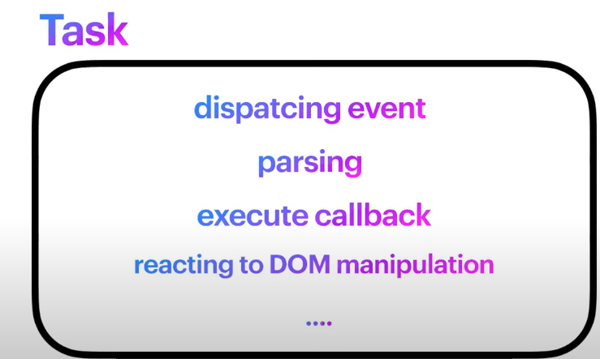

> 브라우저가 HTML 태그를 바탕으로 DOM을 생성 하다가 script 태그를 만나면 자바스크립트 코드를 실행합니다. 우리가 작성한 코드는 마지막 줄까지 다 읽혔지만 브라우저는 사용자의 제스처 입력을 기다리기도 하고 일반적으로 주사율 60Hz 기준 매 16.7ms마다 DOM을 다시 그리는 것을 목표로 합니다. 그래서 우리가 스크롤을 내렸을 때 그에 맞게 뷰가 변하는 것입니다. 

> Renderer Process 안에 있는 메인 스레드입니다. 우리가 자바스크립트는 싱글 스레드라고 말할 때 그 스레드가 바로 저 친구 입니다. 

> 메인 스레드는 렌더링을 하고 우리가 작성한 자바스크립트 코드를 실행합니다. 이 일들은 순서대로 일하기 때문에 하나가 오래 걸리면 다른 하나가 늦어집니다. 

> 저희가 크롬에서 탭을 하나 추가하면 이런 코드가 실행됩니다. 메인 스레드는 무한 루프에 들어가고 queue에서 가장 먼저 들어온 태스크를 하나 뺀 다음에 실행합니다. 그리고 때때로 다시 그릴 타이밍이 되면 화면을 다시 그립니다. 

> 태스크는 콜백함수를 실행하는 일을 지칭합니다. 태스크 자체가 콜백함수는 아니지만 안에서 함수를 호출하라는 내용이 있습니다. 

> 메인 스레드에서 파서가 이 스크립트 태그를 만납니다. 그러면 이 코드를 불러와서 실행을 하게 되는데 이것도 하나의 태스크입니다. 다시 말해서 우리가 작성한 자바스크립트 코드는 맨 처음 하나의 테스크로서 처리됩니다. 

> 모든 이벤트에 대해 행당되는 것은 아니지만 이벤트 객체를 특정 이벤트 타깃에 디스패칭한 일도 테스크로서 실행됩니다. 디스패치되면 Capture phase와 Target Phase 마지막으로 Bubbling phase를 거치면서 저희가 addEventListener로 걸어놓은 핸들러들이 호출됩니다. 

> 브라우저가 우리의 자바스크립트 코드를 실행하는 것 외에도 정말 많은 일들을 하고 있다는 의미입니다. 

> 웹 api를 사용해서 타이머나 네트워크 통신을 한 뒤 그 콜백함수가 Task Queue에 들어갑니다. 핵심은 타이머나 네트워크 통신이 메인 스레드에 대해서 이루어지는 것이 아니라 브라우저 안에 있는 다른 프로세스나 스레드에 대해서 실행이 되고 다 끝나면 Task Queue에 콜백함수를 넣어준다는 것입니다. 

> setTimeout이나 fetch가 끝나고 queue 안에 쌓인 태스크들 즉, 이 콜백함수들은 이벤트루프 안에서 하나씩 깨져서 자바스크립트 엔진 위에서 실행이 됩니다. 

> 총 3개의 queue가 존재한다. 
>
> MacroTaskQueue 안에는 setTimeout, setInterval에 넣은 콜백함수와 이벤트를 디스패치한 태스크 등이 들어있습니다. 이벤트 루프는 Macro TaskQueue에 있는 태스크를 하나만 빼서 실행하고 다음 루프로 넘어갑니다.
>
> MicroTaskQueue는 어떤 일이 끝나고 처리되어야 될 일들이 그 다음 루프로 미뤄지는게 아니라 한번에 처리하기 위해서 탄생했습니다. 그래서 MicroTask를 처리할 때에는 중간에 다른 코드들이 끼지 않습니다. Promise, MutationObserver 핸들러가 이 큐에 들어갑니다. 이벤트 루프는 MicroTaskQueue가 빌 때까지 태스크를 처리합니다. 
>
> AnimationFrameQueue는 requestAnimationFrame으로 등록한 콜백함수들이 queue에 들어갑니다. repaint 직전에 queue에 있는 태스크들 전부 처리합니다. 그래서 애니메이션을 사용하면 framedrop을 최소화 할 수 있습니다. 

> 먼저 이를 쪼개지 않고 한번에 자바스크립트 엔진에서 백만까지 카운팅하는 경우입니다. 메인 스레드가 자바 스크립트 엔진에 붙잡혀 있기 때문에 repaint가 되지 않아 얼어있는 상태입니다. 화면이 얼어있음에도 불구하고 클릭했던 로그가 찍힙니다. 메인 스레드는 자바 스크립트 엔진에서 백만까지 열심히 카운트를 열심히 하고 있지만 브라우저는 사용자로부터 클릭이벤트를 받아서 이 MacroTaskQueue에 넣어줍니다. 
>
> 두 번째는 이벤트 루프가 MacroTaskQueue에 있는 천씩 카운팅하는 태스크를 처리하고 화면을 갱신하고 또 처리하고 화면을 갱신하고 이런 식으로 일을 하기 때문에 가능하다. 카운팅한 속도는 비교적 느리지만 화면이 얼어버리는 문제는 방지할 수 있습니다. 
>
> 세 번째는 천 단위로 쪼개서 MicroTaskQueue에 넣어서 실행한 예시입니다. 이 queue는 queue가 빌 때까지 계속 처리하고 처리되는 와중에 테스크가 중간에 들어와도 다음 루프로 미루지 않기 때문에 화면을 갱신할 여유가 없습니다. 