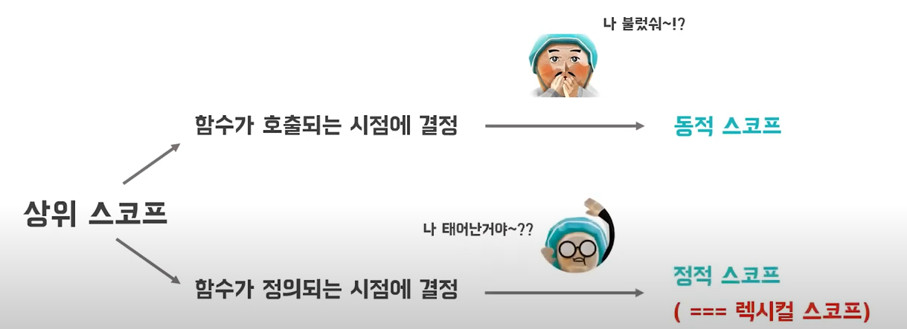
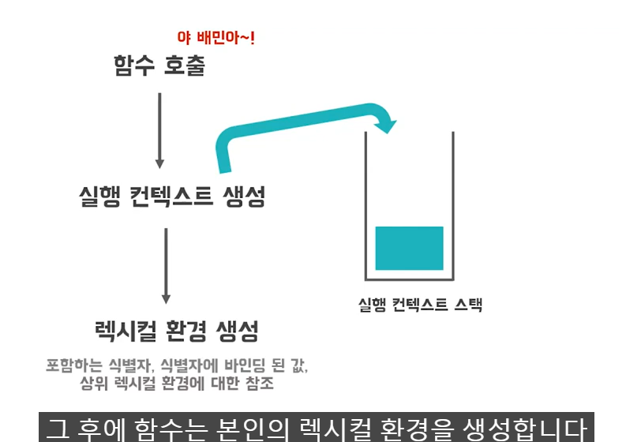

> 변수 x와 y에 대해 다른 코드가 참조할 수 있는 어떠한 범위가 결정되었다. 이러한 유효범위를 스코프라고 한다.

함수는 전역에서 정의될 수도 있지만, 어떠한 함수 내부 몸체에서 정의될 수도 있다.

> 중첩 함수를 포함하는 함수를 외부 함수라고 한다.

스코프가 함수의 중첩에 의해 계층적인 구조를 가질 수 있다는 것을 의미한다.

> 스코프가 계층적으로 연결이 되어 있는 것을 스코프 체인이라고 하고 이 스코프 체인은 물리적으로 존재한다. 변수를 참조할 때 자바스크립트 엔진은 스코프 체인을 통해 변수를 참조합니다. 현재 함수가 어떤 변수를 참조하려고 하는데 내 스코프 안에 원하는 변수가 없다? 상위 스코프로 올라간다. 계속해서 올라가면서 최상위 스코프인 전역 스코프까지 간다. 전역 스코프에서도 없다면 ReferenceError를 출력한다. 

> 함수 몸체와 더불어서 if문, for문과 같은 모든 코드 블록이 지역 스코프를 만듭니다. 이러한 특성을 블록 레벨 스코프라고 하는데요. 반면 자바스크립트에서 var 키워드로 선언된 변수는 오로지 함수 코드 블록만을 지역 스코프로 인정합니다. 
>
> ES6 이후로는 let과 const 키워드를 사용하면 자바스크립트에서도 함수 뿐만 아니라 if문, for문, while문, try catch문 등등 이와 같은 모든 블록 단위에 대한 스코프를 가질 수 있습니다.

> 프로그램 런타임 도중 실행 컨텍스트나 호출 컨텍스트에 의해서 스코프가 결정되는 것을 의미한다. 
>
> 함수가 정의되는 시점에 사우이 스코프가 결정되는 것을 정적 스코프 그리고 렉시컬 스코프라고 합니다. 자바스크립트는 렉시컬 스코프를 따르기 때문에 함수는 선언되자 마자 상위 스코프가 결정이 되고 해당 함수에 의해 함수 객체가 생성이 되면 해당 함수 객체는 본인의 상위 스코프를 항상 알 수 있게 됩니다. 이렇게 해당 함수가 상위 스코프를 항상 알 수 있게 되는 이유는 

> 함수는 태어나면서 자신의 내부 슬롯에 상위 스코프의 참조를 저장한다.

> 먼저 호출된 함수에서 실행 컨텍스트를 생성하고 이를 실행 컨텍스트 스택에 push한다. 그 후에 함수는 본인의 렉시컬 환경을 생성한다. 어떠한 코드가 어디서 실행이 되고 본인의 주변에 어떤 코드들이 있는지 대체적인 정보를 담고 있는 환경이라고 할 수 있습니다.  렉시컬 환경은 함수 본인 내부의 식별자, 그리고 식별자에 바인딩 된 값 등을 기록하고 있는 하나의 자료 구조 입니다. 마지막으로 코드의 실행이 끝나면 실행 컨텍스트 스택에서 해당 컨텍스트를 pop하여 제거합니다. 

> outer라는 함수가 하나 선언이 되어 있고 그 안에 변수 x가 선언이 되어 있습니다. 그리고 함수 내부에 inner라는 함수가 표현이 되어 있다. outer함수는 중첩 함수 inner를 엘라에게 반환하면서 생명주기를 마감하는 함수이다. 즉, outer 함수의 호출이 종료가 되면 outer 함수의 실행 컨텍스트는 실행 컨텍스트 스택에서 제거가 된다. 따라서 outer 함수의 지역 변수 x 또한 생명주기를 동시에 마감하게 되고, 지역 변수 x에 일단 접근할 수 없는 것처럼 보인다. 

> 중첩함수 inner가 이미 생명주기를 마감한 outer함수 즉, 내부 함수의 지역 변수 x를 참조할 수 있다면 이때 inner를 클로져라고 한다.

> outer 함수 종료 전 실행 컨텍스트 렉시컬 환경의 모습을 도식화 함. 