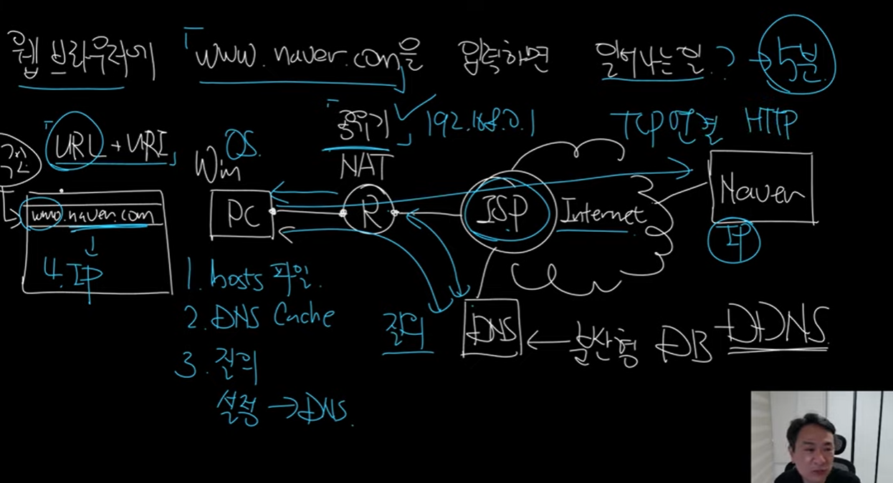

1. 우선 host파일을 뒤진다.
2. DNS 캐쉬로 저장한다
3. 해당 파일에 없으면 DNS서버로 요청을 보낸다(IP주소를 받지만 그때그때 달라질 수 있다. )
   - DNS는 분산형 DB로 구성되어있다
4. IP주소를 획득한 다음에 TCP 연결을 시도한다. 
5. 연결이 성공하면 HTTP Request가 나간다. 
6. Response가 오면 끝이다.

---

> Naver의 서버가 여러 개이다. 접속자 IP주소의 위치를 확인하고 가장 원활하게 통신할 수 있는 IP주소를 제공해준다. (반응성이 높은 IP주소를 알려준다)

부하 분산 어떻게 할건지?

장애 대응 어떻게 할건지?

DNS 스푸핑 어떻게 할지?

무중단 배포 해봤어?

- 서비스가 중지되지 않고 version up하는 것이다.

---

GSLB + CDN에 대해서 이야기 해야한다. 

> akamai가 있으면 CDN을 쓰고 있다고 알고 있으면 된다.
>
> KT도 CDN을 제공해준다. 

### CDN을 사용하는 이유?

### GSLB를 구현하는 방법

> DNS + System제작(DNS)  + health check

