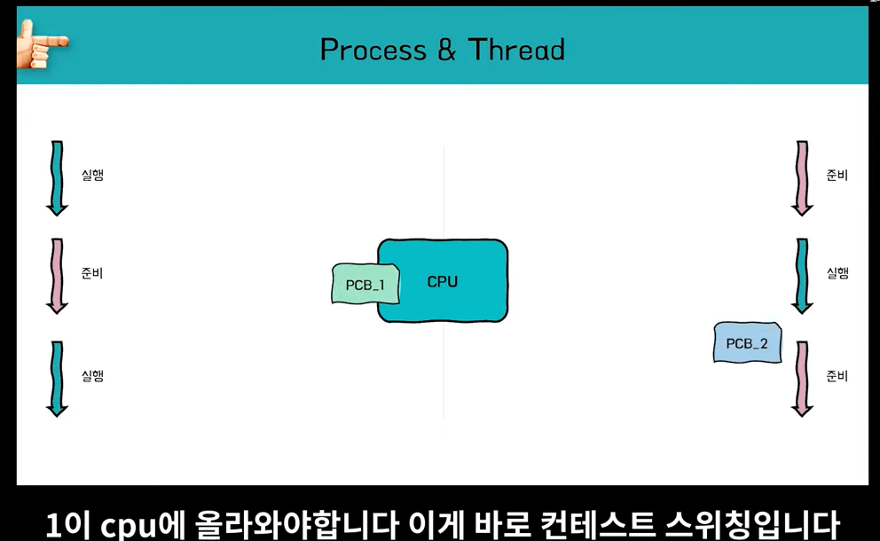

> 동시에 작업이 이루어지는 것이 아니라 작업이 아주 빠르게 진행되어서 거의 동시에 진행되는 것처럼 보이는 것을 의미한다. 프로세스와 스레드 모두 완전히 다른 무언가가 아님.

특정 목적이나 동작을 수행하기 위해 실행 코드들을 모아놓은 상태를 프로그램이라고 한다. 이를 실행시키게 되면 이때부터 프로세스라고 부른다.

프로그램이 실행되면 먼저 프로세스가 필요로 하는 재료들이 메모리에 올라간다.

> 메모리 영역에 code, data, stack, heap 영역이 생성되고 동시에 프로세스에 대한 정보를 담고 있는 PCB(Process Control Block) 블럭이 생성된다.
>
> - 준비상태나 대기상태의 큐를 구현하기 위해 필요한 포인터
>
> - 현재 프로세스 상태를 담는 process state
> - 고유번호를 담는 PID
> - 다음 명령어를 가리키는 프로그램 카운터

다수의 프로세스를 동시에 실행을 하기 위해 여러 개 프로세스를 시분할로, 즉 짧은 텀을 반복하면서 전환해서 실행을 시키도록 한다. 

> 컨텍스트 스위치 -> 문맥 교환을 통해서 CPU를 점유하고 사용한다. 준비 -> 실행을 반복

>  하나의 프로세스 안에 다수의 쓰레드가 있을 때 공유되는 자원이 있다. 프로세스의 메모리 구조는 Code, data, stack, heap이 있는데 여기서 스레드는 코드, 데이터, 힙 영역을 공통된 자원으로 사용한다. 공유되는 자원이 있기 때문에 컨텍스트 스위칭이 일어날 때 캐싱 적중률이 올라간다. 쉽게 말해서 모조리 다 빼고 다시 넣을 필요가 없다는 의미이다. 

- 멀티 프로세스와 멀티 스레드 이 두 가지 개념이 모두 처리방식의 일종이다. 한 어플리케이션에 대한 처리방식이라고 생각을 하면 편하다. 

- 단순히 여러 프로그램을 띄워 놓고 멀티 프로세스라고 이야기를 한다면 멀티 쓰레드란 개념과 비교를 해서 이해하기가 힘들다. 
- 여기서는 한 어플리케이션에 대한 두 가지 다른 처리 방식에 대해 이야기를 한다. 

- 한 어플리케이션이 여러 가지 일을 처리할 때가 있다. 
  - 예를 들어서 여러 사용자가 로그인을 요청하는 상황이 있다고 해보자
  - 한 프로세스는 매번 하나의 로그인만 처리할 수 있기 때문에 동시에 처리할 수 없다. 
  - 그래서 부모 프로세스가 fork()를 해서 자식 프로세스를 여러 개 만들어서 일을 처리하도록 한다.
  - 자식 프로세스는 부모와 별개의 메모리 영역을 확보한다.

- 스레드는 한 프로세스 내에서 구분되어진 실행 단위이다. 

  - 프로세스 내에서 분리해서 여러 스레드로 나뉘어서 실행단위가 나뉘어지면 그게 멀티 스레드이다.
  - 인텔리제이로 테스트를 돌리면서 소스코드를 수정해야 할 때도 있다.
  - 한 어플리케이션에 대한 작업의 단위가 나누어질 때가 많다. 
  - 이때 각각의 쓰레드가 그 작업들을 담당한다.

- 차이점

- 프로세스

  - 프로세스는 독립적이기 때문에 IPC를 통해서 통신을 해야 한다.
    - 예를 들어 사람 두명이 두 개의 회의실에서 같은 작업을 하다가 논의할 일이 있으면 회의실을 나와서 얘기해야 한다는 의미이다.
  - 자원이 소모적이고 메모리를 더 차지한다.

  - 컨텍스트 스위칭 비용도 비싸다 

  - 개별적이기 때문에 동기화 작업에 신경을 덜 써도 된다.

- 스레드

  - 공유자원이 많아 긴밀하게 연결이 되어 있다.
  - 동기화에 신경을 써야하고 공유된 자원으로 메모리가 효율적이고 통신 비용도 절감된다.

  - 컨텍스트 스위칭 비용도 적다

이전 인터넷 익스플로어는 멀티 스레드를 사용했기 때문에 하나의 탭에 문제가 생기면 전체가 꺼진다.

구글은 멀티 프로세스를 사용해서 멀티탭 간의 영향을 덜 받는다.

- 멀티 코어는 하드웨어의 측면에 가깝다
- 멀티 코어와 관견된 키워드는 동시성과 병렬처리이다.

- 싱글코어를 가진 cpu가 실행 단위를 처리할 때는 동시에 여러 가지가 진행되기 위해서 빠른 텀으로 전환이 되면서 실행이 된다.

- 동시성은 이렇게 짧은 순간에 cpu의 시간을 분할해서 동시에 하는 것처럼 보이게 한다.

- 멀티코어는 병렬 처리, 물리적으로 여러 코어를 사용해서 다수의 실행 단위를 한순간에 처리할 수 있게 해준다.

---

- 리눅스 커널에서는 프로세스와 스레드를 동일하게 본다.

- 스레드는 사용자 스레드와 커널 스레드로 나뉜다.

- 리눅스는 일대일 모델로 사용자 스레드당 커널 스레드 하나가 매칭이 되어 있다.

- 그래서 리눅스 커널 입장에서 보면 각각의 쓰레드가 하나의 프로세스다 라고 표현한다.

- 프로세스가 메모리를 공유한다. light weight process라고 구분해서 부른다.

> 더 자세히 보면 tgid라고 스레드 그룹 아이디를 가지고 있고 tid 쓰레드 아이디라는 것도 있다. 사용자 레벨 입장에서 보면 이 스레드 그룹 아이디가 pid로 보여지고, 커널 입장에서 보면 tid가 pid로 인식이 된다.

