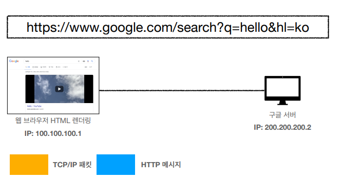

# URI와 웹 브라우저 요청 흐름

- URI(Uniform Resource Identifier)
  - URI는 locator, name 또는 둘 다 추가로 분류될 수 있다

- URI 단어 뜻

  - Uniform: 리소스 식별하는 통일된 방식
  - Resouce: 자원, URI로 식별할 수 있는 모든 것(제한 없음)
  - Identifier: 다른 항목과 구분하는데 필요한 정보

- URL - Locator: 리소스가 있는 위치를 지정

- URN - Name: 리소스에 이름을 부여

- 위치는 변할 수 있지만, 이름은 변하지 않는다.

  

### URL 전체 문법

- scheme
  - 주로 프로토콜 사용
  - 프로토콜: 어떤 방식으로 자원에 접근할 것인가 하는 약속 규칙(클라이언트와 서버 간의 약속과 규칙)
    - 예) http, https, ftp 등등
  - http는 80 포트, https는 443 포트를 주로 사용, 포트는 생략 가능
  - https는 http에 보안 추가 (HTTP Secure)

- userinfo
  - URL에 사용자정보를 포함해서 인증
  - 거의 사용하지 않음
- host
  - 호스트명
  - 도메인명 또는 IP주소를 직접 사용 가능

- PORT
  - 포트
  - 접속 포트
  - 일반적으로 생략, 생략 시 http는 80, https는 443
- path
  - 리소스 경로(path), 계층적 구조
  - 예)
    - /home/file1.jpg
    - /members/100
- query
  - key=value형태
  - ?로 시작, &로 추가 가능 ?keyA=valuea&keyB=valueB
  - query parameter, query string 등으로 불림, 웹서버에 제공하는 파라미터, 문자 형태

- fragment
  - html 내부 북마크 등에 사용
  - 서버에 전송하는 정보 아님

# 웹 브라우저의 요청 흐름

- 웹 브라우저에 HTTP 메시지를 생성하고, SOCKET 라이브러리가 3way handshake로 구글 서버와 연결을 진행
- 그리고 데이터를 전달하고 TCP/IP에서 TCP/IP 패킷 생성

