# 클라이언트 서버-구조

- Request Response 구조
- 클라이언트는 서버에 요청을 보내고, 응답을 대기
  - 서버와 클라이언트를 구분하고 독립적으로 만들면서 서로에게 특화된 방향으로 발전
  - 클라이언트는 UX, UI에 집중, 서버는 데이터 가공, 처리, 보안 등에 집중
- 서버가 요청에 대한 결과를 만들어서 응답

# 무상태 프로토콜

- 스테이스리스(Stateless)
  - 서버가 클라이언트의 상태를 보존X(문맥을 보존)
  - 장점: 서버 확장성 높음(스케일 아웃)
  - 단점: 클라이언트가 추가 데이터 전송

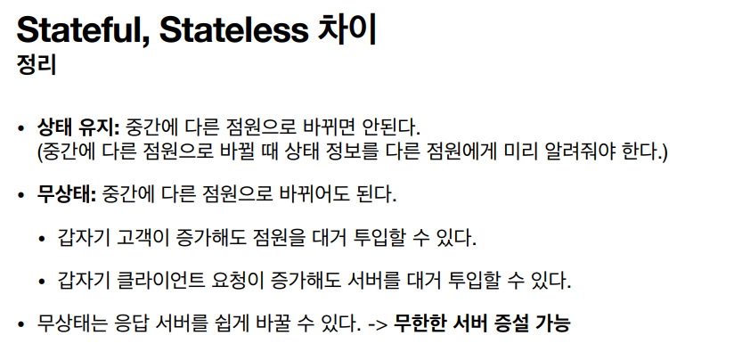

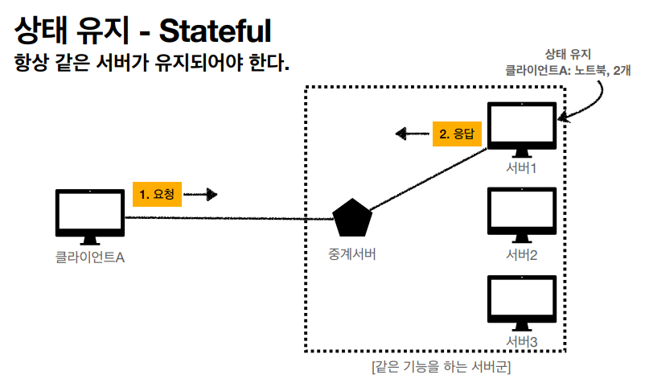

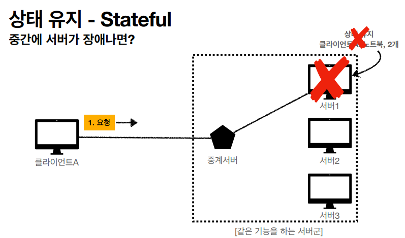

- 상태 유지일 경우 하나의 서버에서만 담당해야하고, 서버가 다운이 되는 경우에는 가지고 있던 데이터들이 모두 잃어버리게 된다.

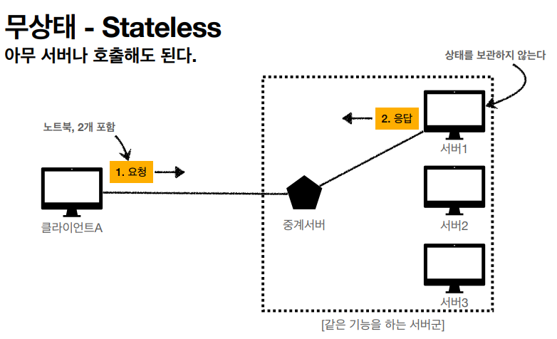

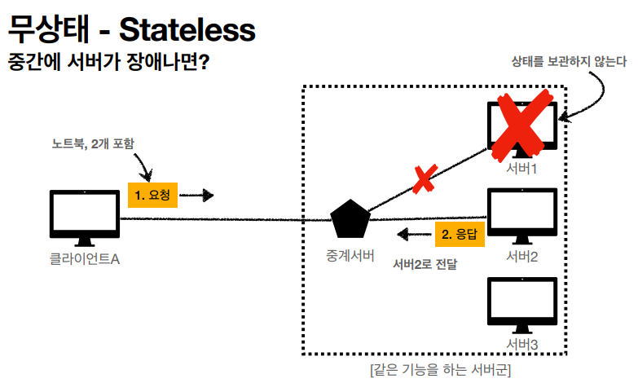

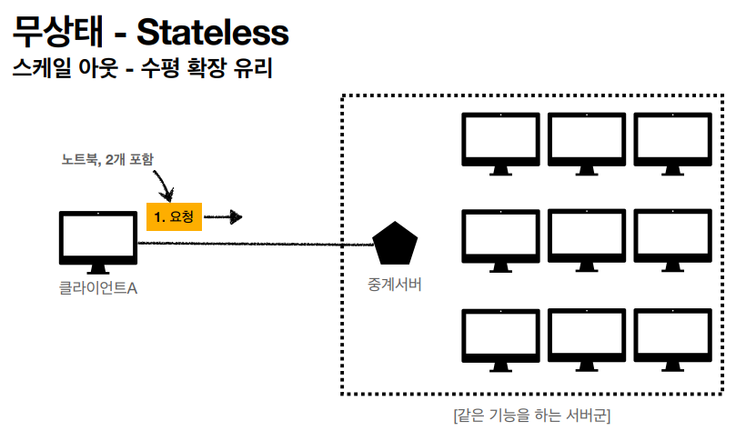

### Stateless 실무 한계

- 모든 것을 무상태로 설계 할 수 있는 경우도 있고 없는 경우도 있다.
- 무상태
  - 예) 로그인이 필요 없는 단순한 서비스 소개 화면
- 상태 유지
  - 로그인
- 로그인한 사용자의 경우 로그인 했다는 상태를 서버에 유지
- 일반적으로 브라우저 쿠키와 서버 세션등을 사용해서 상태 유지
- 요청 시 많은 데이터를 보내게 된다.
- 상태 유지는 최소한만 사용

### 비 연결성

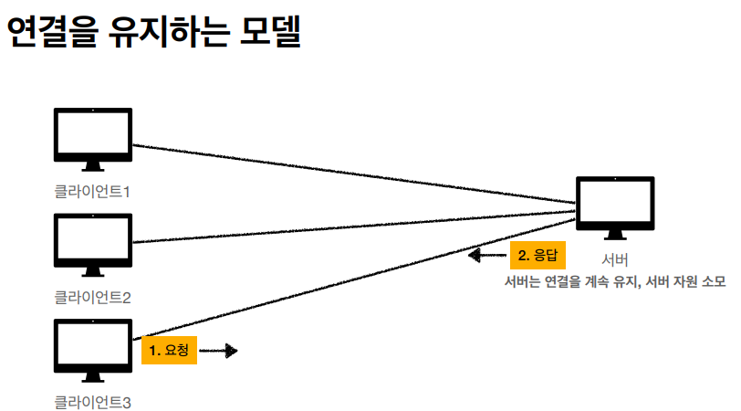

- 클라이언트가 요청하지 않아도 계속 연결하고 있어야함

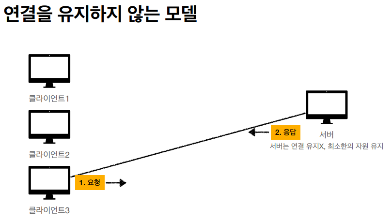

- HTTP는 기본이 연결을 유지하지 않는 모델
- 일반적으로 초 단위 이하의 빠른 속도로 응답
- 1시간 동안 수천명이 서비스를 사용해도 실제 서버에서 동시에 처리하는 요청은 수십개 이하로 매우 작음
  - 예) 웹 브라우저에게 계속 연속해서 검색 버튼을 누르지는 않는닫.
- 서버 자원을 매우 효율적으로 사용할 수 있음

### 비 연결성 한계와 극복

- TCP/IP 연결을 새로 맺어야 함- 3 way handshake 시간 추가
- 웹 브라우저로 사이트를 요청하면 HTML 뿐만 아니라 자바스크립트, css, 추가 이미지 등등 수많은 자원이 함께 다운로드
- 지금은 HTTP 지속 연결(Persistent Connections)로 문제 해결
- HTTP/2, HTTP/3에서 더 많은 최적화

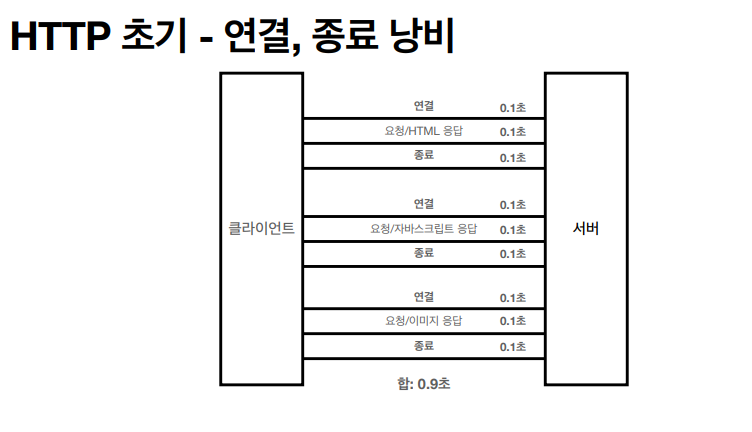

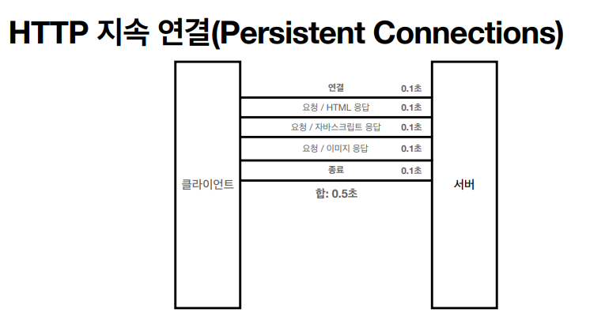

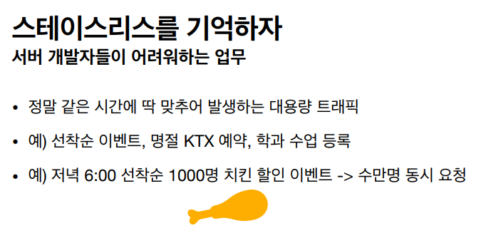

- 최대한 스테이스리스가 되도록 짜야한다.

### HTTP 메시지

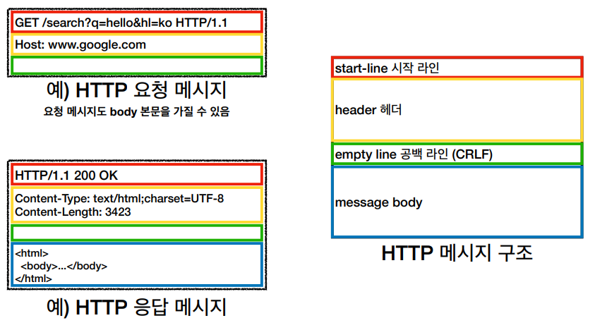

- 응답은 HTTP 버전이 들어간다
- 무조건 공백 라인이 필요하다

### 요청 메시지

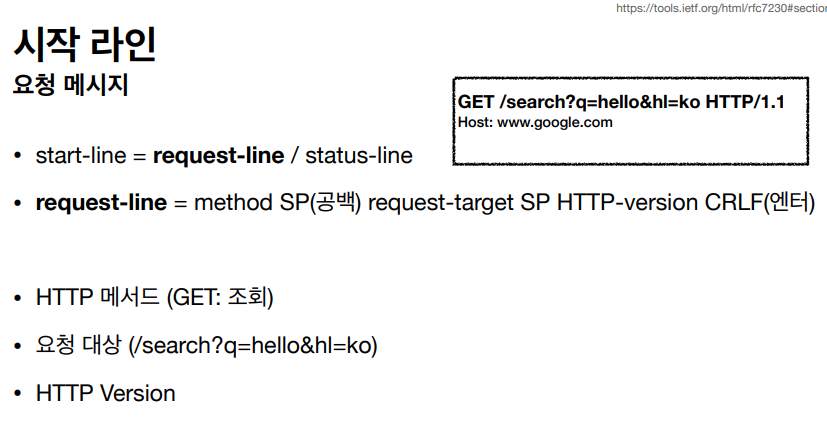

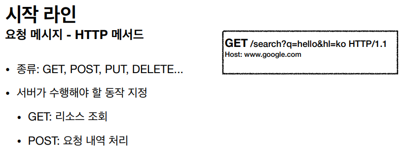

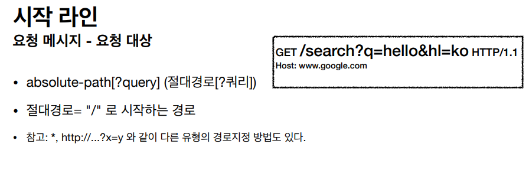

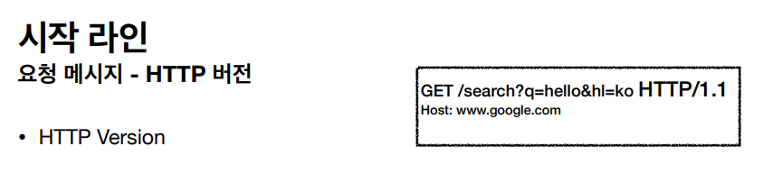

### 응답 메시지

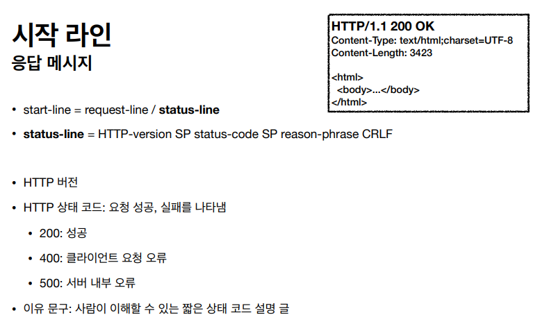

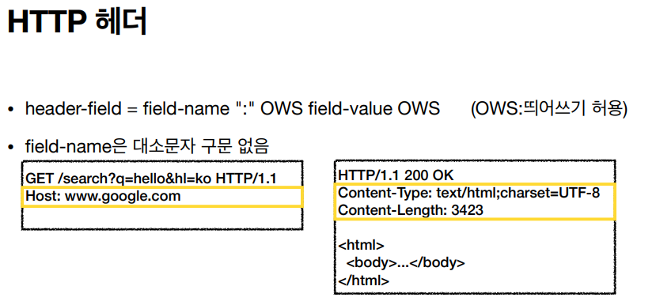

> OWS: 띄어쓰기를 허용한다. 띄어 써도 되고 안 써도 된다
>
> field-name은 대소문자 구분이 없지만, value는 구분한다

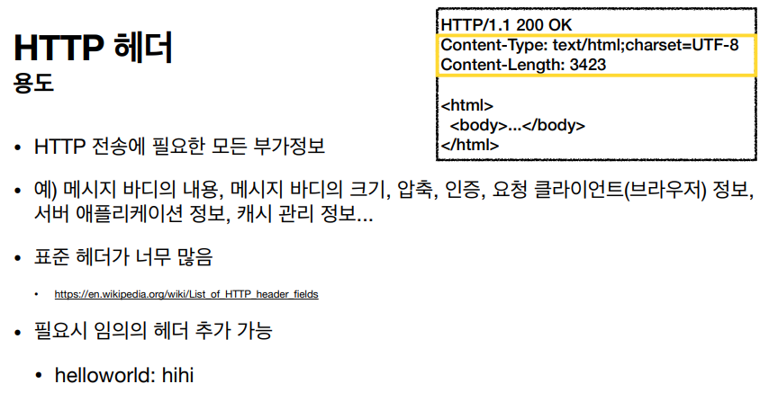

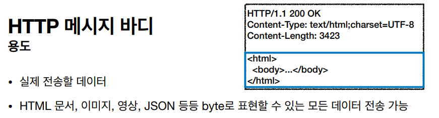

### HTTP의 특징

- HTTP는 단순하다. 스펙도 읽어볼만...
- HTTP 메시지도 매우 단순
- 크게 성공하는 표준 기술은 단순하지만 확장 가능한 기술

### HTTP 정리

- HTTP 메시지에 모든 것을 전송
- HTTP 역사 HTTP/1.1을 기준으로 학습
- 클라이언트 서버 구조
- 무상태 프로토콜(스테이스리스)
- HTTP 메시지
- 단순함, 확장 가능
- 지금은 HTTP 시대