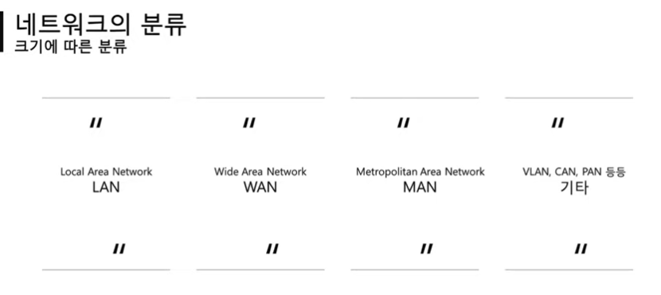
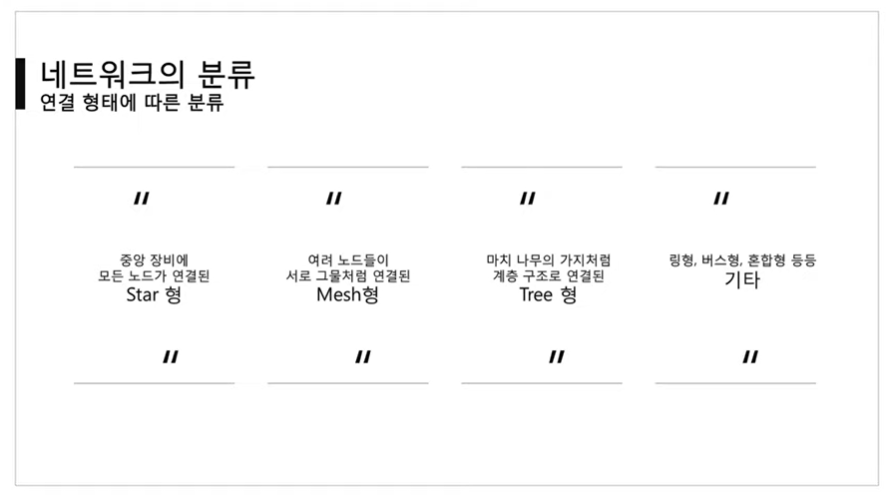
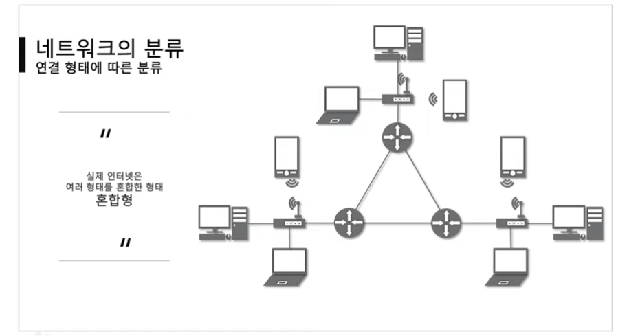
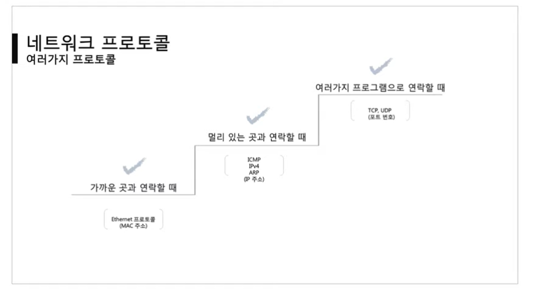
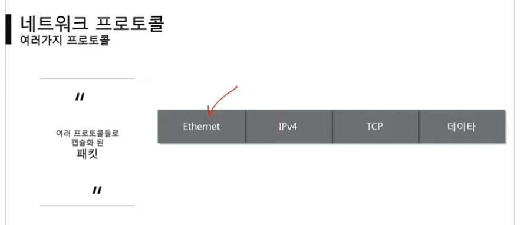
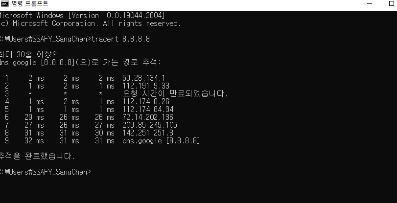
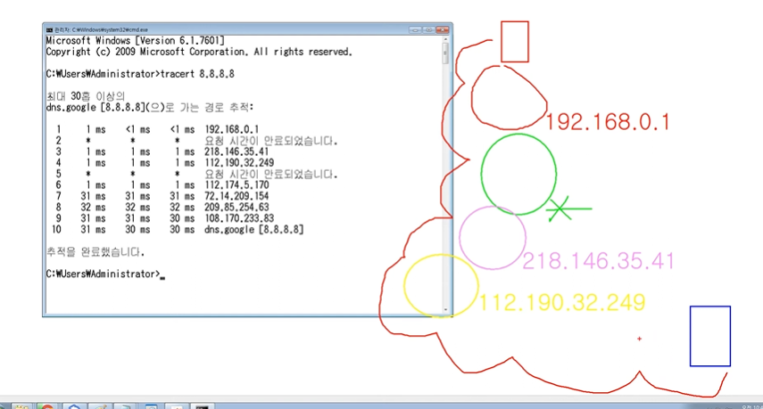
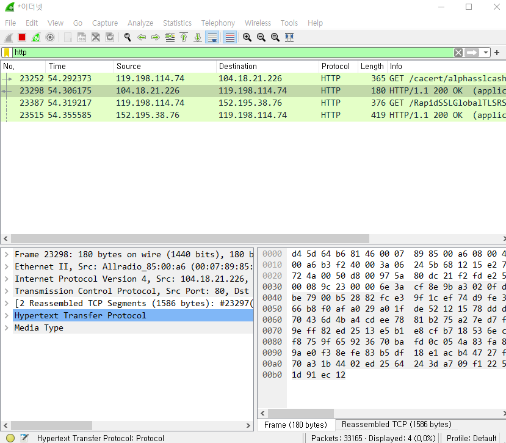

# 네트워크란?

### 정의

노드들이 데이터를 공유할 수 있게 하는 디지털 전기통신망의 하나이다.

즉, 분산되어 있는 컴퓨터를 통신망으로 연결 한 것을 말한다.

네트워크에서 여러 장치들은 노드 간 연결을 사용하여 서로에게 데이터를 교환한다.

### 인터넷이란?

문서, 그림 영상과 같은 여러가지 데이터를 공유하도록 구성된 전세계를 연결하는 네트워크

**월드 와이드 웹**(World Wide Web, WWW, W3)은 [인터넷](https://ko.wikipedia.org/wiki/인터넷)에 연결된 [컴퓨터](https://ko.wikipedia.org/wiki/컴퓨터)를 통해 사람들이 정보를 공유할 수 있는 전 세계적인 정보 공간을 말한다. 간단히 **웹**(the Web)이라 부르는 경우가 많다. 이 용어는 인터넷과 동의어로 쓰이는 경우가 많으나 엄격히 말해 서로 다른 개념이다. 웹은 [전자 메일](https://ko.wikipedia.org/wiki/전자_메일)과 같이 인터넷 상에서 동작하는 하나의 서비스일 뿐이다

- LAN: 가까운 지역을 하나로 묶은 네트워크
- WAN: 멀리 있는 지역을 한데 묶은 네트워크, LAN과 LAN을 묶은 것

---

### 📌실습1(tracert)

- google로 접속하기 위핸 랜 대역들
  - IP주소를 공개하지 않는 곳이 있다(방화벽)
  - 홉 단위를 사용한다
  - 대부분 15개 이내로 연결되어 있다.

---

### 📌실습2(WireShark)

- 사용되고 있는 프로토콜을 시각적으로 보여주는 프로그램

- WinPcap다운필요
- HTTP, TCP, IPv4, Ethernet 등등 다양한 프로토콜을 함께 사용하고 있다

🔥 실행되지 않을 때에는 관리자 권한으로 실행 필요

---

출처: [[따라學IT\] 01. 네트워크란 무엇인가? - YouTube](https://www.youtube.com/watch?v=Av9UFzl_wis&list=PL0d8NnikouEWcF1jJueLdjRIC4HsUlULi&index=2)