# 상태 코드

- 클라이언트가 보낸 요청의 처리 상태를 응답에서 알려주는 기능
  - 1xx(Informational): 요청이 수신되어 처리중
  - 2xx(Successful): 요청 정상 처리
  - 3xx(Redirection):요청을 완료하려면 추가 행동이 필요
  - 4xx(Client Error): 클라이언트 오류, 잘못된 문법 등으로 서버가 요청을 수행할 수 없음
  - 5xx(Server Error): 서버 오류, 서버가 정상 요청을 처리하지 못함

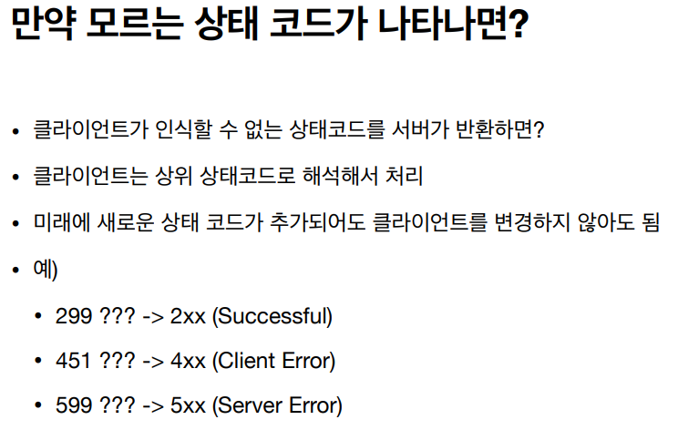

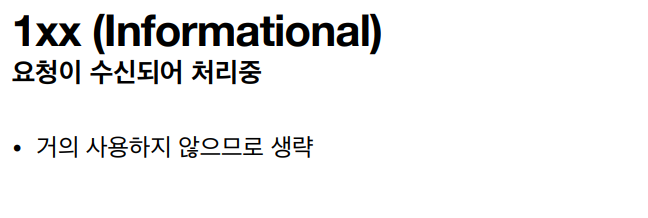

### 2xx(Successful)

- 클라이언트의 요청을 성공적으로 처리
  - 200 OK
  - 201 Created(리소스를 생성시켰을 때)
  - 202 Accepted
  - 204 No Content

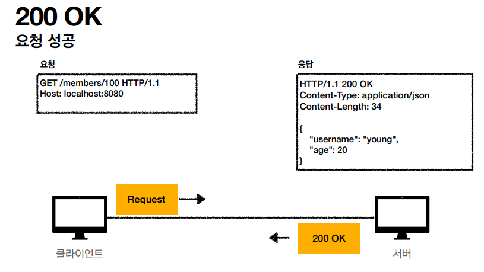

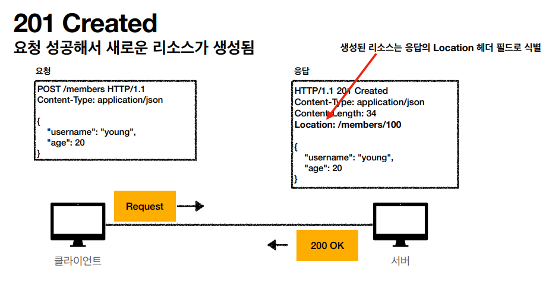

- 새로 생성된 리소스의 URI를 응답함

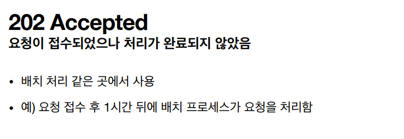

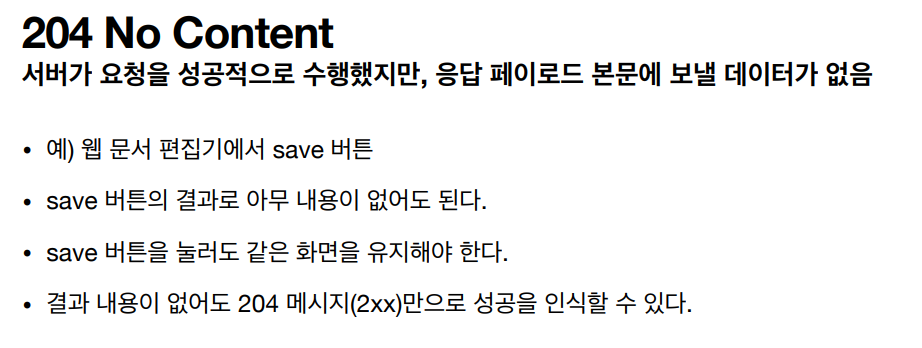

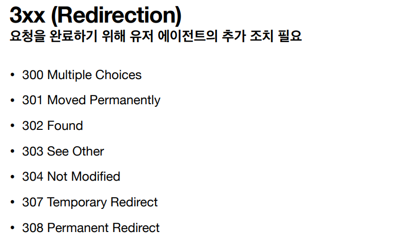

### 리다이렉션 이해

- 웹 브라우저는 3xx 응답의 결과에 Location 헤더가 있으면, Location 위치로 자동 이동(리다이렉트)

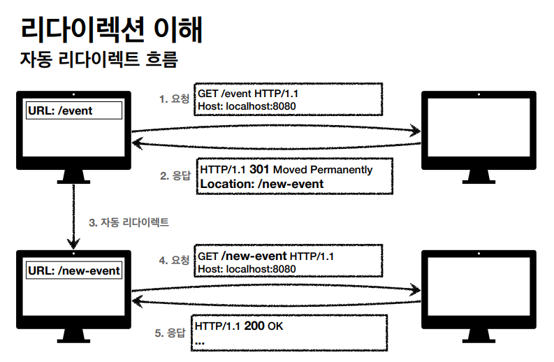

- 이전 이벤트의 경로를 더 이상 사용하지 않을 경우 리다이렉트를 활용해서 새로운 이벤트 경로로 리다이렉트할 수 있다.

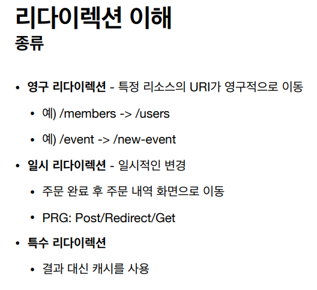

### 영구 리다이렉션(301, 308)

- 리소스의 URI가 영구적으로 이동
- 원래의 URL을 사용 X, 검색 엔진 등에서도 변경 인지
- 301 Moved Permanently
  - 리다이렉트시 요청 메서드가 GET으로 변하고, 본문이 제거될 수 있음(MAY)
- 308 Permanent Redirect
  - 301과 기능은 같음
  - 리다이렉트시 요청 메서드와 본문 유지(처음 POST를 보내면 리다이렉트도 POST 유지)

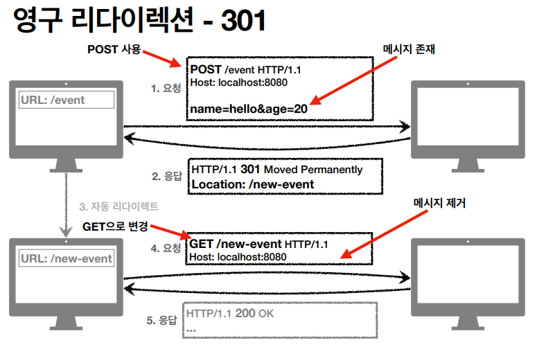

> POST로 입력값과 함께 넘겼지만 리다이렉트 후 GET으로 변경되면서 다시 입력해야하는 상황이 온다.

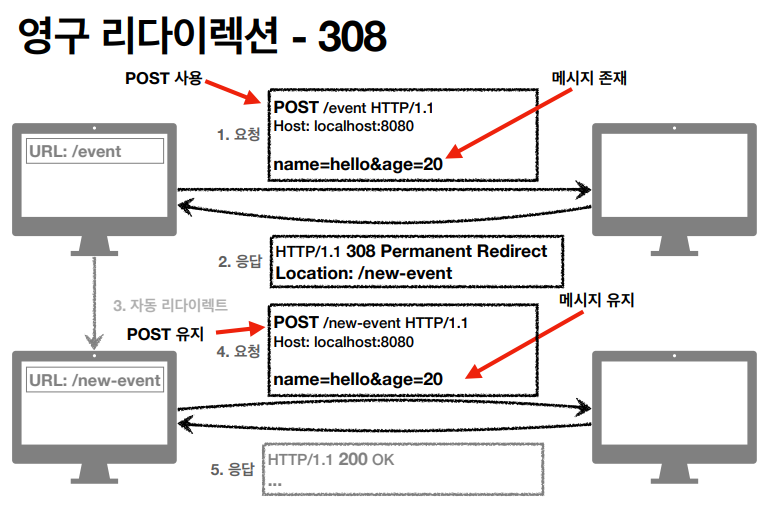

> 308인 경우에는 HTTP 메서드와 메시지를 유지해서 데이터가 등록이 될 수 있게 해준다. 301과 308은 거의 사용되지 않는다.

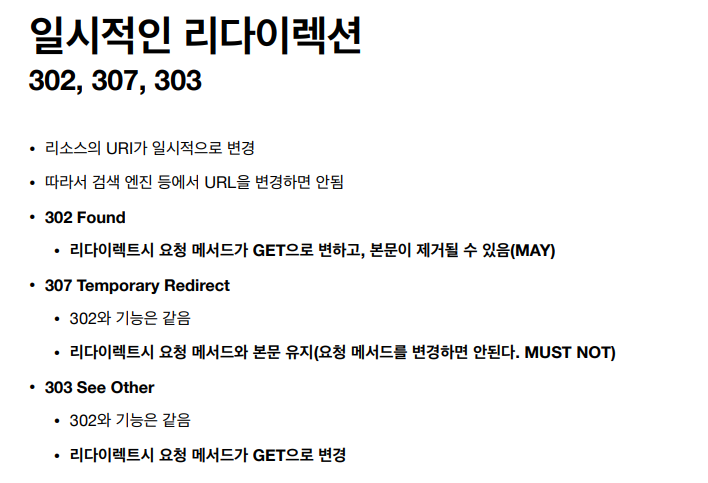

> 302는 불확실, 307과 303은 명확하게 변경된다. 실무에서는 주로 302를 사용한다.

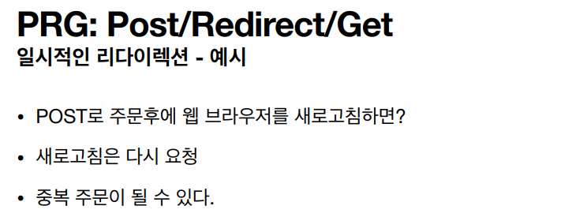

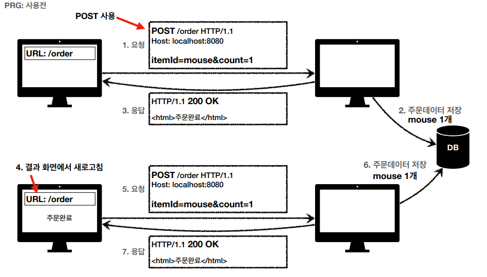

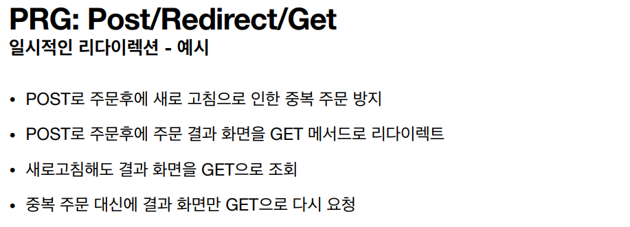

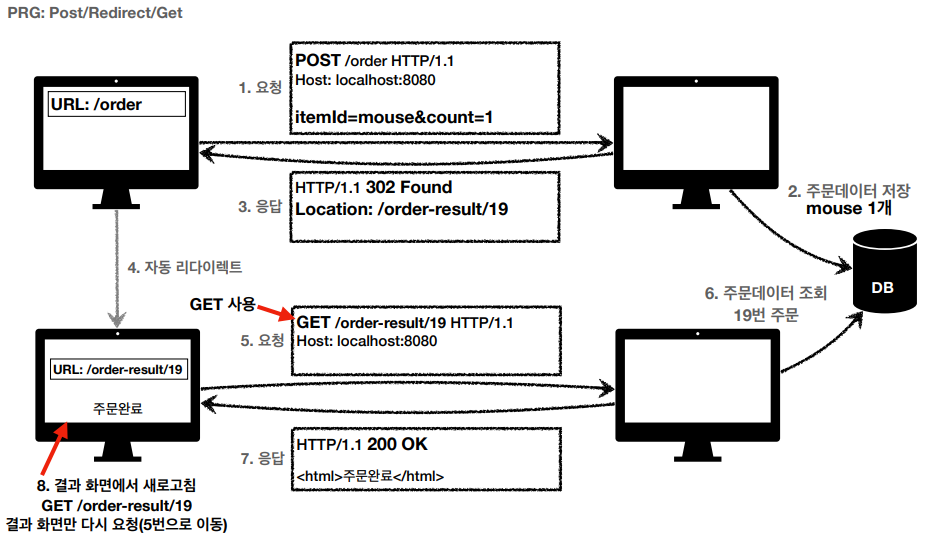

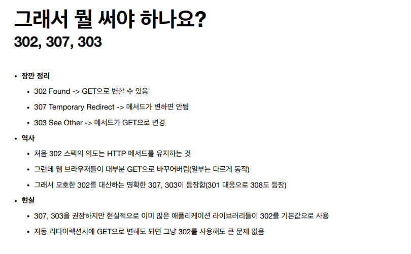

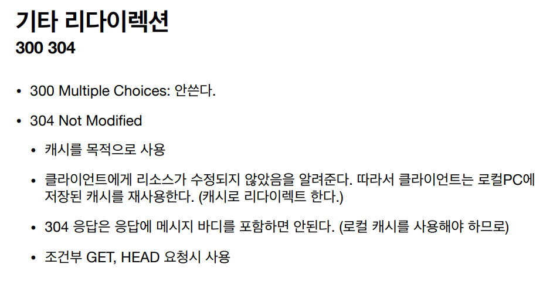

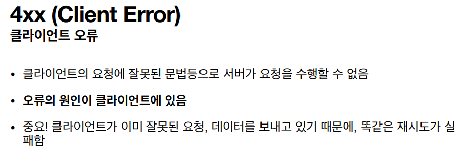

> 5xx는 서버가 복구되면 응답이 가능해짐, 4xx은 요청 자체가 잘못되어 재시도가 계속 실패

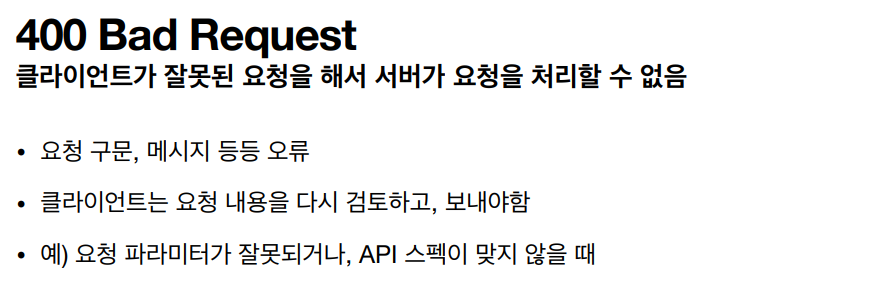

> 숫자를 보내야하는데 문자를 보내는 등 잘못된 요청을 했을 때 발생

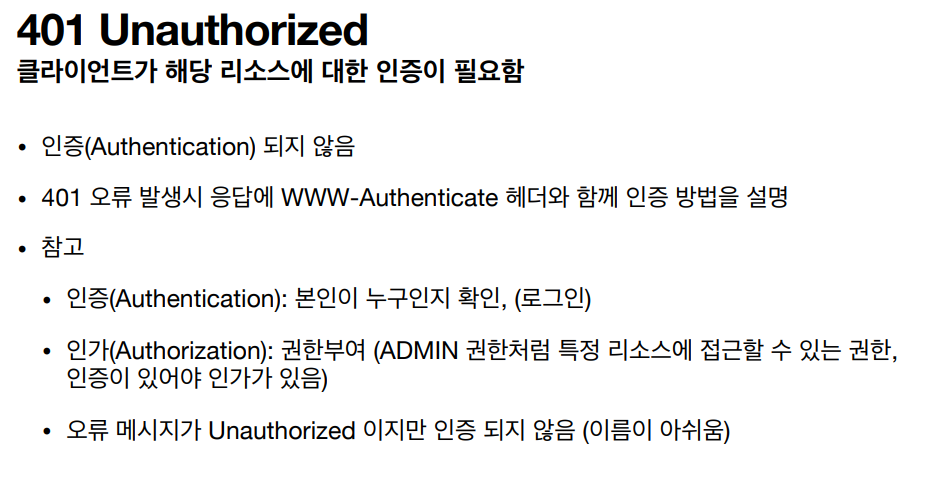

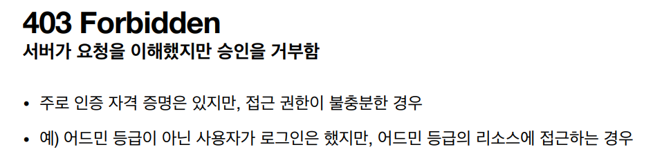

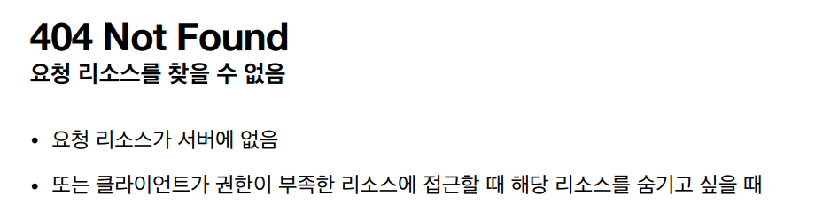

> 잘못된 URL을 쳤거나, 리소스를 아예 숨긴 경우

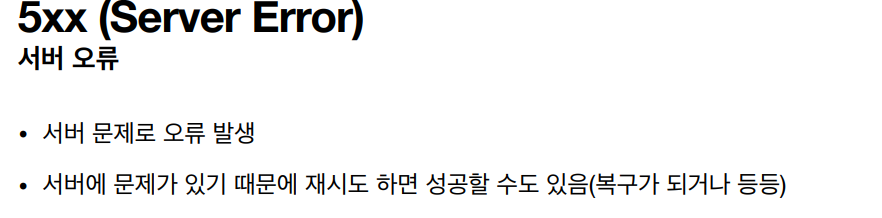

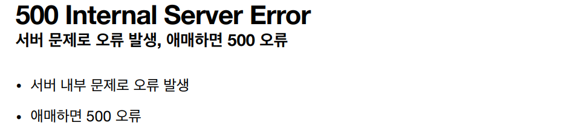

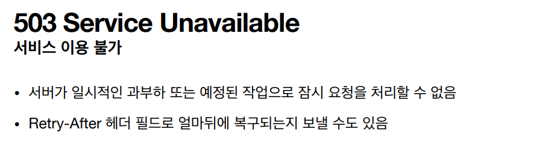

> 5xx의 오류는 정말 서버에 문제가 있을 경우에만 활용
>
> 잔고가 없거나 제한 연령이 맞지 않을 경우 서버 에러로 표시하는 경우가 있는데 그럴 때는 사용하지 않는 것이 좋다