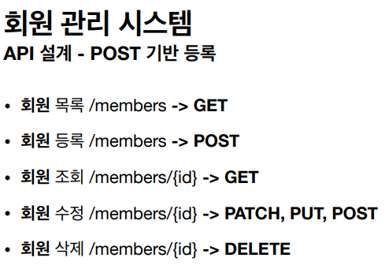
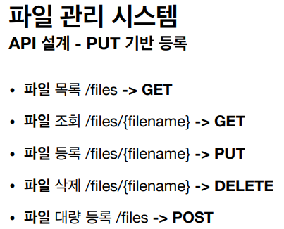
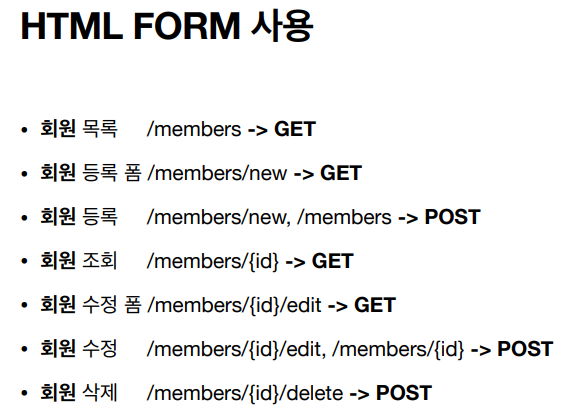
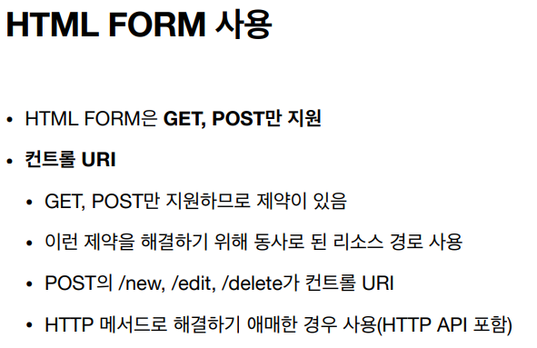
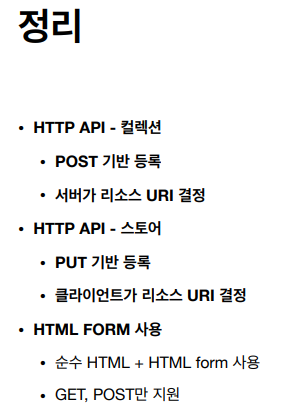
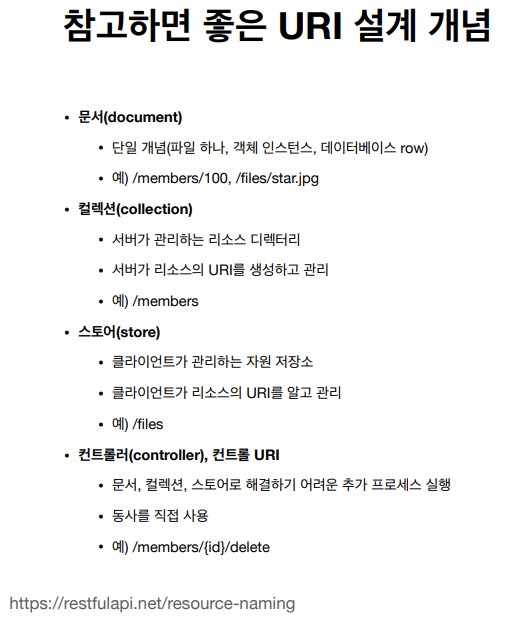

# HTTP API 설계

- HTTP API - 컬렉션
  - POST기반 등록
  - 예) 회원 관리 API 제공
- HTTP API - 스토어
  - PUT 기반 등록
  - 예) 정적 컨텐츠 관리, 원격 파일 관리
- HTML FORM사용
  - 웹 페이지 회원 관리
  - GET, POST만 지원

- PUT은 전체를 덮어 쓰기 때문에 부분 수정할 때는 좋지 않음
  - 예) 게시글, 댓글은 부분 수정을 잘 하지 않기 때문에 PUT을 활용하는 게 낫다
- PUT과 PATCH 모두 애매할 경우 POST를 사용

### 회원 관리 시스템

- POST - 신규 자원 등록 특징
- 클라이언트는 등록될 리소스의 URI를 모른다.
  - 회원등록 /members -> POST
  - POST /members
- 서버가 새로 등록된 리소스 URI를 생성해준다
  - HTTP/1.1 201 Created
  - Location: /members/100
- 컬렉션(Collection)
  - 서버가 관리하는 리소스 디렉토리
  - 서버가 리소스의 URI를 생성하고 관리
  - 여기서 컬렉션은 /members

> POST에서는 서버가 URI를 생성하고 관리한다.

### 파일 관리 시스템

- API 설계 - PUT 기반 등록

- PUT - 신규 자원 등록 특징
- 클라이언트가 리소스 URI를 알고 있어야 한다.
  - 파일 등록/files/{filename} -> PUT
  - PUT /files/star.jpg
- 클라이언트가 직접 리소스의 URI를 지정한다.
- 스토어(Store)
  - 클라이언트가 관리하는 리소스 저장소
  - 클라이언트가 리소스의 URI를 알고 관리
  - 여기서 스토어는 /files

### HTML FORM 사용

- HTML FORM은 GET, POST만 지원
- AJAX 같은 기술을 사용해서 해결 가능 -> 회원 API 참고
- 여기서는 순수 HTML, HTML FORM이야기
- GET, POST만 지원하므로 제약이 있음

- 회원 등록폼과 회원 등록의 URI는 맞춰주는 게 좋다
  - validation과 관련되서 처리할 때 편리함

