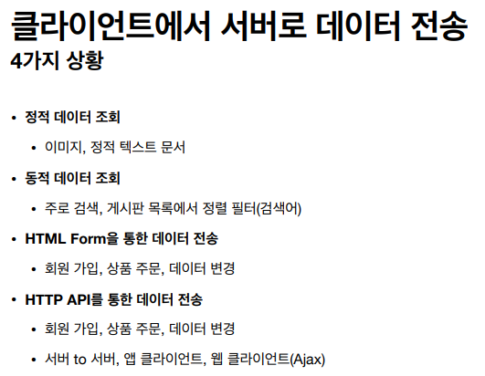
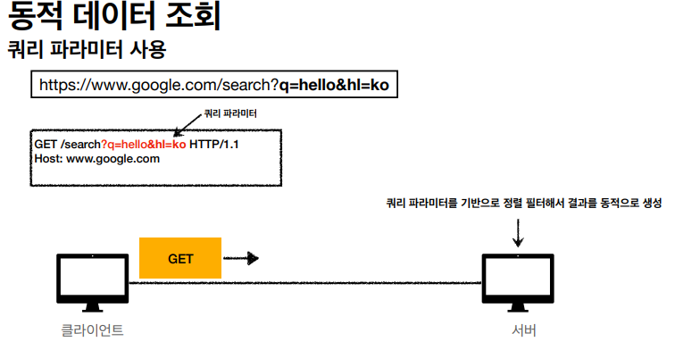
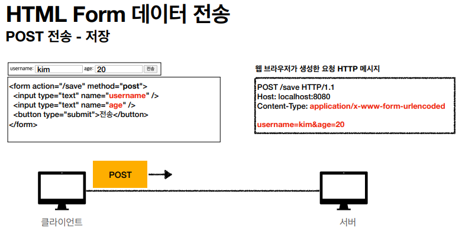
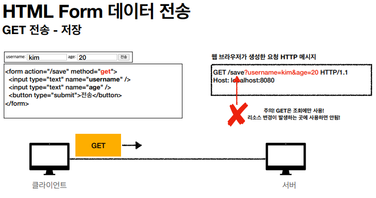
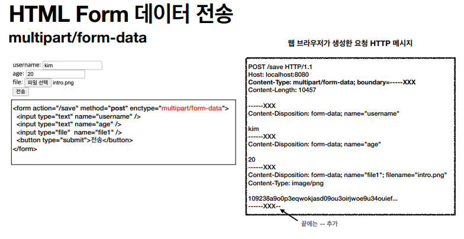
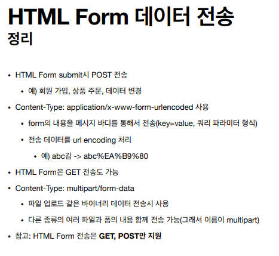

# HTTP 메서드 활용

### 클라이언트에서 서버로 데이터 전송

- 쿼리 파라미터를 통한 데이터 전송
  - GET
  - 주로 정렬 필터(검색어)
- 메시지 바디를 통한 데이터 전송
  - POST, PUT, PATCH
  - 회원 가입, 상품 주문, 리소스 등록, 리소스 변경

- 정적 데이터 조회
  - 이미지, 정적 텍스트 문서
  - 조회는 GET 사용
  - 정적 데이터는 일반적으로 쿼리 파라미터 없이 리소스 경로로 단순하게 조회 가능

- 동적 데이터 조회
  - 주로 검색, 게시판 목록에서 정렬 필터(검색어)
  - 조회 조건을 줄여주는 필터, 조회 결과를 정렬하는 정렬 조건에 주로 사용
  - 조회는 GET 사용
  - GET은 쿼리 파라미터 사용해서 데이터를 전달

- 웹 브라우저가 쿼리파라미터와 거의 유사한 방식으로 데이터를 바디에 넣은 후 전송

- GET은 메시지 바디에 넣지 않고 쿼리파라미터로 취급해서 넣음

### 파일 전송 시

- binary 데이터를 전송할 때 주로 사용

### HTTP API 데이터 전송

- 서버 to 서버
  - 백엔드 시스템 통신: 서버끼리는 HTML이 필요없음
- 앱 클라이언트
  - 아이폰, 안드로이드
- 웹 클라이언트
  - HTML에서 Form 전송 대신 자바 스크립트를 통한 통신에 사용(AJAX)
  - 예) React, Vue.js 같은 웹 클라이언트와 API 통신
- POST, PUT, PATCH: 메시지 바디를 통해 데이터 전송
- GET: 조회, 쿼리 파라미터로 데이터 전달
- Content-Type: application/json을 주로 사용(사실상 표준)
  - TEXT, XML, JSON 등등

> 기존에는 XML을 주로 사용했지만, 표현이 복잡하고 읽기 쉬집 않아서 거의 JSON을 활용. 간단하고 읽기 쉽고, 데이터도 상대적으로 작아서 사용.