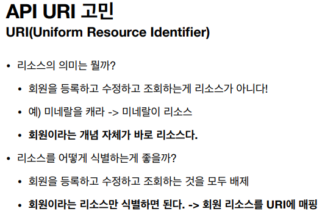
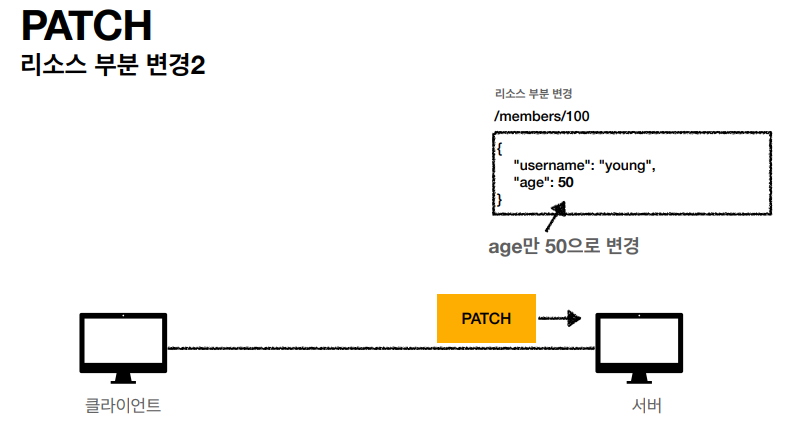

# HTTP 메서드

### 설계 시 중요한 것은 리소스 식별

- URI는 리소스만 식별
- 리소스와 해당 리소스를 대상으로 하는 행위를 분리
  - 리소스: 회원
  - 행위: 조회, 등록, 수정, 삭제
- 리소스는 명사, 행뒤는 동사

### HTTP 메서드 종류

- GET: 리소스 조회
- POST: 요청 데이터 처리, 주로 등록에 사용
- PUT: 리소스를 대체, 해당 리소스가 없으면 생성
- PATCH: 리소스 부분 변경
- DELETE: 리소스 삭제

> - HEAD: GET과 동일하지만 메시지 부분을 제외하고, 상태 줄과 헤더만 반환
> - OPTIONS: 대상 리소스에 대한 통신 가능 옵션(메서드)을 설명(주로 CORS에서 사용)
> - CONNECT: 대상 자원으로 식별되는 서버에 대한 터널을 설정
> - TRACE: 대상 리소스에 대한 경로를 따라 메시지 루프백 테스트를 수행

### GET

- 리소스 조회
- 서버에 전달하고 싶은 데이터는 query(쿼리 파라미터, 쿼리 스트링)를 통해서 전달
- 메시지 바디를 사용해서 데이터를 전달할 수 있지만, 지원하지 않는 곳이 많아서 권장하지 않음

### POST

- 요청 데이터 처리
- 메시지 바디를 통해 서버로 요청 데이터 전달
- 서버는 요청 데이터를 처리
  - 메시지 바디를 통해 들어온 데이터를 처리하는 모든 기능을 수행한다.
- 주로 전달된 데이터로 신규 리소스 등록, 프로세스 처리에 사용

- 리소르를 메서드로 최대한 설계를 하고, 어쩔 수 없는 부분들에 대해서는 컨트롤 URI로 설계

- GET은 캐싱을 통해 조회하므로 유리한 부분이 존재함
- GET의 메시지 바디를 인정하지 않는 서버도 많으므로 그럴 때는 POST 사용

### PUT, PATCH, DELETE

### PUT

- 리소스를 대체
  - 리소스가 있으면 대체
  - 리소스가 없으면 생성
  - 쉽게 이야기해서 덮어버림
- 중요! 클라이언트가 리소스를 식별
  - 클라이언트가 리소스 위치를 알고 URI 지정
  - POST와 차이점

### PATCH

- 리소스 부분 변경

> PATCH를 지원하지 않는 서버가 있을 수도 있다
>
> 그럴 때는 POST 활용

### DELETE

- 리소스 제거

### HTTP 메서드의 속성

- 안전(Safe Methods)
- 멱등(Idempotent Methods)
- 캐시가능(Cacheable Methods)

### 안전(Safe)

- 호출해도 리소스를 변경하지 않는다.
- Q: 그래도 계속 호출해서, 로그 같은게 쌓여서 장애가 발생하면요?
- A: 안전은 해당 리소스만 고려한다. 그런 부분까지 고려하지 않는다.

### 멱등(Idempotent)

> 아이뎀포턴트

- f(f(x)) = f(x)

- 한 번 호출하든 두 번 호출하든 100번 호출하든 결과가 똑같다.

- 멱등 메서드

  - GET: 한 번 조회하든, 두 번 조회하든 같은 결과가 조회된다.
  - PUT: 결과를 대체한다. 따라서 같은

  - DELETE: 결과를 삭제한다. 같은 요청을 여러번 해도 삭제된 결과는 똑같다.
  - POST: 멱등이 아니다! 두 번 호출하면 같은 결제가 중복해서 발생할 수 있다.

- 활용
  - 자동 복구 메커니즘
  - 서버가 TIMEOUT 등으로 정상 응답을 못 주었을 때, 클라이언트가 같은 요청을 다시 해도 되는가? 판단 근거
  - 예) 삭제를 요청했는데 서버 응답이 안 될 때, 다시 한 번 더 요청이 가능

### 캐시가능

- 응답 결과 리소스를 캐시해서 사용해도 되는가?
- GET, HEAD, POST, PATCH 캐시 가능
- 실제로는 GET, HEAD 정도만 캐시로 사용
  - POST, PATCH는  본문 내용까지 캐시 키로 교려해야 하는데, 구현이 쉽지 않음

> GET은 URL만 잡고 캐시 키로 변형이 가능해서 쉽다.

> Cache란 자주 사용하는 데이터나 값을 미리 복사해 놓는 임시 장소.

