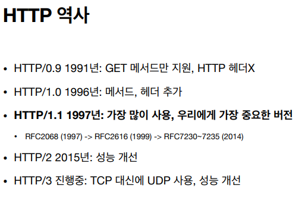

# HTTP(Hyper Text Transfer Protocol)

- 모든 것이 HTTP
  - HTTP 메시지에 모든 것을 전송
  - HTML, TEXT
  - IMAGE, 음성, 영상, 파일
  - JSON, XML (API)
  - 거의 모든 형태의 데이터 전송 가능
  - 서버 간에 데이터를 주고 받을 때도 대부분 HTTP 사용
  - 지금은 HTTP 시대!

### 기반 프로토콜

- TCP: HTTP/1.1, HTTP/2
- UDP: HTTP3
- 현재 HTTP/1.1 주로 사용
  - HTTP/2, HTTP/3도 점점 증가

### HTTP 특징

- 클라이언트 서버 구조
- 무상태 프로토콜(스테이스리스), 비연결성
- HTTP 메시지
- 단순함, 확장 가능