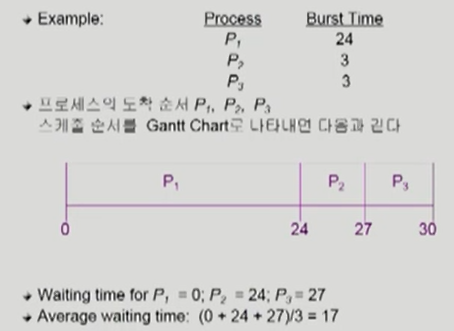

# CPU Scheduling 1

- Ready Queue 상태에 있는 프로세스들 중에서 어떤 프로세스에 CPU 제어권을 우선으로 줄 것인지 고민하는 작업이 CPU schduling이다.

### Scheduling Criteria(= 성능 척도)

- CPU utilitization(이용률) - 시스템 입장
  - keep the CPU as busy as possible
  - CPU의 전체 가동 시간 중에서 사용 시간을 의미
- Throughput(처리량) - 시스템 입장
  - amount of processes that complete their execution per time unit
  - 주어진 시간동안 프로세스를 완료한 개수
- Turnaround time(소요시간, 반환시간) - 프로그램 입장
  - amount of time to execute a particular process
  - Ready Queue에 대기하고 CPU를 사용한 시간을 통틀어 말함(총 수행 시간)
    - CPU를 사용하기 위해 들어와서 I/O를 하러 가기까지의 시간을 의미하며, 프로세스가 시작되고 종료되는 시간을 의미하는 것이 아님. 순전히 CPU의 관점으로 해석. CPU burst 단위로 봐야한다.
- Waiting time(대기시간) - 프로그램 입장
  - amount of time a process has been waiting in the ready queue
  - Ready Queue에 줄서서 기다리는 시간
- Response time(응답 시간) - 프로그램 입장
  - amount of time it takes from when a request was submitted until the first response is produced, not output
  - Ready Queue에 들어와서 처음으로 CPU를 얻기까지의 시간

> 선점형(preemptive)인 경우에는 강제로 CPU의 제어권이 넘어가기 때문에 여러 번의 대기시간이 존재하며 그것을 모두 합한 것이 Waiting time이다.

# CPU Scheduling Algorithm

### 1. FCFS(First-Come First-Served)

- 먼저 온 순서대로 처리(비선점형)
- 한 번 얻으면 끝날 때까지 기다림

- Convoy effect: 짧은 프로세스가 긴 프로세스 뒤에 기다리는 현상

### 2. SJF(Shortest-Job-First)

- 각 프로세스의 다음 번 CPU burst time을 가지고 스케줄링에 활용

- CPU burst time이 가장 짧은 프로세스를 제일 먼저 스케쥴

- Two schemes:

  - Nompreemptive
    - 일단 CPU를 잡으면 이번 CPU burst가 완료될 때까지 CPU를 선점(preemption) 당하지 않음

  - Preemptive
    - 현재 수행중인 프로세스의 남은 burst time보다 더 짧은 CPU burst time을 가지는 새로운 프로세스가 도착하면 CPU를 빼앗김
    - 이 방법을 Shortest-Remaining-Time-First(SRTF)이라고 부른다

- SJF is optimal

  - 주어진 프로세스들에 대해 minimum average waiting time을 보장

문제점)

- Long process가 Starvation 현상이 일어날 수 있다(영원히 실행이 안될 수도 있다)

- CPU 사용 시간을 알 수 없다.(예측은 가능하다)
  - 과거의 이력을 통해 예측을 진행한다.->과거의 CPU burst time을 이용해서 추정
  - exponential average를 활용(이전의 이력에 가중치를 곱하고 더해가며 구한다.)

### 3. Priority Scheduling

- A priority number(integer) is associated with each process
- highest priority를 가진 프로세스에게 CPU 할당(smallest integer = highest priority)
  - preemptive
  - nonpreemptive
- SJF는 일종의 priority scheduling이다
  - priority = predict next CPU burst time
- Problem
  - Starvation(기아 현상): low priority processes may never execute

- Solution

  - Aging(노화): as time progresses increase the priority of the process

  - 시간이 지나면 우선 순위를 조금 높여주는 장치

### 4. Round Robin(RR)

- 각 프로세스는 동일한 크기의 할당 시간(time quantum)을 가짐(일반적으로 10 ~ 100 milliseconds)
- 할당 시간이 지나면 프로세스는 선점(preempted) 당하고 ready queue의 제일 뒤에 가서 다시 줄을 선다
- n개의 프로세스가 ready queue에 있고 할당 시간이 q time unit인 경우 각 프로세스는 최대 q time unit 단위로 CPU 시간의 1/n을 얻는다.
  - 어떤 프로세스도 (n-1)q time unit 이상 기다리지 않는다.
- Performance
  - q large => FCFS
  - q small => context switch 오버헤드가 커진다

- 응답 시간이 짧다는 장점이 있다
- 적당한 규모의 q time unit을 주는 것이 좋다

- 일반적으로 SJF보다 average tunraround time이 길지만 response time은 더 짧다

- 단점
  - 6초 대의 실행시간이 필요한 프로그램이 여러 개 들어올 경우 동시에 프로그램 처리가 끝나면서 비효율적인 면이 생긴다

출처 : ABRAHAM SILBERSCHATZ ET AL., OPERATING SYSTEM CONCEPTS, NINTH EDITION, WILEY, 2013- 반효경, 운영체제와 정보기술의 원리, 이화여자대학교 출판부, 2008

