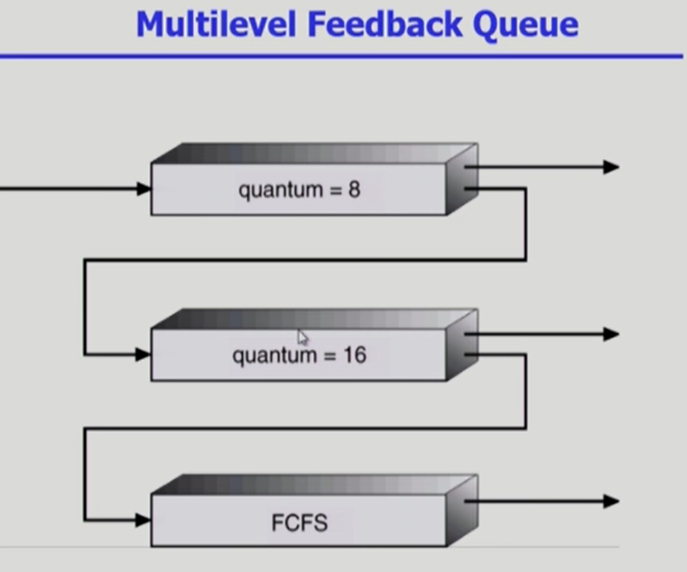

# CPU Scheduling

### Multilevel Queue

- Ready queue를 여러 개로 분할
  - foreground(interactive)
  - background(batch - no human interaction)
- 각 큐는 독립적인 스케줄링 알고리즘을 가짐
  - foreground - RR
  - background - FCFS
- 큐에 대한 스케줄링이 필요
  - Fixed priority scheduling
    - serve all from foreground then from background
    - Possibility of starvation
      - 우선 순위가 높은 프로세스만 먼저 다 진행하면 기아 현상이 생길 수 있다.
  - Time slice
    - 각 큐에 CPU time을 적절한 비율로 할당
    - Eg., 80% to foreground in RR, 20% to background in FCFS

### Multilevel Feedback Queue

- 프로세스가 다른 큐로 이동 가능
- 에이징을 이와 같은 방식으로 구현할 수 있다
- Multilevel-feedback-queue scheduler를 정의하는 파라미터들
  - Queue의 수
  - 각 큐의 scheduling algorithm
  - Process를 상위 큐로 보내는 기준
  - Process를 하위 큐로 내쫓는 기준
  - 프로세스가 CPU 서비스를 받으려 할 때 들어갈 큐를 결정하는 기준

- 짧은 프로세스에게 우선순위를 더 부여하고 그 시간 내에 해결 못하면 뒤로 넘어간다

### Multi-Processor Scheduling

- CPU가 여러 개인 경우 스케줄링은 더욱 복잡해짐
- Homogeneous processor인 경우
  - Queue에 한줄로 세워서 각 프로세서가 알아서 꺼내가게 할 수 있다
  - 반드시 특정 프로세서에서 수행되어야 하는 프로세스가 있는 경우에는 문제가 더 복잡해짐
- Load sharing
  - 일부 프로세서에 job이 몰리지 않도록 부하를 적절히 공유하는 메커니즘 필요
  - 별개의 큐를 두는 방법 vs 공동 큐를 사용하는 방법
- Symmetric Multiprocessing(SMP)
  - 각 프로세서가 각자 알아서 스케줄링 결정
- Asymmetric multiprocessing
  - 하나의 프로세서가 시스템 데이터의 접근과 공유를 책임지고 나머지 프로세서는 거이에 따름

### Real Time Scheduling

- Hard real-time systems
  - Hard real-time task는 정해진 시간 안에 반드시 끝내도록 스케줄링해야 함
- Soft real-time computing
  - Soft real-time task는 일반 프로세스에 비해 높은 priority를 갖도록 해야 함

### Thread Scheduling

- Local Scheduling
  - User level thread의 경우 사용자 수준의 thread library에 의해 어떤 thread를 스케줄할지 결정
  - OS가 아닌 사용자 프로그램이 내부의 프로세스의 우선순위를 매김
- Global Scheduling
  - Kernel level thread의 경우 일반 프로세스와 마찬 가지로 커널의 단기 스케줄러가 어떤 thread를 스케줄할지 결정

### Algorithm Evaluation

 

출처 :

- ABRAHAM SILBERSCHATZ ET AL., OPERATING SYSTEM CONCEPTS, NINTH EDITION, WILEY, 2013
- 반효경, 운영체제와 정보기술의 원리, 이화여자대학교 출판부, 2008