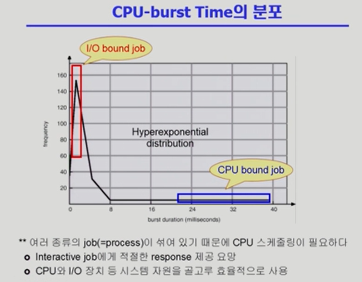

# CPU Scheduling

- CPU만 연속적으로 쓰는 단계와 I/O만 쓰는 단계가 번갈아 수행된다.
- 이때 CPU만 연속적으로 쓰면서 Instruction을 수행하는 단계를 CPU Burst라 부르고,
- I/O를 실행하는 단계를 I/O Burst라 부른다. 
- 프로그램의 종료에 따라 CPU와 I/O Burst의 빈도수가 다르다.

- CPU를 아주 짧게 쓰고 중간에 I/O가 끼어드는 작업을 I/O bound job이라 한다
- CPU를 오래 쓰는 프로그램을 CPU bound job이라 부른다.

- CPU scheduling의 목적은 interactive한 job이 원활하게 수행될 수 있도록 돕는 것이다.
- CPU 독점을 하게 된다면, 다른 프로그램은 실행하지 못하는 상황에 처하기 때문에 효율성이 떨어진다.

- 프로세스는 그 특성에 따라 다음 두 가지로 나눔
  - I/O bound process
    - CPU를 잡고 계산하는 시간보다 I/O에 많은 시간이 필요한 job
    - many short CPU burst
  - CPU-bound process
    - 계산 위주의 job
    - few very long CPU bursts

### CPU Scheduler & Dispatcher

- CPU Scheduler
  - 운영체제 안에서 CPU스케쥴링을 하는 코드가 있다.(별도의 하드웨어나 소프트웨어가 아니다)
  - Ready 상태의 프로세스 중에서 이번에 CPU를 줄 프로세스를 고른다.
- Dispatcher
  - CPU의 제어권을 CPU scheduler에 의해 선택된 프로세스에게 넘긴다
  - 이 과정을 context switch(문맥 교환)라고 한다.
- CPU 스케줄링이 필요한 경우는 프로세스에게 다음과 같은 상태 변화가 있는 경우이다
  - Running -> Blocked (예: I/O 요청하는 시스템 콜)
  - Running -> ready (예: 할당시간 만료로 timer interrupt)
  - Blocked -> ready(예: I/O 완료 후 인터럽트)
  - Terminate (프로세스가 종료되서 할 일이 없어졌을 때)
- 1, 4에서의 스케쥴링은 nonpreemptive(=강제로 빼앗지 않고 자진 반납)
- All other scheduling is preemptive(=강제로 빼앗음)

<출처: 반효경, 운영체제와 정보기술의 원리, 이화여자대학교 출판부, 2008>