# Deadlock(교착 상태)

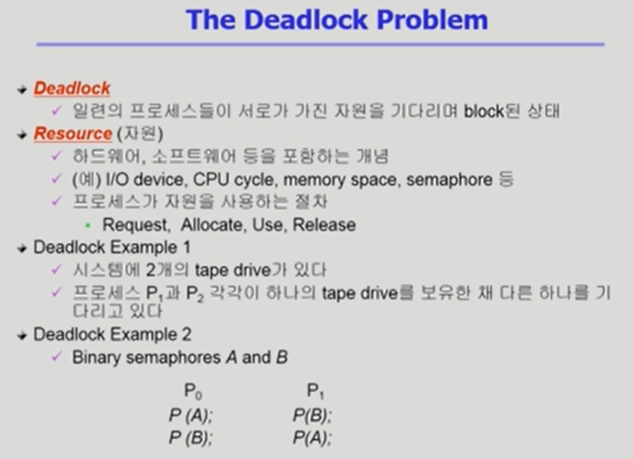

> 1) 두 개의 테이프가 동시에 들어가야 복사가 되며 프로세스가 진행되는데, 예시에서는 각각 하나의 테이프만 가진 채 진행이 되지 않는 것을 의미한다.(하드웨어 자원을 기다리며 교착상태)
> 2) semaphore의 경우에는 A자원과 B자원을 각각 획득한 상태로 있어서 진행이 안되는 상태
>
> 자원 사용 절차
>
> Request(요청) -> Allocate(획득) -> Use(사용) -> Release(반납)

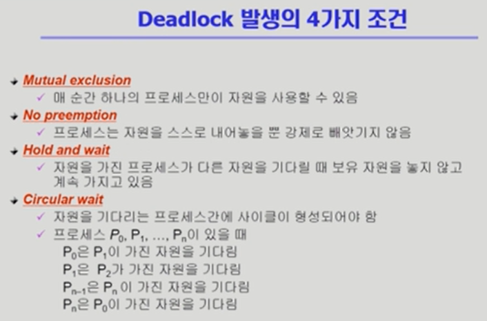

- 독점적으로 사용해야 하고(상호 배제),
- 빼앗기지 않고(비선점),
- 가진 자원을 내놓지 않음(보유대기),
- 프로세스 간에 사이클 형성(순환대기)

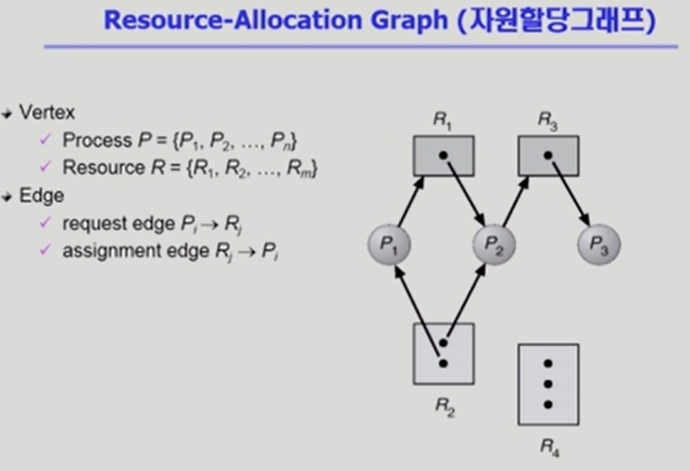

> 동그라미: 프로세스, 사각형: 자원, 화살표: 자원->프로세스(사용)와 프로세스 -> 자원(요청)
>
> 해당 그래프는 사이클이 없어서 deadlock이 아니다

- 자원 할당 그래프로 deadlock인지 아닌지 확인이 가능

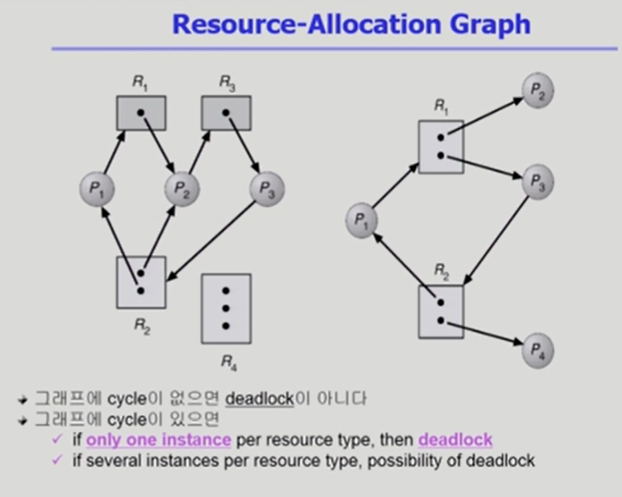

> 자원이 하나씩 밖에 없을 때는 deadlock이다
>
> 여러 개가 있을 경우 deadlock일수도 있고 아닐 수도 있다.
>
> 두 번째 예시는 deadlock이 아니다. 자원이 2개이고, P2와 P4가 모든 프로세스를 완료하고 자원을 반납하면 해결이 된다.

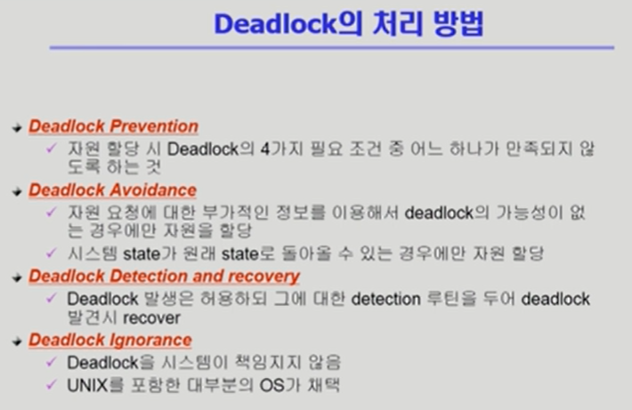

> 요즘은 deadlock ignorance를 채택하고 있고, 미연에 방지하는 방법은 많은 오버플로우가 생기기 때문에 그냥 놔둔다. deadlock이 자주 생기는 것도 아니고, 만약 발생하게 된다면 사용자가 처리하면 된다.
>
> 위로 갈수록 엄격한 처리 방법을 사용한다.

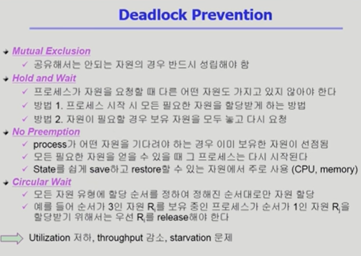

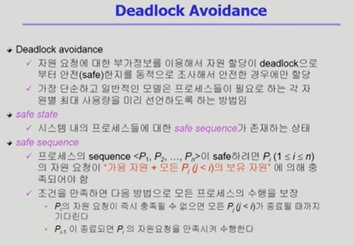

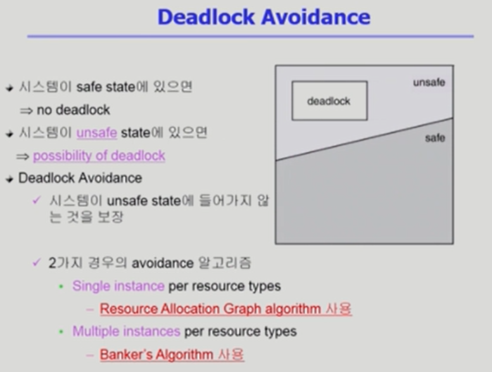

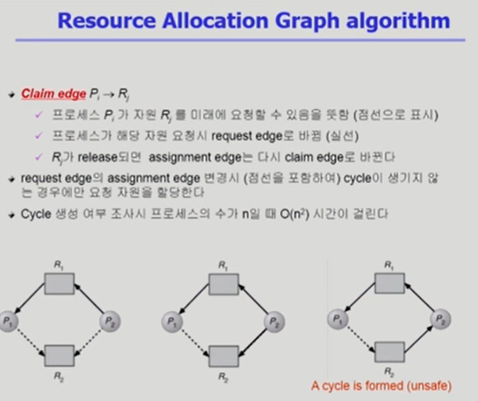

- 자원당 인스턴스가 하나만 있는 경우의 상황
- 프로세스가 시작할 때 데드락의 발생가능성을 모두 따진 후 없을 경우에만 자원을 할당시킨다.
- 점선의 경우 미래에 자원을 요청할 가능성이 있다는 것을 의미한다.

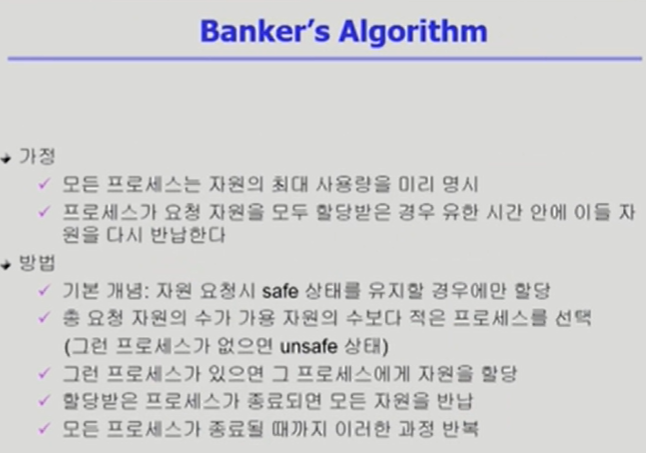

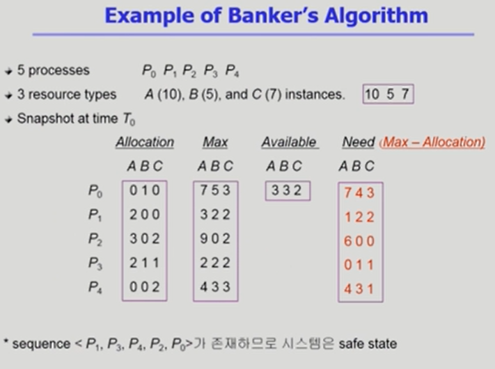

- Allocation은 현재 사용하고 있는 자원의 양이고, Max는 해당 프로세스가 최대로 자원을 가질 수 있는 양, Available은 현재 자원을 사용할 수 있는 양이다. 이때 각 프로세스가 자원을 요청할 것인데 추가로 요청 가능한 최대치의 양을 비교하여(Need) 만약 현재 가진 가용 자원으로 만족할 수 없다면 자원을 주지 않는 방식으로 미연에 방지한다.

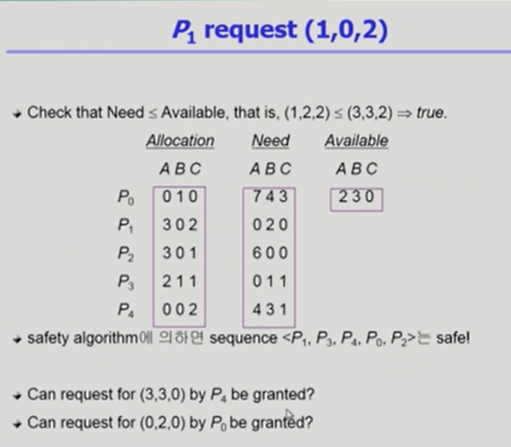

출처 :

- ABRAHAM SILBERSCHATZ ET AL., OPERATING SYSTEM CONCEPTS, NINTH EDITION, WILEY, 2013
- 반효경, 운영체제와 정보기술의 원리, 이화여자대학교 출판부, 2008