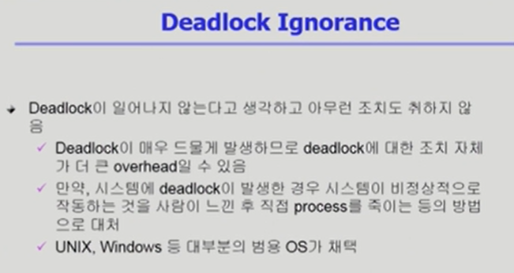

# DeadLock

> 최대 요청이 만족이 되면 자원을 할당해주고 그렇지 못할 경우에는 할당하지 않는다. 항상 최악의 경우를 생각하고 자원을 주지 않기 때문에 비효율적이다. safe한 상황을 계속 만들어준다. 가지고 있는 자원만으로도 해결할 수 있는지 판단.

> 순환 그래프가 있는지 확인하려면 모든 그래프를 따라가야 하므로 N^2의 시간이 걸린다. 그래프의 완전 탐색과 동일하다.

> 자원을 제거하면 간단한 그래프 생성이 가능(순환이 있는지만 확인하면 되므로)

> 뱅커스의 하위에 자원 할당 그래프가 존재, 뱅커스가 모두 해결가능함.

- 프로세스 종료
  - 전부 종료
  - 하나씩 종료
- 자원 선점
  - 희생자를 선정한다
  - starvation을 고려하여 rollback 횟수도 같이 고려한다.

출처 :

- ABRAHAM SILBERSCHATZ ET AL., OPERATING SYSTEM CONCEPTS, NINTH EDITION, WILEY, 2013
- 반효경, 운영체제와 정보기술의 원리, 이화여자대학교 출판부, 2008