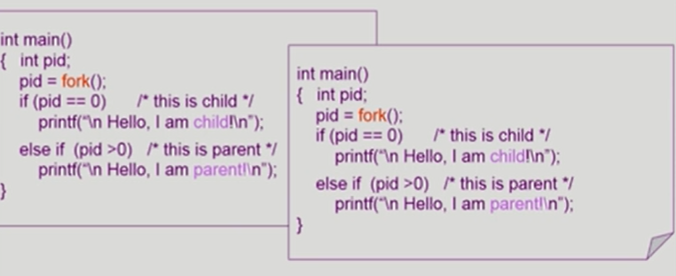
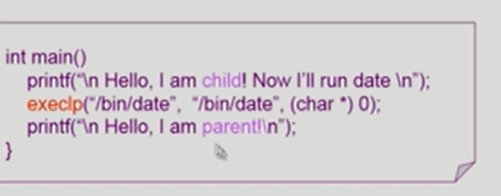
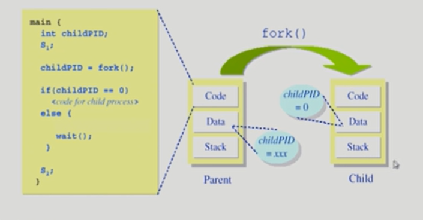
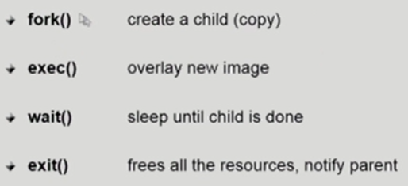
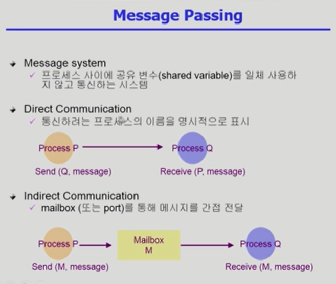
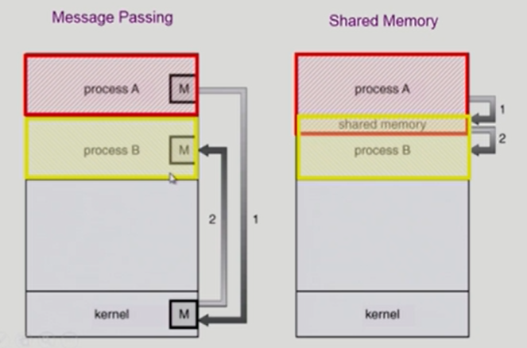

# Process Management

# 프로세스 생성(Process Creation)

- 부모 프로세스(Parent Process)가 자식 프로세스(children process)생성
- 프로세스의 트리(계층 구조) 형성
- 프로세스는 자원을 필요로 함
  - 운영체제로부터 받는다
  - 부모와 공유한다

- 자원의 공유
  - 부모와 자식이 모든 자원을 공유하는 모델
  - 일부를 공유하는 모델
  - 전혀 공유하지 않는 모델(일반적)
    - CPU를 차지하기 위해 경쟁 구도로 간다
- 수행(Execution)
  - 부모와 자식은 공존하며 수행되는 모델
  - 자식이 종료(terminate)될 때까지 부모가 기다리는(wait) 모델

- 주소 공간(Address space)
  - 자식은 부모의 공간을 복사함(binary and OS data)
  - 자식은 그 공간에 새로운 프로그램을 올림
- 유닉스의 예
  - fork() 시스템 콜이 새로운 프로세르를 생성
    - 부모를 그대로 복사(OS data except PID + binary)
    - 주소 공간 할당
  - fork 다음에 이어지는 exec() 시스템 콜을 통해 새로운 프로그램을 메모리에 올림

- 프로세스가 마지막 명령을 수행한 후 운영체제에게 이를 알려줌(exit)
  - 자식이 부모에게 output data를 보냄(via wait)
  - 프로세스의 각종 자원들이 운영체제에게 반납됨
- 부모 프로세스가 자식의 수행을 종료시킴(abort)
  - 자식이 할당 자원의 한계치를 넘어섬
  - 자식에게 할당된 태스크가 더 이상 필요하지 않음
  - 부모가 종료(exit)하는 경우
    - 운영체제는 부모 프로세스가 종료하는 경우 자식이 더 이상 수행되도록 두지 않는다
    - 단계적인 종료

> 부모에 program 카운터로 공유하다가 바뀔 경우에만 Copy-on-write를 통해 필요한 부분만 복사해서 바뀐다. 나머지는 공유를 그대로 진행. 사용자 프로그램이 운영체제에 시스템 콜을 통해 복사해달라고 요청함.

### fork() 시스템 콜

- fork를 만나면 하나의 자식 프로세스를 만들고, 계속해서 다른 함수를 실행한다.
  - fork의 return 값이 달라서 부모와 자식을 구분지어 준다.
  - 부모는 양수, 자식은 0의 리턴값을 가짐
- 자식 프로세스는 main함수가 아닌 fork 이후의 함수를 실행한다.
  - 부모의 문맥을 그대로 따라가기 때문이다(프로그램 카운터를 불러와서 실행한다)

### exec() 시스템 콜

- fork를 해서 자식을 만든 후 exec함수를 만들면 완전히 새로운 프로그램으로 덮어씌워진다.
- exec를 한 다음에 다시 되돌아오지 않고 완료되면 종료된다.
- 꼭 자식을 만들어서 exec을 해야하는 것은 아니다.
- exec이후의 코드는 실행되지 않는다.

### wait()시스템 콜

- 프로세스 A가 wait() 시스템 콜을 호출하면
  - 커널은 child가 종료될 때까지 프로세스 A를 sleep시킨다(block상태)
  - Child process가 종료되면 커널은 프로세스 A를 깨운다(ready 상태)

- 부모 코드가 wait함수를 만나면 CPU를 얻지 못하게 대기 상태에 머무른다. 자식 프로세스가 종료될 때까지.

### exit()시스템 콜

- 프로세스의 종료
  - 자발적 종료
    - 마지막 statement 수행 후 exit() 시스템 콜을 통해
    - 프로그램에 명시적으로 적어주지 않아도 main 함수가 리턴되는 위치에 컴파일러가 넣어줌
  - 비자발적 종료
    - 부모 프로세스가 자식 프로세스를 강제 종료시킴
      - 자식 프로세스가 한계치를 넘어서는 자원 요청
      - 자식에게 할당된 태스크가 더 이상 필요하지 않음
    - 키보드로 kill, break 등을 친 경우
    - 부모가 종료하는 경우
      - 부모 프로세스가 종료하기 전에 자식들이 먼저 종료함

### 프로세스 간 협력

- 독립적 프로세스(Independent process)
  - 프로세스는 각자의 주소 공간을 가지고 수행되므로 원칙적으로 하나의 프로세스는 다른 프로세스의 수행에 영향을 미치지 못함
- 협력 프로세스(Cooperating process)
  - 프로세스 협력 메커니즘을 통해 하나의 프로세스가 다른 프로세스의 수행에 영향을 미칠 수 있음
- 프로세스 간 협력 메커니즘(IPC: Interprocess Communication)
  - 메시지를 전달하는 방법
    - message passing: 커널을 통해 메시지 전달
    - 사용자끼리 전달은 불가능
  - 주소 공간을 공유하는 방법
    - shared memory: 서로 다른 프로세스 간에도 일부 주소 공간을 공유하게 하는 shared memory 메커니즘이 있음

> thread: thread는 사실상 하나의 프로세스이므로 프로세스 간 협력으로 보기는 어렵지만 동일한 process를 구성하는 thread들 간에는 주소 공간을 공유하므로 협력이 가능
>
> thead는 하나의 프로세스 안에 CPU 수행 단위가 여러 개 있는 것이다.

- Indirect 같은 경우에는 Mailbox를 통해 다양한 프로세스에 접근이 가능

- shared memory구성도 운영체제에 요청해서 메모리를 쓴다는 시스템 콜을 요청해서 맵핑을 미리 해둠.

<출처: https://core.ewha.ac.kr/publicview/C0101020140325134428879622?vmode=f,
반효경, 운영체제와 정보기술의 원리, 이화여자대학교 출판부, 2008>

