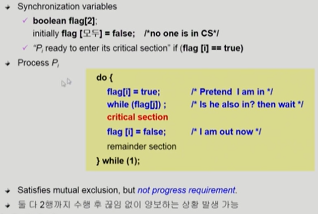

# Process Synchronization

- 두 개의 프로세스가 있다고 가정 P1, P2
- 프로세스들의 일반적인 구조
  - 접근하려는 변수의 공유 데이터의 양쪽에 section을 두어서 동시 접근이 되지 않도록 방지
  - critical section이 수행되는 동안에는 lock을 걸고 수행이 끝나면 lock을 풀어서 다른 프로세스가 접근할 수 있게 함

### 프로그램적 해결법의 충족 조건

- Mutual Exclusion
  - 프로세스 Pi가 critical section 부분을 수행 중이면 다른 모든 프로세스들은 그들의 critical section에 들어가면 안된다.
- Progress
  - 아무도 critical section에 있지 않은 상태에서 critical section에 들어가고자 하는 프로세스가 있으면 critical section에 들어가게 해주어야 한다.
- Bounded Waiting(유한 대기)
  - 프로세스가 critical section에 들어가려고 요청한 후부터 그 요청이 허용될 때까지 다른 프로세스들이 critical section에 들어가는 횟수에 한계가 있어야 한다.(starvation 현상이 생기지 않게 방지)

- 알고리즘 1
  - turn을 통해 순서를 표시(critical section에 들어가는 차례를 표시)
  - while문을 통해 자기 차례가 아니면 계속해서 대기 중이게 된다.
    - 잘못 작성하게 되면 무한 대기에 빠지거나 들어가지 못하는 경우가 생길 수도 있다.(Progress 조건을 만족시키지 못한다.)
    - P0는 빈번하게 수행되어야 하고, P1은 한번만 수행된다면 P0는 P1의 동작이 끝나야 동작하는데 그것이 한번이므로 둘다 진행되지 않게 된다.

- 알고리즘 2

- 알고리즘 3(피터슨의 알고리즘)
  - Busy Waiting(=spin lock) -> while문을 사용하기 때문에 계속 CPU와 memory를 사용하면서 대기한다.

※ 하드웨어적으로 인스트럭션을 진행할 때 읽고/쓰는 것을 동시에 할 수 있도록 할 수 있게 된다면 앞 쪽의 코드처럼 복잡해지지 않는다

출처 :

- ABRAHAM SILBERSCHATZ ET AL., OPERATING SYSTEM CONCEPTS, NINTH EDITION, WILEY, 2013
- 반효경, 운영체제와 정보기술의 원리, 이화여자대학교 출판부, 2008