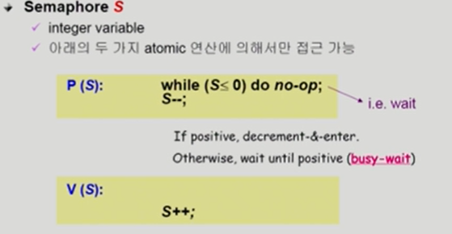
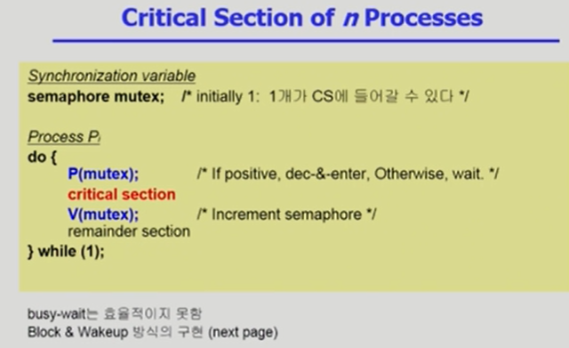
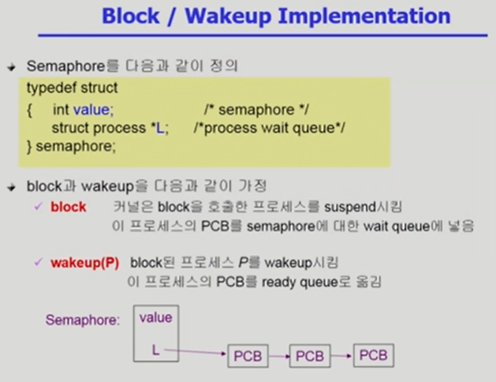
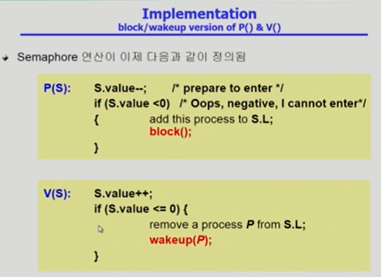
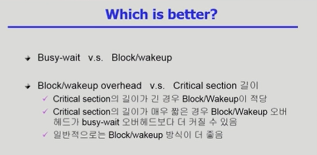
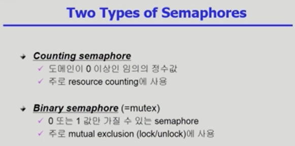
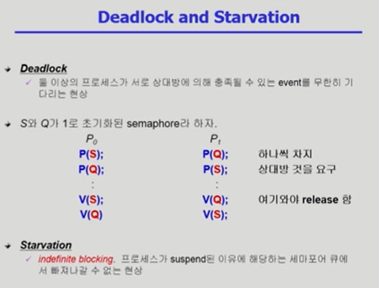

### Semaphores

- 앞의 방식들을 추상화시킴

- P연산은 Semaphore 변수값을 획득하는 과정 = 공유 데이터를 획득하느 과정
- V연산은 반납하는 과정

> S가 5면 자원이 5개 있다는 의미. P연산을 한 번 해주면 자원을 가져가는 것. 5번의 P가 가능. 이전 시간의 lock을 풀고 닫는 과정은 S가 1이라고 생각해주면 된다. P 연산을 하게 되면 락을 거는 것, V 연산은 락을 푸는 것으로 보면 된다.
>
> S<=0이면 while문으로 기다리게 된다. 누군가가 자원을 내놓으면 자원을 획득가능.

> 프로그래머가 하나하나 코드를 작성하는 것이 아닌, semaphore의 추상화 개념을 활용하여 P와 V의 연산만 활용하면 된다. 이때 busy-wait(=spin lock)는 프로세스가 실행되지 못하고 CPU의 시간을 할당받고 있는 상황을 말한다.

> semaphore를 획득하지 못하면 block 상태가 되고, 추후에 semaphore를 가질 수 있게되면 다시 ready queue상태로 돌아가서 실행이 되게 된다.

> Semaphore의 변수 S가 음수이면 획득할 수 있는 자원이 없다는 의미이므로 L이라는 리스트에 해당 프로세스를 추가하고 block시킨다. 

> 상대방이 가진 자원을 기다리면서 영원히 기다리게 되는 상황을 Deadlock이라고 말한다.

출처 : ABRAHAM SILBERSCHATZ ET AL., OPERATING SYSTEM CONCEPTS, NINTH EDITION, WILEY, 2013

- 반효경, 운영체제와 정보기술의 원리, 이화여자대학교 출판부, 2008