# Classical Problem Synchronization

### 1. Bounded-Buffer Problem

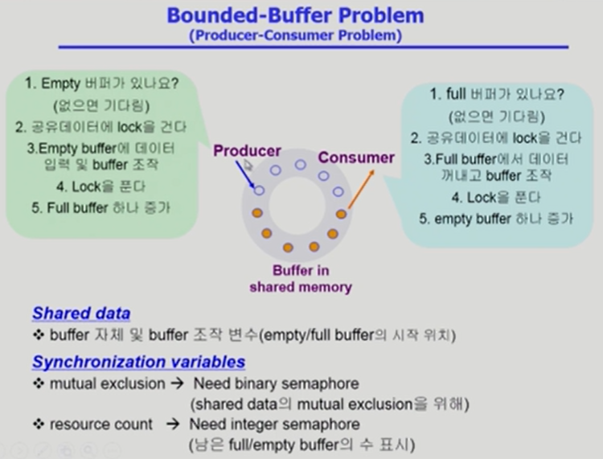

> Producer(생산자): 데이터를 만들어서 집어 넣는 역할
>
> 공유 버퍼에 비어있는 곳을 확인하고 공유데이터에 lock을 걸어서 다른 프로세스들의 접근을 막은 다음에 비어있는 곳에 데이터를 집어넣고 해당 작업이 끝나면 락을 푼다.

- 동시에 접근할 경우 문제가 생겨 lock을 걸고 푸는 문제가 생김
- 버퍼가 유한해서 생기는 문제
  - 버퍼가 다 찼는데 또 생산자가 들어왔을 때 넣을 수 없다. 비어있는 버퍼가 생길 때까지 기다려야한다.(소비자가 꺼내가야 한다.)
  - 소비자의 경우도 마찬가지로 데이터가 올 때까지 계속 기다려야한다.
- Semaphore를 이용해 만들어야하는 일이 2가지
  - 동시에 공유 버퍼에 접근하는 것을 막기 위해 lock을 거는 작업
  - 버퍼가 가득 차거나 비었을 때, 확인시켜주는 counting semaphore가 필요하다

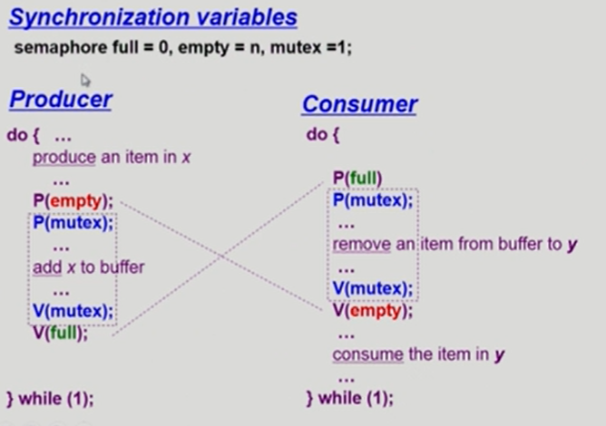

> lock을 걸기위한 변수 mutex, 내용이 들어있는 버퍼의 개수 full, 비어있는 버퍼의 수 empty

- 내용을 생성하고
- 넣어줄 공간이 있는지 확인하고
- 버퍼에 lock을 걸어서 데이터를 입력하고
- 끝나면 lock을 풀고
- 가득차 있는 공간의 개수를 1 증가시킨다

### 2. Readers-Writers Problem

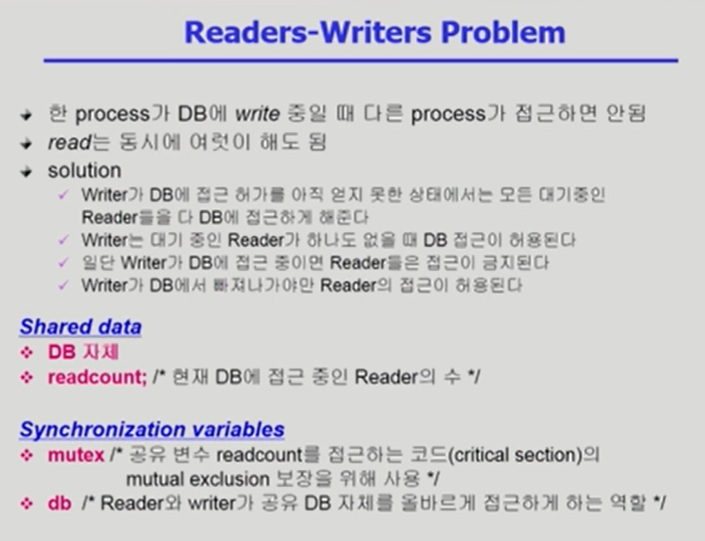

> reader가 진행 중일 때 reader가 들어오면 들어갈 수 있지만, writer는 불가
>
> DB가 공유 데이터
>
> db는 DB에 접근하는 것에 대한 lock
>
> mutex는 readcount에 대한 lock

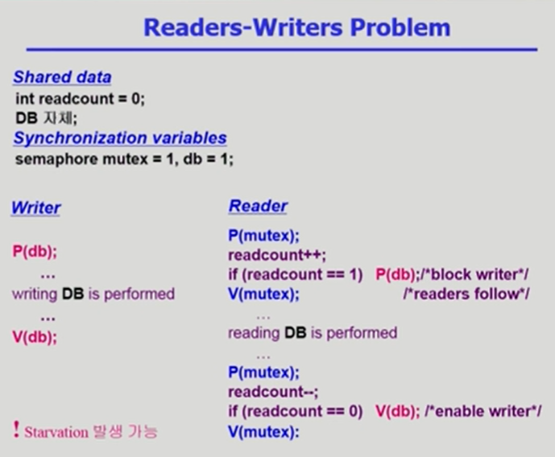

> readcount를 통해 몇 명이 읽는지 확인할 수 있음. reader도 lock을 걸어놔야 writer가 들어오지 않게 된다.
>
> 최초인 reader가 락을 걸어놨기 때문에 추가로 lock을 걸어주지 않아도 된다.
>
> readcount(공유변수)도 lock을 걸어줘서 동시 접근을 막아 하나씩 들어올 수 있게 한다.(동시 접근 시 +2가 아닌 +1만 될 수도 있다.)
>
>
> Starvation을 막기 위해서는 어느 정도의 리더가 진행된 다음에는 접근을 막는 게 필요

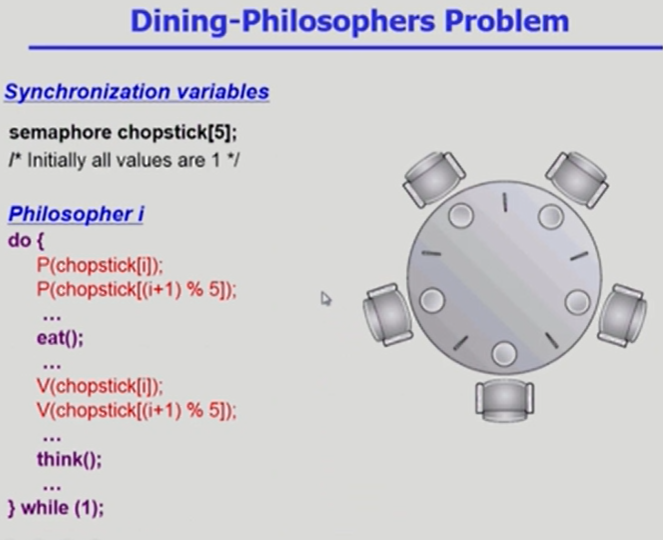

> 데드락이 발생하는 잘못된 코드

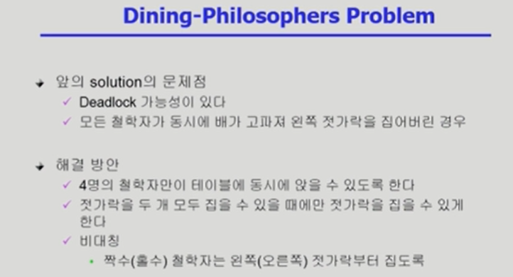

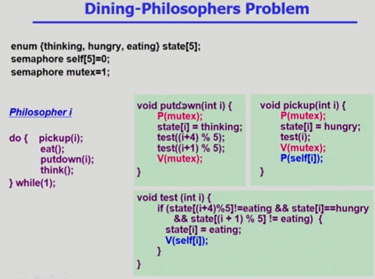

> 2번 째 해결방안을 활용한 코드(잘 짜여진 코드가 아니다)
>
> semaphore self[x] = 1이면 두 젓가락을 모두 잡을 수 있다를 의미한다.
>
> state는 상태 표시(3개로 나눔)
>
> 철학자들끼리도 영향을 주기 때문에 lock을 걸어줘야하므로 mutex 변수가 있다
>
> test는 철학자가 젓가락을 모두 가질 수 있는지 확인하는 함수
>
> 왼쪽, 오른쪽 철학자가 밥을 먹고 있지 않고, 내가 배가 고프면 철학자의 상태를 밥먹는 상태로 바꾸고 권한을 준다.

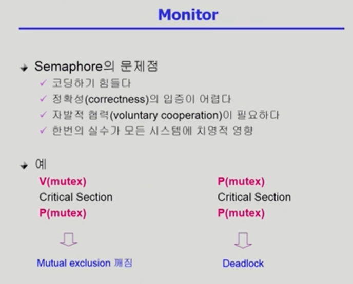

> 프로그래머의 실수로 sematphore 연산을 잘못사용하게 되면 중복으로 처리하거나 교착상태가 생긴다.

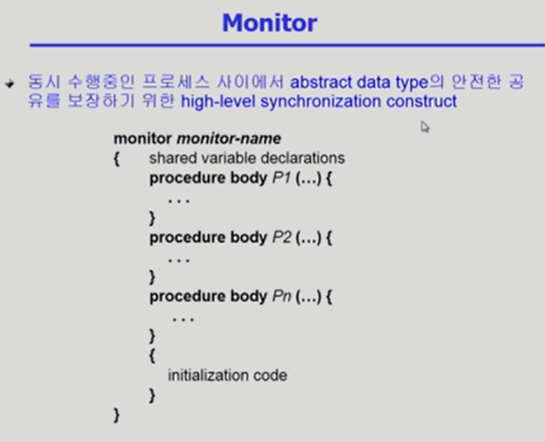

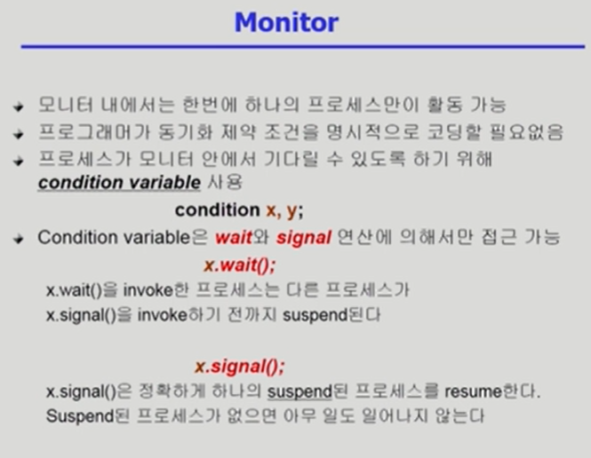

> 모니터 내에 자원이 있으면 바로 사용하게 되는데 없다면 wait에 의해 기다리게 되고, 어떤 프로세스가 끝나면 signal을 통해서 기다리고 있는 다른 프로세스가 자원을 사용할 수 있도록 한다.

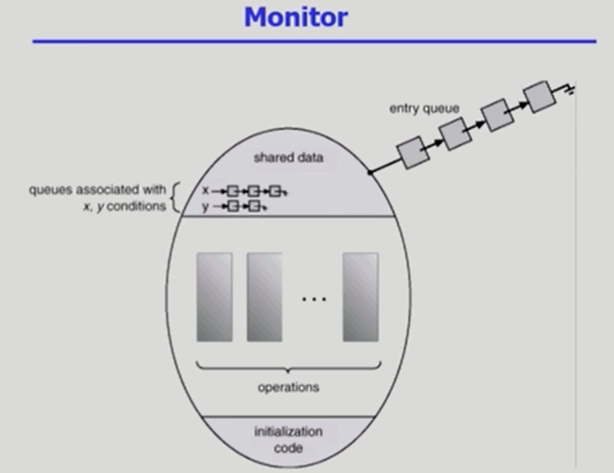

> 외부에서 바로 공유 데이터에 접근하는 것이 아니라 내부의 프로시저를 거쳐서 접근하도록 해야한다. 락이 필요없어지고 모니터로서 접근하면 된다. 하나의 프로세스만 접근하고 다른 프로세스는 기다리도록 큐로 만든다.

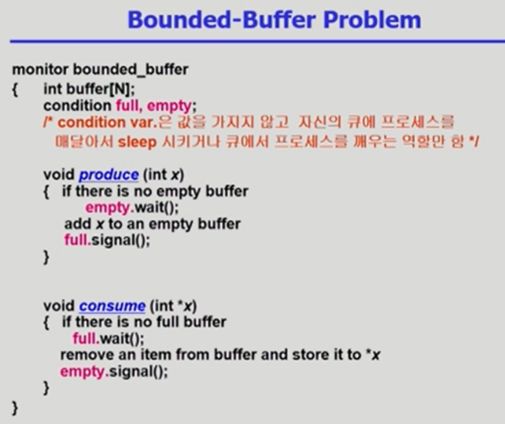

> 모니터 내에서 생산과 소비 함수가 이루어지기 때문에 따로 락이 필요없다. 코딩도 훨씬 간단하고 쉬워지고 나머지 프로세스는 줄서서 기다린다. buffer의 유무에 따라 프로세스가 진행된다.

출처 :

- ABRAHAM SILBERSCHATZ ET AL., OPERATING SYSTEM CONCEPTS, NINTH EDITION, WILEY, 2013

- 반효경, 운영체제와 정보기술의 원리, 이화여자대학교 출판부, 2008