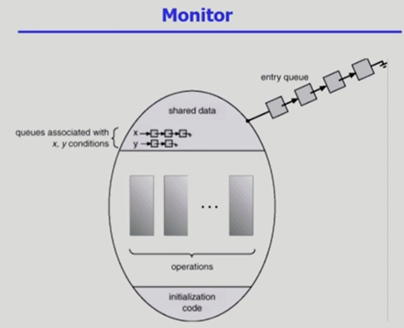
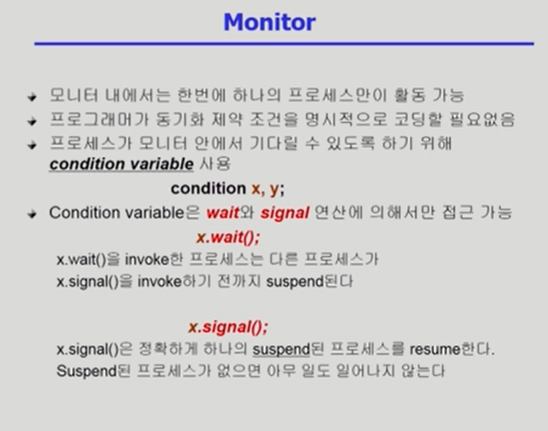
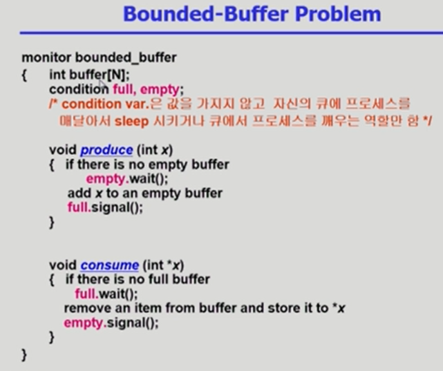
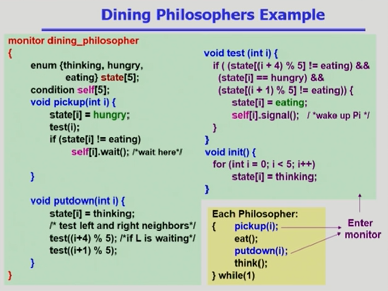

### Process Synchronization(프로세스 동기화) = Concurrency Control(병행 제어)

- 프로세스가 동시에 실행하면서 생기는 문제를 해결하는 것을 의미

> 모니터 자체가 락을 걸어주는 역할을 하기 때문에 프로그래머의 실수와 부담을 줄여준다. semaphore같은 경우에는 P와 V연산을 잘못 사용하게 되면 치명적인 오류가 생긴다. 우선 모니터 안에는 공유 자원과 그 공유 자원에 접근할 수 있는 프로시저가 있는데 사용하기 위해 들어온 프로세스가 모니터 내에서 active한 상태가 되면 다른 프로세스는 접근하지 못하고 외부에서 기다리게 된다. 프로세스는 cpu의 제어권을 뺏기더라도 active한 상태로 내부에 존재하게 되고, 만약 그 프로세스가 조건을 충족하지 못해 잠들거나 또는 충족되서 모니터를 빠져나가게 되면 외부에 기다리던 프로세스가 들어와 코드를 실행하게 된다.

> 어떤 프로세스를 잠들게 하려면 x.wait()를 사용한다. 그러면 모니터 내부에서 잠들게 된다.

> 생산자 소비자 문제
>
> 생산자: buffer에 데이터 채워넣음
>
> 소비자: buffer의 데이터를 사용
>
> 모니터는 공유 버퍼에 대한 락이 필요 없다.
>
> semaphore와 monitor의 코드는 conversion이 가능하다.
>
> monitor에서 condition variable은 값이나 카운트를 가지는 게 아니라 그저 기다리고 있는 프로세스의 상태를 나타낸다.

출처 :

- ABRAHAM SILBERSCHATZ ET AL., OPERATING SYSTEM CONCEPTS, NINTH EDITION, WILEY, 2013
- - 반효경, 운영체제와 정보기술의 원리, 이화여자대학교 출판부, 2008