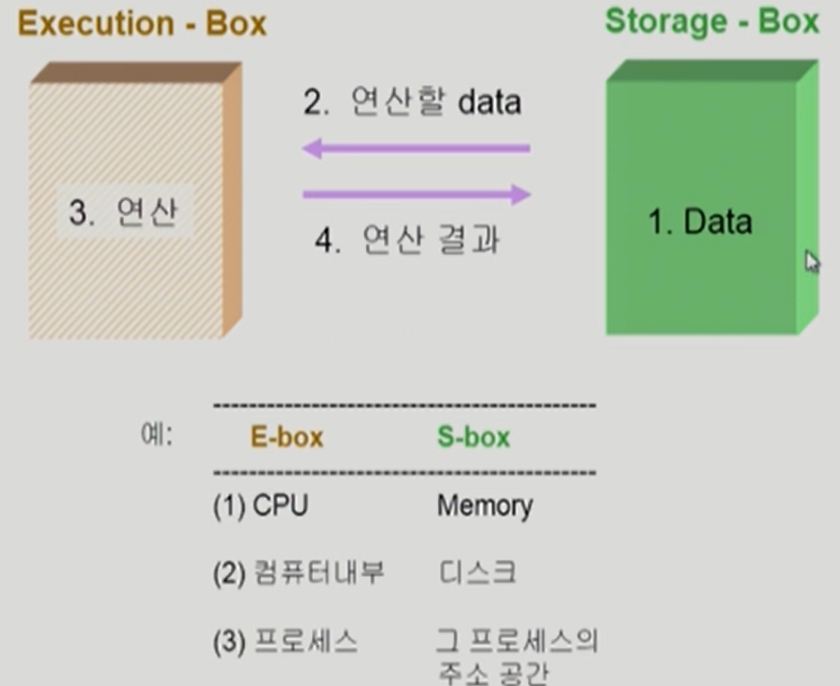
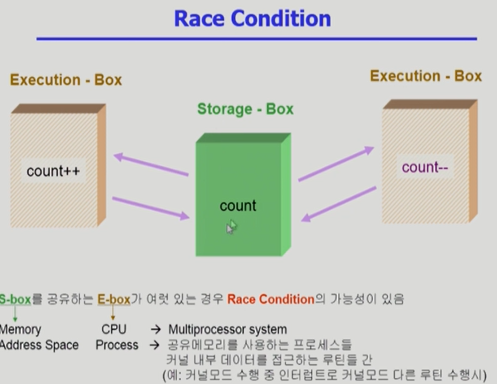
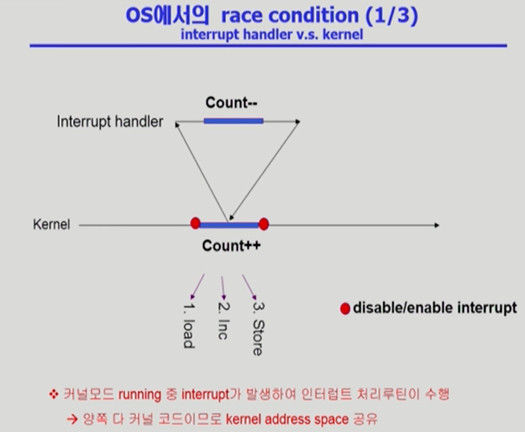
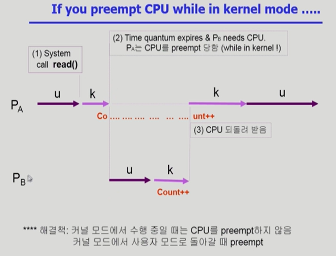
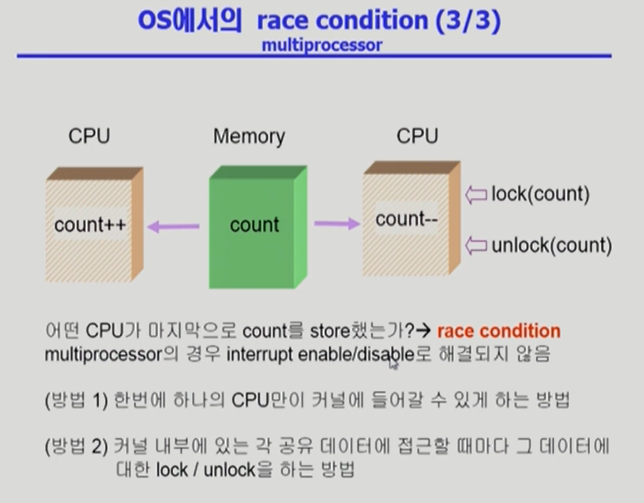
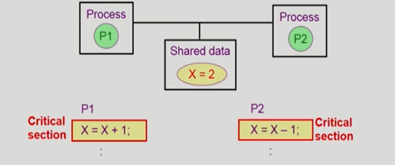

# Process Synchronization

- 데이터를 공유하여 사용할 경우 실행 순서가 명시되지 않으면 연산이 달라질 수 있음
- 여러 주체가 존재할 경우 Race Condition이라고 하므로 이를 처리해줘야한다.

- OS에서 race condition은 언제 발생하는가?

  1. kernel 수행 중 인터럽트 발생 시

  2. Process가 system call을 하여 kernel mode로 수행 중인데 context switch가 일어나는 경우

  3. Multiprocessor에서 shared memory 내의 kernel data

- 빨간 점 사이에서는 interrupt가 들어와도 인터럽트 처리를 하지 않는다.
  - 처리할 경우 count--는 인식되지 않아서 적용이 되지 않는다

- 커널모드가 실행 중일 때 빼앗지 않고 사용자로 돌아갈 때 빼앗는다. 중간에 다른 처리가 들어와도 처리가 되지 않는다. 이미 초기에 읽어들인 값이 있기 때문이다.

- 방법1은 CPU가 여러 개 있더라도 하나만 사용하므로 비효율적인 방법

### Process Synchronization 문제

- 공유 데이터(shared data)의 동시 접근(concurrent access)은 데이터의 불일치 문제(inconsistency)를 발생시킬 수 있다.
- 일관성(consistency) 유지를 위해서는 협력 프로세스(cooperating process) 간의 실행 순서(orderly execution)를 정해주는 메커니즘 필요
- Race condition
  - 여러 프로세스들이 동시에 공유 데이터를 접근하는 상황
  - 데이터의 최종 연산 결과는 마지막에 그 데이터를 다룬 프로세스에 따라 달라짐
- race condition을 막기 위해서는 concurrent process는 동기화(synchronize)되어야 한다.

### The Critical-Section Problem

- n개의 프로세스가 공유 데이터를 동시에 사용하기를 원하는 경우
- 각 프로세스의 code segment에는 공유 데이터를 접근하는 코드인 critical section이 존재
- Problem
  - 하나의 프로세스가 critical section에 있을 때 다른 모든 프로세스는 critical section에 들어갈 수 없어야 한다.

출처 :

- ABRAHAM SILBERSCHATZ ET AL., OPERATING SYSTEM CONCEPTS, NINTH EDITION, WILEY, 2013
- 반효경, 운영체제와 정보기술의 원리, 이화여자대학교 출판부, 2008