# DataBase

### 데이터베이스의 등장

- 스프레드 시트, 파일과 달리 프로그래밍 언어를 사용 가능
- 가장 많이 사용되는 유형은 RDB(Relational Database)라고 부르는 관계형 데이터베이스
- RDB는 각각의 데이터를 테이블에 기입함
- 쉽게 생각하면 스프레드시트 파일 모음을 관계형 DB라고 보면 됨

### Database 정의

- 체계화된 데이터의 모임
- 여려 사람이 공유하고 사용할 목적으로 통합 관리되는 정보의 집합
- 내용을 고도로 구조화 하면서 검색과 갱신의 효율화를 꾀한 것
- 이러한 Database를 조작하는 프로그램 = DBMS(Database Management System)
  - Oracle, MySQL, SQLite ..등이 모두 DBMS

- 웹 개발에서 대부분의 데이터베이스는 관계형 데이터베이스 관리 시스템(RDBMS)를 사용하여 SQL로 데이터와 프로그래밍을 구성

### RDB란

- Relational Database(관계형 데이터베이스)
- 데이터를 테이블, 행, 열 등으로 나누어 구조화 하는 방식
- 여러 테이블로 나누어서 관리하고, 테이블간의 관계를 설정해 여러 데이터를 쉽게 조작

- 스키마(Schema)
  - 테이블의 구조
  - 자료의 구조, 표현 방법, 관계등 전반적인 명세를 기술한 것(column과 datatype 등등)
- 테이블(Table)
  - 필드(field)와 레코드(record)를 사용해 조직된 데이터 요소들의 집합
  - 관계라고도 부름

- 레코드
  - 튜플 혹은 행(row)
  - 테이블의 데이터는 레코드에 저장됨
- PK(Primary Key)
  - 기본키
  - 각 레코드의 고유한 값
    - 각각의 데이터를 구분할 수 있는 고유값
  - 기술적으로 다른 항목과 절대로 중복될 수 없는 단일값(Unique)

- 관계형 데이터베이스의 이점
  - 데이터를 직관적으로 표현할 수 있음
  - 각 데이터에 쉽게 접근 가능

### RDBMS

- Relational Database Management System(관계형 데이터베이스 관리 시스템)
- 관계형 데이터베이스를 만들고 업데이트하고 관리하는 데 사용하는 프로그램
  - SQLite, MySQL, Oracle Database, PostgreSQL 등

### SQLite

- 응용 프로그램에 파일 형식으로 넣어 사용하는 비교적 가벼운 데이터베이스
- 안드로이드, iOS, macOS에 기본적으로 탑재되어 있으며, 임베디드 소프트웨어에서도 많이 활용
- 오픈 소스 프로젝트이기 때문에 자유롭게 사용 가능
- 단점
  - 대규모 동시 처리 작업에는 적합하지 않음
  - 다른 RDMBS에서 지원하는 SQL기능을 지원하지 않을 수 있음
- 학습 이유?
  - 어떤 환경에서나 실행 가능한 호환성
  - 데이터 타입이 비교적 적고 강하지 않기 때문에 유연한 학습 환경 제공
  - Django Framework의 기본 데이터베이스

### SQL

- Structured Query Language
- RDBMS의 데이터를 관리하기 위해 설계된 특수 목적의 프로그래밍 언어
- RDBMS에서 데이터베이스 스키마를 생성 및 수정할 수 있으며, 테이블에서의 자료 검색 및 관리도 할 수 있음
- 많은 데이터베이스 관련 프로그램들이 SQL을 표준으로 채택하고 있음

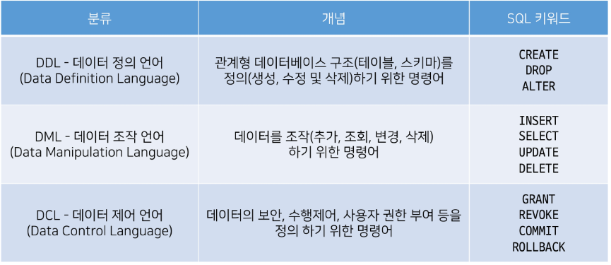

- SQL Syntax
- 모든 SQL문은 SELECT, INSERT, UPDATE등과 같은 키워드로 시작하고, 하나의 statement는 세미콜론(;)으로 끝남
  - 세미콜론은 각 SQL 문을 구분하는 표준 방법
- SQL 키워드는 대소문자를 구분하지 않음
  - 즉, SELECT와 select는 SQL 문에서 동일한 의미
  - 하지만 대문자로 작성하는 것을 권장

- Statement(문)
  - 독립적으로 실행할 수 있는 완전한 코드 조각
  - statement는 clause로 구성됨
- Clause(절)
  - statement의 하위 단위

### DDL

- data definition
- SQL 데이터 정의 언어를 사용하여 테이블 데이터베이스 개체를 만드는 방법을 학습
- DDL은 테이블 구조를 관리
  - CREATE, ALTER, DROP

### CREATE TABLE statement

- 데이터베이스에 새 테이블을 만듦

- ID 컬럼은 우리가 직접 기본 키 역할의 컬럼을 정의하지 않으면 자동으로 rowid라는 컬럼으로 만들어짐

- Data Types

  - Null
    - NULL value
    - 정보가 없거나 알 수 없음을 의미
  - INTEGER
    - 정수
    - 크기에 따라 0, 1, 2, 3, 4, 6 또는 8바이트와 같은 가변 크기를 가짐
  - REAL
    - 실수
    - 8바이트 부동 소수점을 사용하는 10진수 값이 있는 실수
  - TEXT
    - 문자 데이터
  - BLOB(Binary Large Object)
    - 입력된 그대로 저장된 데이터 덩어리(대용 타입 없음)
    - 바이너리 등 멀티미디어 파일
    - 예시
      - 이미지 데이터

  - 날짜와 시간은 데이터 타입이 따로 존재하지 않고 함수로 불러옴
    - TEXT, REAL, INTEGER로 불러와짐

- SQLite는 다른 모든 SQL 데이터베이스 엔진(MySQL, PostgreSQL등)의 정적이고 엄격한 타입이 아닌 동적 타입 시스템을 사용

  - 컬럼에 선언된 타입에 의해서가 아니라 컬럼에 저장된 값에 따라 데이터 타입이 결정됨

  - 예를 들어 동일한 컬럼에 정수 1을 넣을 경우 INTEGER로 타입이 지정되고, 문자 '1'을 넣을 경우 TEXT 타입으로 지정됨
  - 다만 이는 다른 데이터베이스와의 호환성 문제가 있기 때문에 테이블 생성 시 데이터 타입을 지정하는 것을 권장

- 타입 선호도 존재 이유
  - 다른 데이터베이스 엔진 간의 호환성을 최대화
  - 정적이고 엄격한 타입을 사용하는 데이터베이스의 SQl문을 SQLite에서도 작동할 수 있도록 하기 위해서

### Constraints

- 제약조건
- 입력하는 자료에 대해 제약을 정함
- 제약이 맞지 않다면 입력 거부됨
- 원하는 조건의 데이터만을 유지하기 위해, 무결성을 유지하기 위해

- 데이터 무결성

  - 데이터에 대한 정확성, 일관성을 보장하기 위해 데이터 변경 혹은 수정 시 여러 제한을 두어 데이터의 정확성을 보증하는 것

- 종류

  - NOT NULL
    - 컬럼이 NULL 값을 허용하지 않도록 지정
    - 기본적으로 NULL을 허용하므로 NOT NULL을 입력해줘야함
  - UNIQUE
    - 컬럼의 모든 값이 서로 구별되거나 고유한 값이 되도록 함
  - PRIMARY KEY
    - 테이블에서 행의 고유성을 식별하는 데 사용되는 컬럼
    - 각 테이블에는 하나의 기본 키만 있음
    - 암시적으로 NOT NULL 제약 조건이 포함되어 있음

  - AUTOINCREMENT
    - 사용되지 않은 값이나 이전에 삭제된 행의 값을 재사용하는 것을 방지
    - INTEGER PRIMARY KEY 다음에 작성하면 해당 rowid를 다시 재사용하지 못하도록 함

- rowid의 특징

  - 테이블을 생성할 때마다 rowid라는 암시적 자동 증가 컬럼이 자동으로 생성됨
  - 테이블의 행을 고유하게 식별하는 64비트 부호 있는 정수 값
  - 테이블에 새 행을 삽입할 때마다 정수 값을 자동으로 할당
    - 값은 1에서 시작

  - 만약 INTEGER PRIMARY KEY 키워드를 가진 컬럼을 직접 만들면 이 컬럼은 rowid 컬럼의 별칭(alias)이 됨
    - 즉, 새 컬럼 이름으로 rowid에 액세스 할 수 있으며 rowid 이름으로도 여전히 액세스 가능

### ALTER TABLE

- Modify the structure of an existing table
- 기존 테이블의 구조를 수정
  - 테이블의 이름 수정
  - 열의 이름을 수정
  - 새로운 컬럼을 추가
  - 컬럼을 삭제

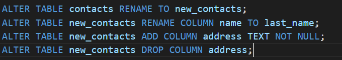

- 단, 데이터가 있을 경우 컬럼 추가 시 NULL이 작성되어 에러가 발생
  - DEFAULT 제약 조건을 사용하여 해결할 수 있음

- 삭제하지 못하는 경우가 있음

  - 컬럼이 다른 부분에서 참조되는 경우

  - PRIMARY KEY인 경우
  - UNIQUE 제약 조건이 있는 경우

### DROP TABLE

- 테이블 삭제 시
- 존재하지 않는 테이블을 제거하면 SQLite 오류 발생

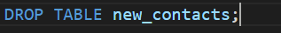

- 한 번에 하나의 테이블만 삭제할 수 있음
- 여러 테이블을 제거하려면 여러 DROP TABLE 문을 실행해야 함
- DROP TABLE문은 실행 취소하거나 복구할 수 없음

### DML

- DML을 통해 데이터를 조작하기 (CRUD)
- INSERT(C), SELECT(R), UPDATE(U), DELETE(D)

- SELECT문
  - 특정 테이블에서 데이터를 조회하기 위해 사용
  - SELECT 절에서 컬럼 또는 쉼표로 구분된 컬럼 목록을 지정
  - FROM 절에서 데이터를 가져올 테이블을 지정

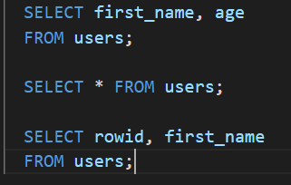

- 정렬
- ORDER BY 절을 사용
  - 하나 이상의 컬럼을 기준으로 결과를 오름차순, 내림차순으로 정렬할 수 있음
  - 이를 위해 ASC:오름차순(기본값), DESC:내림차순 사용

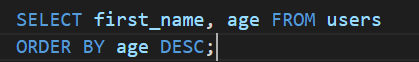

- 나이를 먼저 오름차순으로 정리하고 계좌순으로 내림차순

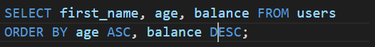

- NULL은 가장 작은 값으로 인식

- Filtering data
  - 중복제거, 조건 설정 등 쿼리를 제어
- SELECT DISTINCT clause
  - 조회 결과에서 중복된 행을 제거
  - DISTINCT 절은 SELECT 키워드 바로 뒤에 나타나야 함
  - DISTINCT 키워드 뒤에 컬럼 또는 컬럼 목록을 작성

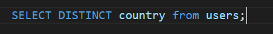

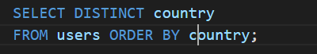

- SQLite는 NULL 값을 중복으로 간주
- NULL이 하나만 남는다.
- WHERE clause
  - 조회 시 특정 검색 조건을 지정
  - 논리연산자: 1, 0 또는 NULL값을 반환
  - SQLite는 Boolean 데이터 타입을 제공하지 않아 1은 TRUE를 의미하고 0은 FALSE를 의미

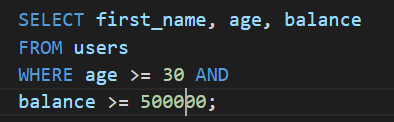

- LIKE operator
  - 패턴 일치를 기반으로 조회
  - 두 개의 와일드카드를 제공
    - %(percent): 0개 이상의 문자가 올 수 있음을 의미
    - _(underscore): 단일(1개) 문자가 있음을 의미 -> 김으로 시작하는 2글자

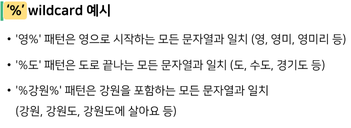

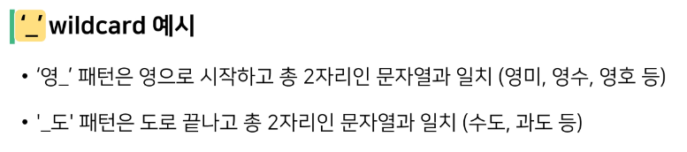

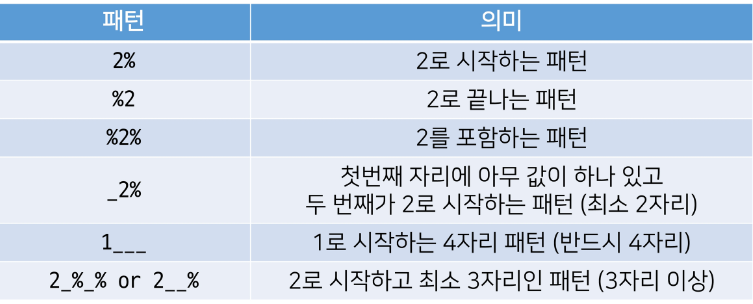

- "wildcards" character

  - 파일을 지정할 때, 구체적인 이름 대신에 여러 파일을 동시에 지정할 목적으로 활용
    - *, ?

  - 주로 특정한 패턴이 있는 문자열 혹은 파일을 찾거나, 긴 이름을 생략할 때 쓰임

- IN operator
  - 값이 값 목록 결과에 있는 값과 일치하는지

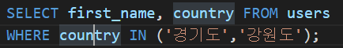

- BETWEEN 범위를 설정

- LIMIT clause
  - 행 수를 제한

- OFFSET keyword
  - 특정 지정된 위치에서 데이터 조회가능
  - LIMIT와 함께 사용되어 응용

