# Django - Model

## Namespace

- 가상환경을 항상 시작하기 전에 설정해주어야 함
- pip list를 한 다음에 2가지만 있으면 초기환경이므로 가상환경을 잘 연결되어있다는 의미

- pip install -r requirements.txt를 하면 해당 버전들이 전부 다운됨

- python manage.py runserver를 하면 실행이 가능

- urls의 분리를 통해 pages에서 url을 작성해도 pages/index/로 되어서 중복이 되지는 않음

- 명시적 상대경로를 통해 from . import views를 활용(현재 공간)

- view함수에서 첫번째 인자로 request 객체가 들어감.

- url의 물리적 주소가 아닌 이름을 지어주고 해당 이름을 사용

문제 발생

1. 두번째 앱 index로 이동하는 하이퍼 링크 클릭 시 현재 페이지로 다시 이동
   - URL namespace

2. url을 직접 쳤지만, 보여지는 건 articles의 index페이지가 출력
   - template namespace

- 이름이 중복으로 겹쳐서 app의 이름을 더 붙임
  - app_name:urlname 으로 접근!!
  - app_name을 안 적어주면 NoReverseMatch 에러가 생김
    - 그 페이지의 url 태그만 확인하면 해결됨

- templates도 분리 시켜줘야함
  - articles/templates
  - pages/templates
    - App폴더의 templates 안에서 index.html을 찾는데 중복이라 찾을 수 없음
    - render 시 이름이 중복된다면 앱의 등록 순서에 따라 templates를 출력
    - 앱 등록 순서는 pjt의 settings.py에 등록함

- 기본경로는 바꿀수는 없다
  - 그렇기 때문에 앞에 또다른 물리적인 공간을 만들어줘야한다.

- url이름 공간과 달리 template의 이름 공간은 물리적인 이름공간을 만들어줘야한다.
  - articles/templates/articles/index.html
  - pages/templates/pages/index.html


## Django Model

- 데이터를 구조화하고 조작하기 위한 추상적인 계층을 제공

### Database

- 체계화된 데이터의 모임
- 검색 및 구조화 같은 작업을 보다 쉽게 하기 위해 조직화된 데이터를 수집하는 저장 시스템
- database 기본 구조
- 스키마(Schema)
  - 뼈대
  - 데이터베이스에서 자료의 구조, 표현방법, 관계등을 정의한 구조

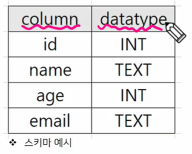

- 테이블(Table)
  - 실제 데이터베이스는 수많은 테이블의 모음

- 필드와 레코드를 사용해 조직된 데이터 요소들의 집합

- 관계(relation)라고도 부름

  - 필드: 속성, 컬럼
  - 레코드: 튜플, 행
  - 레코드가 작성되었다는 것은 데이터가 입력된 것
  - 필드는 속성 뼈대를 의미

  - 엑셀 하나가 큰 데이터베이스 인거고 sheet 하나가 테이블을 의미, 여러 sheet를 만들 수 있음

- 필드

  - 속성 혹은 컬럼
  - 각 필드에는 고유한 데이터 형식이 지정

- 레코드

  - 테이블의 데이터는 레코드에 저장됨

- PK(Primary Key)

  - 기본키
  - 각 레코드의 고유한 값(식별자로 사용)
  - 다른 항목과 절대로 중복될 수 없는 단일값
  - 데이터베이스 관리 및 테이블 간 관계 설정 시 주요하게 활용됨.

- 쿼리(Query)
  - 데이터를 조회하기 위한 명령어
  - 조건에 맞는 데이터를 추출하거나 조작하는 명령어
  - Query를 날린다: 데이터베이스를 조작한다.

### Model

- Django는 Model을 통해 데이터에 접근하고 조작

- 사용하는 데이터들의 필수적인 필드들과 동작(메서드)들을 포함

- 저장된 데이터베이스의 구조(layout)

- 일반적으로 각각의 모델은 하나의 데이터베이스 테이블에 매핑

  - 모델 클래스 1개 == 데이터베이스 테이블 1개

  - 장고의 모델을 통해 DB에 간접적으로 사용

- Model을 통해 데이터 관리(독립적인 DB와 소통)

  - view가 Model에 데이터 요청, Model은 DB에 데이터를 찾아서 전달

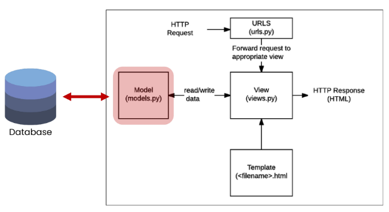

- 매핑: 하나의 값을 다른 값으로 대응시키는 것
- 하나의 테이블을 위해선 하나의 클래스가 필요함
  - models안의 Model클래스를 상속받음(부모가 가진 코드를 다 받음)
  - 우선 필드를 정의함(게시판의 제목과 내용)

- 클래스 변수가 하나의 필드

- models 안에 여러가지 데이터 타입을 결정할 수 있는 필드가 있음

  - 필드들이 클래스로서 존재하고 있고 내가 생성한 변수 title은 인스턴스가 된다.

  - models라는 모듈 안에 있는 클래스
  - 클래스를 통한 인스턴스 생성(스키마 즉 뼈대를 만드는 중)

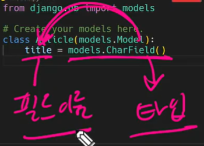

- Charfield 필수 키워드 인자가 있어서 반드시 max_length를 써줘야함

  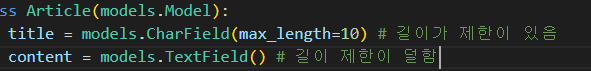

- 모델 클래스를 작성하는 것은 데이터베이스 테이블의 스키마를 정의하는 것
  - 모델 클래스 == 테이블 스키마
  - id 컬럼은 테이블 생성시 장고가 자동적으로 생성해줌
- 각 모델은 django.models.Model 클래스의 서브 클래스
  - 클래스 상속 기반 형태의 Django 프레임워크 개발
  - 잘 만들어진 도구를 가져다가 잘 쓰는 것

- Article에는 어떤 데이터 구조가 필요한지 정의
- title과 content는 DB 필드를 나타냄

## Django Model Field

- CharField와 TextField를 장고 모델 필드라고 함, 데이터 유형을 정의
  - 공식문서를 확인해서 어떤 필드가 있는지 보고 사용
- https://docs.djangoproject.com/en/3.2/ref/models/fields/
- 웬만하면 구글에서 찾고자하는 것을 치는 게 좋음
- 공식문서는 오른쪽 목차를 통해 확인

- CharField(ma_length=None, **options)
  - 길이의 제한이 있는 문자열을 넣을 때 사용
  - max_length
    - 필드의 최대 길이(문자): 255글자까지 가능
    - CharField의 필수 인자
    - 데이터베이스와 Django의 유효성 검사(값을 검증하는 것)에서 활용

- TextField(**options)
  - 글자의 수가 많을 때 사용(DB에 따라 글자수가 다름)
  - SQLite, Oracle.DB, MySQL 등을 사용
  - 기본적으로 SQLite를 쓰고 최대 문자 길이는 2^31 - 1개만큼 들어갈 수 있음.
  - max_length 옵션 작성 시 사용자 입력 단계에 반영되지만, 유효성을 검증하지는 않음
- 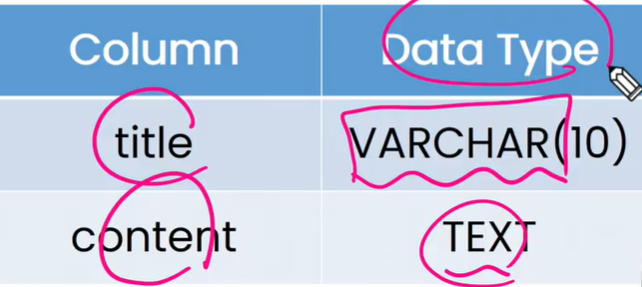

- VARCHAR는 가변길이 문자

## Migrations

- Django가 모델에 생긴 변화(필드 추가, 수정 등)를 실제 DB에 반영하는 방법
- makemigrations와 migrate가 주요 명령어

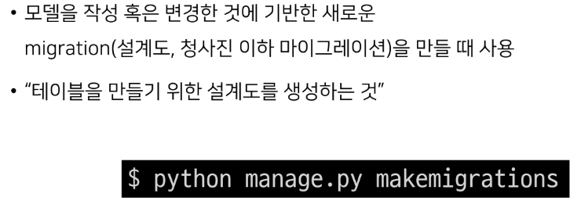

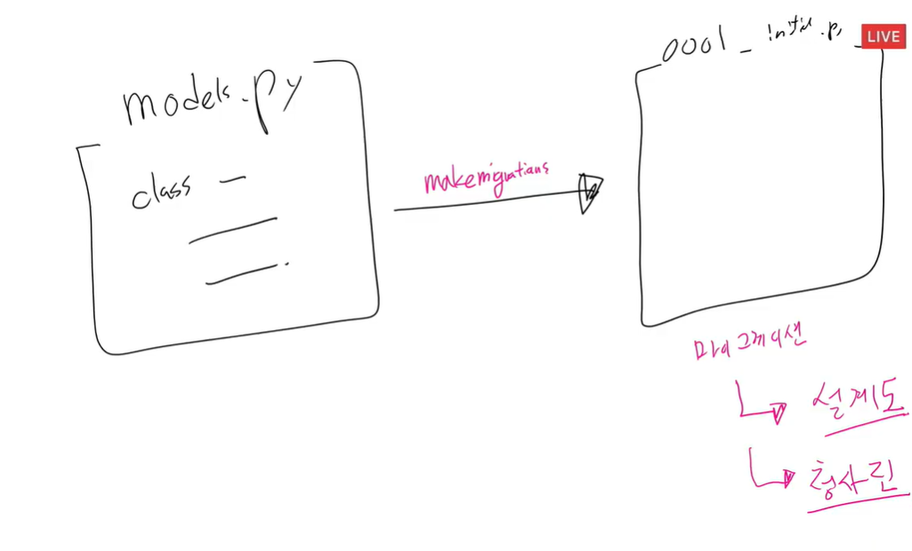

- 아직은 DB가 비어있다. 설계도만 만든 상태

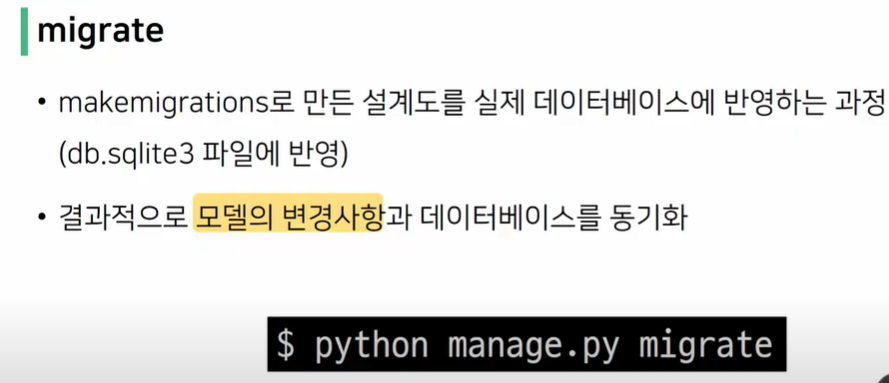

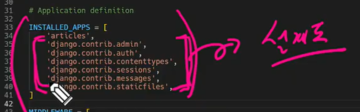

- 장고를 구동하기 위한 내장 앱들이 존재하고 그 앱들도 나름의 데이터 구조를 가짐
  - 처음 migrate에는 내장 앱들의 테이블도 다 같이 만들어지므로 출력값이 많다.
- migrate 명령어를 쓰면서 DB에 생성됨
- SQLite 확장 프로그램 다운하기

- 테이블을 만들 때 앱 이름_클래스 이름을 작성
- 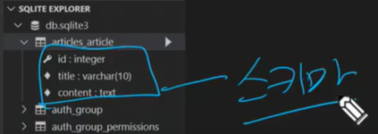

- `python manage.py showmigrations` migrate됐는지 확인 여부
  - [X]는 확인이 되었다는 기호
- `python manage.py sqlmigrate articles 0001`
  - migrations 파일이 SQL문으로 어떻게 해석 될 지 미리 확인 가능

- models.py에 변경사항이 생겼을 때 어떤 과정의 migration이 필요할까?
- 추가 모델 필드 작성 후 다시 한 번 makemigrations 진행

- 변경사항을 토대로 update된 새로운 설계도를 만들어야함
  - 새로 추가된 컬럼의 기본값 설정이 필요, DB는 빈값을 들어가도록 설계되지 않음

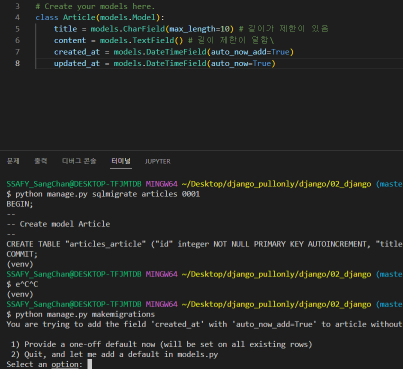

1) 장고에 직접 기본값을 추가하거나
2) 코드에 기본값을 넣는 것

- 우리는 1번을 선택, 문자열로 넣기가 불가능하므로 timezone 모듈을 사용해야하나 장고가 알아서 넣어줌. 그래서 1번으로 진행함

- 2번 설계도는 1번이 있어야 의미가 있다. 왜냐하면 의존성이 있기 때문에

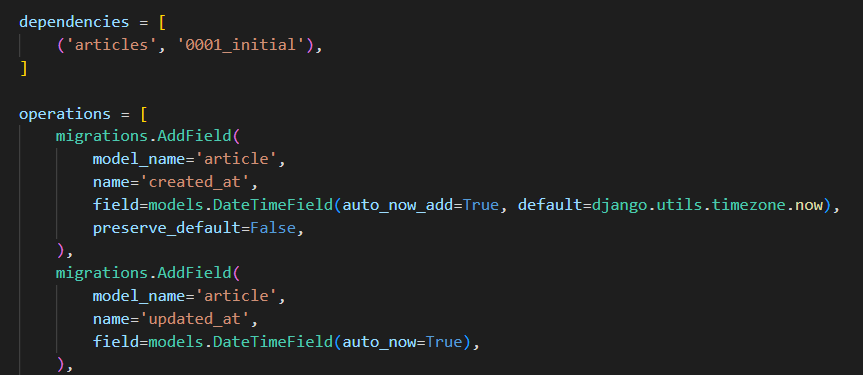

- 최신 설계도만 있는 게 아니라 계속해서 쌓아나감
  - git은 커밋을하고 버전을 쌓아나감 변경사항을 계속 수정해감
- DateTimeField()
  - python의 datetime.datetime 인스턴스로 표시되는 날짜 및 시간을 값으로 사용하는 필드
  - Date Field를 상속받는 클래스
  - 선택 인자
    - auto_now_add
    - 최초 생성 일자
    - 데이터가 실제로 만들어질 때 현재 날짜와 시간으로 자동으로 초기화 되도록 함
    - auto_now
    - 최종 수정 일자
    - 데이터가 수정될 때마다 현재 날짜와 시간으로 자동으로 갱신되도록 함.

- 장고에서 DB로 갈 때 중간 길에서 번역해주는 담당은 ORM이다.

- ORM(Object - Relational - Mapping)

  - 객체 지향 프로그래밍 언어를 사용해 호환되지 않는 유형의 시스템 간에 데이터를 변환하는 프로그래밍 기술

  - Django 는 내장 Django ORM을 사용
  - SQL을 사용하지 않고 데이터베이스를 조작할 수 있게 만들어주는 매개체

- 장점
  - SQL을 잘 알지 못해도 객체지향 언어로 DB조작이 가능
  - 객체 지향적 접근으로 인한 높은 생산성
- 단점
  - ORM만으로 세밀한 데이터베이스 조작을 구현하기 어려운 경우가 있다.

- 사용하는 이유

  - 생산성
  - 현시대 개발에서 가장 중요한 키워드는 바로 생산성
  - 우리는 DB를 객체로 조작하기 위해 ORM을 사용할 것

- QuerySet API

  - ORM이 사용하는 method들의 이름이 QuerySet API임
  - 대화형 쉘 화면을 위해 추가 라이브러리 설치

  - 자동완성, 컬러라이즈 해줌

- 간혹 외부라이브러리는 등록까지 해줘야함

- 패키지 목록이 업데이트 했기에 requirement update해줌

- Ipython

  - 기본 쉘보다 더 강력한 파이썬 쉘

- django-extensions

  - shell_plus, grapth model등 다양한 확장 기능 제공

- Shell

  - 운영체제 상에서 다양한 기능과 서비스를 구현하는 인터페이스를 제공하는 프로그램

  - 사용자 <> 셸 <> 운영체제

  - Python shell

    - 파이썬 코드를 실행해주는 인터프리터
    - 인터프리터: 코드를 한 줄씩 읽어 내려가며 실행하는 프로그램

    - python -i하면 python shell이 실행됨
    - exit()하면 나가짐
    - ipython을 치면 ipython이 켜짐

- Django shell
  - 파이썬 쉘이 Django 안에서 켜짐
  - 장고에 자주쓰는 클래스나 메소드를 가져옴
  - 맨 윗줄에는 우리가 만든 Article클래스가 있다.
  - 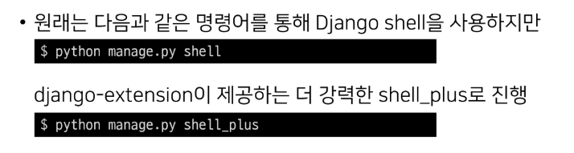

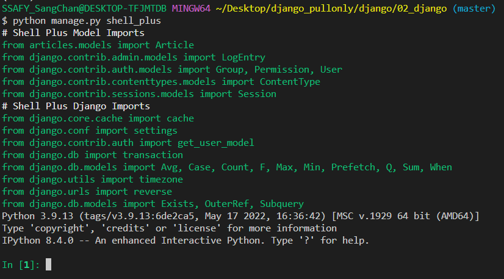


- 전체 데이터 조회
  - 결과가 QuerySet의 객체로 나옴

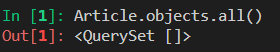

- Database API

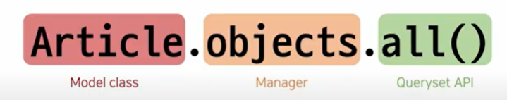

- objects는 고정이고 뒤쪽 Queryset API 메서드로 읽고, 조작, 수정, 삭제가 가능

- objects manager
  - Django 모델 클래스에 대해 objects라는 Manager 객체를 자동으로 추가함
- Query
  - 데이터베이스에 특정한 데이터를 보여 달라는 요청
    - 쿼리문을 작성한다: 원하는 데이터를 얻기 위해 데이터베이스에 요청을 보낼 코드를 작성한다
    - 파이썬으로 작성한 코드가 ORM에 의해 SQL로 변환
    - 응답 데이터를 ORM이 QuerySet이라는 자료형태로 변환해 우리에게 전달
- QuerySet
  - 데이터베이스에게서 전달 받은 객체 목록(데이터 모음)
    - 순회가 가능한 데이터로써 1개 이상의 데이터를 불러와 사용할 수 있음
    - 인덱스로도 접근이 가능함
  - Django ORM을 통해 만들어진 자료형, 필터를 걸거나 정렬 가능
  - 단, 데이터베이스가 단일한 객체인 경우 QuerySet이 아닌 인스턴스로 돌아옴

- CRUD
  - Create/Read/Update/Delete
    - 생성/조회/수정/삭제
  - 대부분의 컴퓨터 소프트웨어가 가지는 기본적인 데이터 처리 기능 4가지를 묶어서 일컫는 말

- Create

  - 인스턴스 객체 생성
  - 데이터 넣어줌

  - 모델 클래스로 만들어진 클래스에 save메서드를 활용
    - 반드시 save를 해야함
  - 데이터의 id가 부여됨

  - 생성, 수정시간은 UTC로 표출됨, 한글로 바꿔도 UTC가 그대로이다.
  - 실제 데이터 저장은 UTC로 고정이고 보여줄 땐 한국시간으로 변경됨
  - 어떤 데이터베이스라도 UTC로 함. 글로벌적인 소통을 위해

  - article.pk는 프라이머리 키로 id와 동일한 것이다.

- save()
  - 객체를 데이터베이스에 저장함
    - save를 호출하기 전에 객체의 id값은 None
    - id 값은 Django가 아니라 데이터베이스에서 계산되기 때문에
  - save를 호출해야 데이터가 추가됨

```django
1)article = Article()
  article.title = 'first'
  article.content = 'django!'
  article.save()
2)article = Article(title ='second',content='django!')
  article.save()
3) Article.objects.create(title='third', content='django!') # save까지 포함
```

- Read
  - 1) 쿼리셋을 받느냐(목록을 받느냐)
    2) 데이터 하나를 받느냐
  - all(): 전체 데이터 조회

```python
articles = Article.objects.all()
for article in articles:
    ...:     print(article)
   
# Article object (1)
# Article object (2)
# Article object (3)
```

- get()
  - 단일 데이터 조회
  - 객체를 찾을 수 없으면 DoesNotExist 예외를 발생
  - 둘 이상의 객체를 찾으면 MultipleObjectsReturned 예외를 발생시킴
  - 위 같은 특징을 가지고 있어 primary key와 같이 고유성(uniqueness)을 보장하는 조회에서 사용해야 함
  - 내용이 여러개여도 에러남

```python
Article.objects.get(id=1)
```

- filter()
  - 없어도 빈 쿼리셋
  - 하나여도 쿼리셋
  - pk를 조회할 때 없어도 빈 쿼리셋이라 확인이 힘들다, 쿼리셋으로 한번 더 감싸져 있어서 바로 알기도 어렵다
  - pk조회는 get을 사용해라

```python
# ja가 들어간 데이터를 추출 내용에 ja가 포함된 게시글 3개를 조회
under bar 2개-> 던더 
Article.objects.filter(content__contains='ja')
```

- Update과정

  - 수정 전에 먼저 해야할 것: 조회해서 변수를 가져온다음에 변경 진행

  - 조회 먼저하고 새로운 값 바꾸고 save진행
  - 수정 시간이 변경 됨

- Delete 과정

  - 삭제하고자 하는 인스턴스 객체를 조회후 반환 값 저장
  - delete()인스턴스 메서드 호출

  - 삭제되면 해당 고유값을 재사용하지 않음


- str을 통해서 출력되는 부분을 바꿔줄 수 있음
  - 작성 시 쉘을 껐다가 다시 켜야함

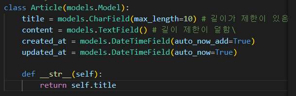


- 빨간 글씨는 migrate가 안돼서 떴던 에러였음


- Create 로직을 구현하기 위해서는 몇 개의 View 함수가 필요할까?(2개)
  - 글을 작성 후 페이지를 리턴(throw)
    - 사용자의 입력을 받을 페이지를 렌더링 하는 함수 1개
  - 데이터 받아서 DB에 저장하는 함수(catch)
    - 사용자가 입력한 데이터를 전송 받아 DB에 저장하는 함수 1개