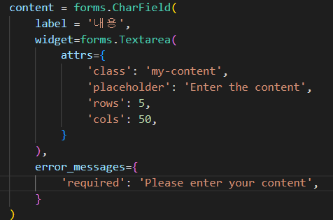
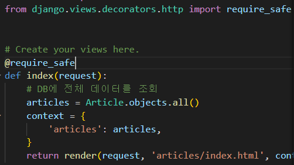

# Django Form

- 이처럼 사용자가 입력한 데이터가 우리가 원하는 데이터 형식이 맞는지에 대한 유효성 검증
- 외부의 악의적 공격 및 데이터 손상에 대한 중요한 방어 수단
- 유효성 검사를 단순화하고 자동화 할 수 있는 기능을 제공

### Form Class 선언

- Model Class를 선언하는 것과 비슷함
- forms 라이브러리의 Form 클래스를 상속받음

- CharField는 forms에서 max_length가 필수사항이 아니지만 모델과 맞춰주기 위해 작성해줌
- forms에는 text 필드가 없어서 CharField를 사용
- forms.py를 만드는 것은 관행은 아니지만, 유지보수의 관점에서 또는 관행적으로 해당 파일에서 작성
  - 다른 곳에서도 작성이 가능하다.

- form과 관련된 객체를 만들고 html에 불러오면 바로 text input이 작성된다.

- form의 인스턴스 method를 활용해 input 간에 br을 줄 수 있다.(`form.as_p`)

- **Form fields**
  - 입력에 대한 유효성 검사 로직을 처리
  - 템플릿에 직접 사용됨
- **Widgets**
  - 웹 페이지의 HTML input 요소 렌더링을 담당(유효성 검증과 관계가 없음)
    - input 요소의 단순한 출력 부분을 담당
  - Widgets은 반드시 form fields에 할당됨(구글에 django widget을 치면 표준 양식이 나온다)

- DropDown 형태로도 가능

- 장고의 스타일 가이드 권장사항이 변수를 만들어 놓고 value를 입력하는 것이다.
  - django style guide를 구글에 치면 해당 내용이 나온다.

- 앞으로 내용의 수정은 form 클래스에서 진행해야 한다.

- class를 통한 인스턴스 생성으로 진행하고, 똑같은 상속 구조를 가지고 필드 정의를 클래스 변수로 하고 있다. 필드의 이름이 같지만 다른 모듈을 사용함.

### Django ModelForm

- 장고의 Model 형식을 들고가므로 재정의할 필요가 없어짐

- 인스턴스를 만드는 것이 아니라 참조값을 활용, 등록을 한다고 생각

- created_at과 updates_at은 DB가 생성될 때 자동적으로 만들어지므로 불러오지 않아야 함.

- modelform은 모델에 대한 정의를 기반으로 form을 자동적으로 만들어 준다.
  - Model과 밀접한 관련이 있다.
- fields 속성에 '`__all__`'를 사용하여 모델의 모든 필드를 포함할 수 있음
- exclude 속성을 사용하여 모델에서 포함하지 않을 필드를 지정할 수 있음

- Meta data

  - 데이터를 표현하기 위한 데이터
  - 예시 - "사진 파일"
    - 사진 데이터
    - 사진 데이터의 데이터(촬영 시각, 렌즈, 조리개 값 등)
    - 사진의 Meta data라고 함.

  - 호출하지 않고 이름만 작성

- form 인스턴스를 생성, 데이터를 인자로 넣음
- 넣은 데이터를 검증을 하고 form.save()로 저장함

- 바인딩 => 데이터가 들어갔다
- save() method
- form 인스턴스에 바인딩 된 데이터를 통해 데이터베이스 객체를 만들고 저장
- ModelForm의 하위 클래스는 키워드 인자 instance 여부를 통해 생성할 지, 수정할 지를 결정함
  - 제공되지 않은 경우 save()는 지정된 모델의 새 인스턴스를 만듦(CREATE)
  - 제공되면 save()는 해당 인스턴스를 수정(UPDATE)

- is_valid에서 error 출력이 가능
  - 유효성 검증을 실패한 원인이 딕셔너리 형태로 저장

- 공백은 장고가 받아서 에러를 보여주고
- 데이터가 없는 것은 input의 required가 에러를 보내줌

- **UPDATE**
- ModelForm의 인자 Instance는 수정 대상이 되는 객체를 지정
  - request.POST
    - 사용자가 form을 통해 전송한 데이터(새로운 데이터)
  - instance
    - 수정이 되는 대상

### Form과 ModelForm

- ModelForm이 Form보다 더 좋은 것이 아니라 각자 역할이 다른 것
- Form
  - 사용자로부터 받는 데이터가 DB와 연관되어 있지 않는 경우에 사용
  - DB에 영향을 미치지 않고 단순 데이터만 사용되는 경우
    - 예시 - 로그인, 사용자의 데이터를 받아 인증 과정에서만 사용 후 별도로 DB에 저장 x
- ModelForm
  - 사용자로부터 받는 데이터가 DB와 연관되어 있는 경우에 사용
  - 데이터의 유효성 검사가 끝나면 데이터를 각각 어떤 레코드에 맵핑해야 할지 이미 알고 있기 때문에 곧바로 save()호출이 가능

### Widgets 활용하기

- 장고와 관련이 없는 부분, input tag의 표현에만 영향을 끼침
  - maxlength는 유효성 검사와 상관 없음

- error_messages는 core argument로서 widgets 안에 있는 것은 아님
  - field가 발생시키는 기본 내용을 변경

### Handling HTTP requests

- 아래쪽 context는 위에서 valid를 충족하지 않을 때의 에러 출력과 아래쪽 new에 대한 처리 두 개가 진행된다.

- 다음과 같이 병합했을 때 urls와 html의 경로를 변경해줘야 한다.
- 기존의 new.html도 create.html로 바꾼다.

- POST일 때만 DB의 조작이 있기 때문에 가장 먼저 빼낸다(*중요 Logic)
  - POST가 아닌 경우도 존재, PUT, DELETE 등등

- delete가 get에서도 삭제 될 수 있게 하면 url로 삭제가 가능해진다.
  - get은 조회 방식에서만 사용

### View decorators

- 데코레이터
  - 기존에 작성된 함수에 기능을 추가하고 싶을 때, 해당 함수를 수정하지 않고 기능을 추가하는 함수

### Allowed HTTP methods

- Method가 GET이 아닐 시 405 응답 코드를 준다(4가 앞에 오는 것은 클라이언트 잘못)
  - 405 Method Not Allowed
  - 요청 방법이 서버에게 전달 되었으나 사용 불가능한 상태

- require_http_methods는 받아들이는 method를 여러 개 설정 가능

- require_POST는 POST만 받아들인다.if문 삭제됨

- django 부트스트랩5 활용도 가능

https://django-bootstrap-v5.readthedocs.io/en/latest/installation.html