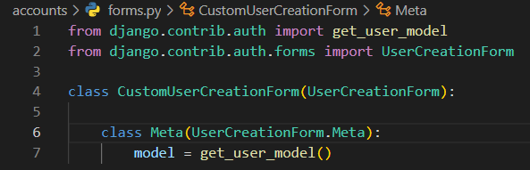

# Django 사용자 인증 및 권한

- Custom User Model로 대체하기
- 우리는 admin이라는 유저 모델을 사용하고 있었음
- 개발자들이 작성하는 일부 프로젝트에서는 django에서 제공하는 built-in User model의 기본 인증 요구사항이 적절하지 않을 수 있음
  - 예를 들어, 내 서비스에서 회원가입 시 username 대신 email을 식별 값으로 사용하는 것이 더 적합한 사이트인 경우, Django의 User Model은 기본적으로 username을 식별 값으로 사용하기 때문에 적합하지 않음
  - Django는 현재 프로젝트에서 사용할 User Model을 결정하는 AUTH_USER_MODEL을 덮어 씌운다.
- AUTH_USER_MODEL
  - settings.py에 존재
    - 우리가 작성하는 setting.py는 사실 global_setting.py를 상속받아 재정의하는 파일이어서 보이지 않음
  - 프로젝트에서 User를 나타낼 때 사용하는 모델
  - auth 앱의 User모델 클래스
  - 프로젝트가 진행되는 동안(모델을 만들고 마이그레이션 한 후) 변경할 수 없음
  - 프로젝트 시작 시 설정하기 위한 것이며, 참조하는 모델은 첫 번째 마이그레이션에서 사용할 수 있어야 함
    - 즉, 첫번째 마이그레이션 전에 확정 지어야 하는 값

### Custom User model로 대체하기

- 대체하는 과정을 외우기 어려울 경우 해당 공식문서를 보며 순서대로 진행하는 것을 권장
- AbstractUser를 상속받는 커스텀 User 클래스 작성

(1)기존 User 클래스도 AbstractUser를 상속받기 때문에 커스텀 User 클래스도 완전히 같은 모습을 가지게 됨

(2) Django 프로젝트에서 User를 나타내는데 사용하는 모델을 방금 생성한 커스텀 User 모델로 지정

- 중간에 바꾸면 거스를 수 없음, 바꾸려면 데이터를 다 지우고 시작해야함
- User가 서로 연관되어 있어 수정이 어려움
- 모델 관계에 영향을 미치기 때문에 훨씬 더 어려운 작업이 필요
  - 예를 들면 변경사항이 자동으로 수행될 수 없기 때문에 DB 스키마를 직접 수정하고, 이전 사용자 테이블에서 데이터를 이동하고, 일부 마이그레이션을 수동으로 다시 적용해야 하는 등..

(3) admin.py에 커스텀 User 모델을 등록

- 기본 User 모델이 아니기 때문에 등록하지 않으면 admin site에 출력되지 않음

- User 모델 상속 관계
  - AbstractUser가 대부분의 기능을 가지고 있음
  - 관리자 권한과 함께 완전한 기능을 가지고 있는 User model을 구현하는 추상 기본클래스

- Abstract base classes(추상 기본 클래스)
  - 몇 가지 공통 정보를 여러 다른 모델에 넣을 때 사용하는 클래스
    - 몇 가지 기능을 전달하기 위한 클래스
  - 데이터베이스 테이블을 만드는 데 사용되지 않으며, 대신 다른 모델의 기본 클래스로 사용되는 경우 해당 필드가 하위 클래스의 필드에 추가 됨

### 데이터베이스 초기화

1. migrations 파일 삭제(설계도 삭제)
   - migrations 폴더 및 `__ini__py`는 삭제하지 않음
   - 번호가 붙은 파일만 삭제
2. db.sqlite3 삭제
3. migrations 진행
   - makemigrations
   - migrate

- User모델을 Accounts의 User모델로 대체완료

- 커스텀 User 모델은 기본 User 모델과 동일하게 작동하면서도 필요한 경우 나중에 맞춤 설정할 수 있기 때문

### HTTP Cookies

- HTTP
  - Hyper Text Transfer Protocol
  - HTML 문서와 같은 리소스들을 가져올 수 있도록 해주는 프로토콜(규칙, 규약)
  - 웹(WWW)에서 이루어지는 모든 데이터 교환의 기초
  - 클라이언트 - 서버 프로토콜이라고도 부름
- 요청(requests)
  - 클라이언트(브라우저)에 의해 전송되는 메시지
- 응답(response)
  - 서버에서 응답으로 전송되는 메시지
- 특징
  - 비 연결 지향(connectionless)
    - 서버는 요청에 대한 응답을 보낸 후 연결을 끊음
    - 예를 들어 우리가 네이버 메인 페이지를 보고 있을 때 우리는 네이버 서버와 연결되어 있는 것이 아님
    - 네이버 서버는 우리에게 메인 페이지를 응답하고 연결을 끊은 것
  - 무상태(stateless)
    - 연결을 끊는 순간 클라이언트와 서버 간의 통신이 끝나며 상태 정보가 유지되지 않음
    - 클라이언트와 서버가 주고받는 메시지들은 서로 완전히 독립적
- 어떻게 로그인 상태를 유지할까?
  - 우리가 로그인을 하고 웹 사이트를 사용할 때 페이지를 이동해도 로그인 상태가 유지됨
  - 서버와 클라이언트 간 지속적인 상태 유지를 위해 `'쿠키와 세션'`이 존재
- 쿠키(Cookie)
  - HTTP 쿠키는 상태가 있는 세션을 만들도록 해 줌(상태를 유지시켜주는 쿠키를 세션 쿠키라고 함)
- 개념
  - 서버가 사용자의 웹 브라우저에 전송하는 작은 데이터 조각이다.
  - 사용자가 웹사이트를 방문할 경우 해당 웹사이트의 서버를 통해 사용자의 컴퓨터에 설치되는 작은 기록 정보 파일
    - 브라우저(클라이언트)는 쿠키를 로컬에 KEY-VALUE의 데이터 형식으로 저장
    - 이렇게 쿠키를 정장해 놓았다가, 동일한 서버에 재요청 시 저장된 쿠키를 함께 전송
  - 쿠키는 두 요청이 동일한 브라우저에서 들어왔는지 아닌지를 판단할 때 주로 사용됨
    - 이를 이용해 사용자의 로그인 상태를 유지할 수 있음
    - 상태가 없는(stateless) HTTP 프로토콜에서 상태 정보를 기억 시켜 주기 때문
  - 즉, 웹 페이지에 접속하면 웹 페이지를 응답한 서버로부터 쿠키를 받아 브라우저에 저장하고, 클라이언트가 같은 서버에 재요청 시마다 요청과 함께 저장해 두었던 쿠키도 함께 전송

- 쿠키 사용 목적
  - 세션 관리(Session management)
    - 로그인, 아이디 자동완성, 공지 하루 안 보기, 팝업 체크, 장바구니 등의 정보 관리
  - 개인화(Personalization)
    - 사용자 선호, 테마 등의 설정
  - 트래킹(Tracking)
    - 사용자 행동을 기록 및 분석

- 세션(session)
  - 사이트와 특정 브라우저 사이의 state(상태)를 유지시키는 것
  - 클라이언트가 서버에 접속하면 서버가 특정 session id를 발급하고, 클라이언트는 session id를 쿠키에 저장
    - 클라이언트가 다시 동일한 서버에 접속하면 요청과 함께 쿠기(session id가 저장된)를 서버에 전달
    - 쿠키는 요청 때마다 서버에 함께 전송되므로 서버에서 session id를 확인해 알맞은 로직을 처리
  - session id는 세션을 구별하기 위해 필요하며, 쿠키에는 session id만 저장

- 쿠기 Lifetime(수명)
  - Session cookie
    - 현재 세션이 종료되면 삭제됨
    - 브라우저 종료와 함께 세션이 삭제됨
  - Persistent cookies
    - Expires 속성에 지정된 날짜 혹은 Max-Age 속성에 지정된 기간이 지나면 삭제됨

- Session in Django

  - Django는 database-backed sessions 저장 방식을 기본값으로 사용
    - session 정보는 Django DB의 django_session 테이블에 저장
    - 설정을 통해 다른 저장방식으로 변경 가능
  - Django는 특정 session id를 포함하는 쿠키를 사용해서 각각의 브라우저와 사이트가 연결된 session을 알아냄.

  - Django는 우리가 session 메커니즘(복잡한 동작원리)에 대부분을 생각하지 않게 끔 많은 도움을 줌

### Authentication in Web requests

- Django가 제공하는 인증 관련 built-in forms 익히기

### Login

- 로그인은 Session을 Create하는 과정

- AuthenticationForm
  - 로그인을 위한 built-in form
    - 로그인하고자 하는 사용자 정보를 입력 받음
    - 기본적으로 username과 password를 받아 데이터가 유요한지 검증
  - request를 첫 번째 인자로 취함

- login()
  - login(request, user, backend=None)
  - 인증된 사용자를 로그인시키는 로직으로 view함수에서 사용됨
  - 현재 세션에 연결하려는 인증된 사용가가 있는 경우 사용
  - HttpRequest 객체와 User 객체가 필요
- get_user()
  - AuthenticationForm의 인스턴스 메서드
  - 유효성 검사를 통과했을 경우 로그인 한 사용자 객체를 반환

- 서버에 무조건 저장하면 부하가 걸리므로 브라우저에 쿠키 형태로 저장한다
  - 브라우저라고 해킹이 쉬운 것은 아니다.

### Authentication with user

- 기본 context가 존재하기에 user 변수를 바로 사용할 수 있다
- setting.py에 context processors 설정 값 때문
- context processors
  - 템플릿이 렌더링 될 때 호출 가능한 컨텍스트 데이터 목록
  - 작성된 컨텍스트 데이터는 기본적으로 템플릿에서 사용 가능한 변수로 포함됨
  - 즉, django에서 자주 사용하는 데이터 목록을 미리 템플릿에 로드 해 둔 것

### Logout

- 로그아웃은 Session을 Delete하는 과정
- logout(request)
- HttpRequest 객체를 인자로 받고 반환 값이 없음

- 사용자가 로그인하지 않은 경우 오류를 발생시키지 않음

- 다음 2가지 일을 처리한다.

  - 현재 요청에 대한 session data를 DB에서 삭제

  - 클라이언트의 쿠키에서도 session id를 삭제
    - 다른 사람이 동일한 웹 브라우저를 사용하여 로그인하고, 이전 사용자의 세션 데이터에 엑세스하는 것을 방지하기 위함

### Authentication with User

- User Object와 User CRUD에 대한 이해
  - 회원 가입, 회원 탈퇴, 회원정보 수정, 비밀번호 변경
- 회원가입은 User를 Create하는 것이며 UserCreationForm built-in form을 사용

- 주어진 username과 password로 권한이 없는 새 user를 생성하는 ModelForm
- 3개의 필드를 가짐
  - username(from the user model)
  - password1
  - password2
- UserCreationForm은 모델 폼
  - 등록된 모델이 auth.User를 사용되어 만들어짐
  - 상속을 받아 우리가 사용하는 대체 User로 변경

- 직접 참조하는 것을 권장하지 않고 get_user_model을 활용해 간접적으로 참조

- 로그인 확인은 DB에 들어가서 보거나 로그인 직접 해보기

- 회원가입 시 이메일도 넣고 싶으면 필드를 추가해준다.
  - 이메일은 선택사항이라 입력하지 않아도 가입 가능
  - 장고 유저 오브젝트 치면 확인도 가능

### 회원 탈퇴

- 회원 탈퇴하는 것은 DB에서 유저를 Delete하는 것과 같음

### 회원정보 수정

- 회원정보 수정은 User를 Update 하는 것이며 UserChangeForm built-in-form을 사용

- UserChangeForm
  - 사용자의 정보 및 권한을 변경하기 위해 admin 인터페이스에서 사용되는 ModelForm(이미 쓰고 있는 것)
  - UserChangeForm 또한 ModelForm이기 때문에 instance 인자로 기존 user 데이터 정보를 받는 구조 또한 동일함
  - 이미 이전에 CustomUserChangeForm으로 확장했기 때문에 CustomUserChangForm을 사용하기

- 상기 항목은 UserchangeForm이다.

- 비밀번호를 변경해주는 form이 따로 존재
  - 암호화를 위한 별도의 로직이 있기 때문에

### PasswordChangeForm

- 사용자가 비밀번호를 변경할 수 있도록 하는 Form
- 이전 비밀번호를 입력하여 비밀번호를 변경할 수 있도록 함
- 이전 비밀번호를 입력하지 않고 비밀번호를 설정할 수 있는 SetPasswordForm을 상속받는 서브 클래스

### Limiting access to logged-in users

1. The raw way
   - is_authenticated attribute
2. The login_required decorator

- is_authenticated
  - User model의 속성(attributes) 중 하나
  - 사용자가 인증되었는지 여부를 알 수 있는 방법
  - 모든 User 인스턴스에 대해 항상 True인 읽기 전용 속성
    - AnonymousUser에 대해서는 항상 False
  - 일반적으로 request.user에서 이 속성을 사용(request.user.is_authenticated)

> ​	권한과는 관련이 없으며, 사용자가 활성화 상태이거나 유효한 세션을 가지는지 확인하지 않음

- @login_required 는 기본적으로 /accounts/login으로 설정되어 있다.

- next를 처리하고 싶으면 action에 모든 것을 비우면 브라우저의 주소로 진행된다.