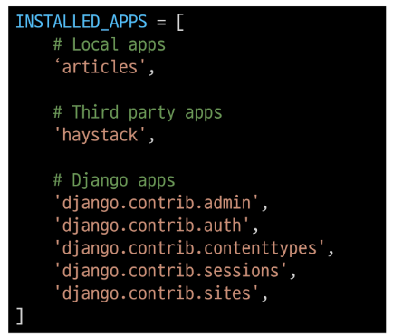

# ✨ Django ✨

## 08.30

- Webservice
  - Spring: Java용
  - flask: 모듈 단위로 구성해주고 이어주진 않음
  - Django: 모든 토대 위에 꾸미는 것만 진행

- Index 페이지는 접속 시 처음 보이는 페이지
- 사용자 입력정보, 서버 정보를 처리해서 새로운 페이지를 내보냄

- 로그인, 로그아웃, 회원관리, 데이터베이스, 서버, 클라이언트, 보안 등이 필요

- 서비스 개발에 필요한 기능들을 미리 구현해서 모아 놓은 것 = 프레임워크(Framework)

  - 장고는 규약이 많음, 그 의미는 안정적이다(상업적으로 사용 중)
  - 플라스크 보다 보안이 좋음

  - 플라스크: 넷플릭스, 인스타그램: 장고

- 장고도 DTL을 통해 클라이언트를 구현함

- 웹 페이지란?
  - 웹에 있는 문서: 우리가 보는 화면 각각 한 장 한 장이 웹 페이지
  - 정적 웹 페이지: 나무위키, 정보를 보여주고 끝
  - 동적 웹 페이지: 기존의 페이지에 조금 다른 기능이 구현되어서 활용됨

- Django의 디자인 패턴은 **MTV디자인**
  - MVC 패턴을 조금 수정한 것

- MVC
  - Model: 데이터 저장, 수정, 삭제
  - View: 레이아웃과 화면을 처리
  - Controller: 명령을 model과 view 부분으로 연결(Model에서 내용을 찾아서 보여주는 부분에 연결)
- MTV
  - Model: 데이터 저장, 수정, 삭제
  - Template: 레이아웃 화면 처리, 인터페이스 구조와 레이아웃을 정의
  - View: Model & Template과 관련한 로직을 처리해서 응답을 반환

- URLS: HTTP request를 받으면 어디로 보내야할지 경로 결정을 함

- Model에서 정보를 불러들여서 Template으로 보여줄 부분을 정해서 View로 응답


- 가상환경을 만드는 이유: 장고는 주로 외부에서 서버에 설치됨

  - 로컬 피시가 서버인 것처럼 활용(여러 사람이 접속할 수 있도록)
  - 동일한 버전이 되도록해야 서버 확충 시 옮겨다닐 수 있음
  - 장고를 여러개 설치해서 만든다
    - 일반적으로는 장고, 플라스크, 텐서플로어와 같이 가상환경을 따로 만들어서 사용

- -m: 만들겠다는 의미

- venv: 가상환경을 만드는 파이썬 명령어(virtual environment)

  - 컴퓨터 내에 환경 하나를 만들었다고 생각

- 그 다음은 가상환경 이름

  - deactivate: 가상환경에서 나와짐
  - source venv/scripts/activate ( 해당 폴더로 가서 확인)
  - ls: 디렉토리 확인
  - cd ~는 초기로 돌아가는 듯??

  - 윈도우 명령창은 그냥 가상환경에 들어가지지만(폴더를 scripts까지 들어가서 activate눌러야함), git bash는 source를 제일 앞에 쳐야함

  - pip list를 치면 설치가능한 pip와 setuptools만 있음
  - mkdir은 폴더 만들기
  - pip list
  - pip freeze > requirements.txt
  - cat requirements.txt로 설치 버전을 알 수 있음(프로그램 버전과 목록을 알 수 있음)
  - pip install -r requirements.txt 를 하면 pip가 requirements를 뒤져서 해당 버전의 프로그램을 다 설치해줌(이사갈 때 사용)
  - django-admin startproject firstpjt . 
    - .은 현재 위치, firstpjt는 이름
  - python manage.py runserver를 사용하면 잘 돌아갔는지 확인
  - 

- 회사마다 LTS 버전이 있음

> **장기 지원 버전**, 곧 **LTS**(Long Term Support)는 일반적인 경우보다 장기간에 걸쳐 지원하도록 특별히 고안된 소프트웨어의 [버전](https://ko.wikipedia.org/wiki/버전) 또는 에디션이다. 이것은 특히 [리눅스](https://ko.wikipedia.org/wiki/리눅스)를 비롯한 [오픈소스 프로젝트](https://ko.wikipedia.org/wiki/자유-오픈_소스_소프트웨어)에서 적용되고 있다.소프트웨어 개발 프로세스 및 소프트웨어 릴리스 수명주기에 안정성 엔지니어링이라는 기조를 적용하는 컴퓨터 소프트웨어의 제품 수명주기 관리 정책이다. 이러한 LTS(장기지원)는 소프트웨어 유지보수기간을 연장한다.

- wsgi는 애플리케이션과 연결시켜줌

- manage.py는 커맨드라인 유틸리티
- python manage.py startapp articles로 앱을 생성


- view가 application 밑에 있다
  - 유저 앱 하나, 제품 앱 하나 이렇게 나눌 수 있음
- urls는 firstpjt에 있다

- 앱을 등록시켜야함
- 우리가 만든 건 앞에 추가해야함
  - 남들이 만든 Third는 가운데에 넣는다



- gitignore로 선택적으로 git push가 가능
  - 모든 프로그램을 올릴 필요가 없음
- URL(요청받고) -> View(데이터 확인) -> Template(보여주기) 순서로 코드 작성
- URLs.py path(경로 이름:, Index 페이지)
  - http(규약): 주소 포트번호 / 경로, 리소스/a.html (URL만드는 규약)

- path함수에 경로가 들어오면 (없으면 404에러) views.py의 index함수에 가서 처리해줘
  - 각 경로마다 데이터 처리가 다름. 그 처리는 views내부 함수를 만들고 그 이름은 경로랑 이름을 동일시해줌
- URL문자열 마지막에 Trailing Slash를 붙인다 경로 뒤에 꼭 붙임

- 장고는 끝날 때마다 계속 쉼표를 붙임


- http request 객체가 들어감 -> 인자의 이름을 request하는게 규약
- 앱 밑에 templates 폴더가 있어야하고 그 안에 사용되는 html은 장고가 선점한 것
  - 그 안에 html을 만들어서 사용

- !엔터치면 html 기본구조가 나옴

<장고 실습>

0.  gitignore

1. 가상환경 생성 및 활성화
2. Django 설치
3. Project 생성 (setting.py와 urls.py를 주로 사용) (django-admin startproject name .)
4. Python manage.py runserever - 로켓확인
5. App 생성(python manage.py startapp name)
6. App 등록(settings에서 등록한다)

## DTL(Django Template Language)

- Variable

  - render()의 세번째 인자가 딕셔너리 형식

  - render(request, 'greeting.html', {'name': 'Alice'}) : html과 데이터로 새로운 html을 만들어서 client로 보내줘라
  - 세 번째 자리에 데이터를 담은 변수를 넣을 수 있다.

- filter
  - {{variable|}}

> Django builtin filter tag에 펴준 툴이 있다.

- 장고가 url을 포스팅해서 path를 연결해준다

- {{pick}}에서 pick은 context의 key값을 의미하고, html을 조합해서 출력할 때에는 변수 자리에 데이터 값이 들어감.

  

- href는 링크이고 그 다음에 주소가 들어온다


- tag는 중괄호와 퍼센트의 조합()
  - emmit이 잘 깔려 있다면 %탭?해도 바로 만들어짐
  - 순서가 있는 것은 ol, 없는 건 ul


- {# #}: 한 줄 주석/  내용 : 여러 줄 주석

## 템플릿 상속

- base template = parent template 을 만들어서 활용
- 반복해서 작성하는 것은 비효율적이라서 상속을 한다

- `` 자식(하위)템플릿이 부모 템플릿을 확장한다는 것을 알림
  - 반드시 템플릿 최상단에 작성 되어야 함(2개 이상 사용 불가)

- ` `으로 고유 코드를 작성가능[**overridden**]

  - 하위 템플릿이 채울 수 있는 공간
  - 일부를 상속받아서 사용

  - content에 이름을 붙여줄 수 있음

- BASE_DIR: prj가 생성된 디렉토리
  - 다른 곳에서도 templates를 쓸 수 있게 하려고 아래에 사용
  - 파일 경로는 C:/로 사용하지 않고, 상대 경로 사용


- query parameter 
  - html에서 form안에 input의 다양한 값들이 전달될 때 request와 데이터가 전송
  - url: protocol 주소 port/resource?par1=val1&par2=val2

<form action = '경로' method(전송방식)

- http전송 방식은 **get(조회), post(저장, 처리),** delete, put

- get은 주소창에 표시되도록 만들어줌.(검색창) -> default값
- post 방식은 주소창에 표시되지 않도록 한다.

- local host는 127.0.0.1
- 

- name 속성은 데이터 전송
- id는 CSS와 관련됨(form안의 label 태그의 for 속성과 같아야함.)
- get

```html



  <h1>Throw</h1>
  <form action="/catch/" method='GET'>
    <label for="message">Throw</label> # for와 id가 연결되어 있음.
    <input type="text" id="message" name="message"> # name은 주소창에 나오는 변수명?
    <input type="submit">
  </form>

```

- catch라는 경로를 만들어줘서 데이터를 받음

- HTTP request의 GET이라는 속성에 get 메소드를 통해 키값을 넣어준다

- sky라는 값이 message라는 키에 들어온 것이다.

- submit을 하면 Get방식으로 데이터를 받고 catch경로로 이동해라

> Trailing Slashes

- protocol:주소:port/index

- /가없으면 파일 /가 있으면 폴더 /를 무조건 붙여서 폴더로 만들어주는 게 장고 철학

- routing은 주소를 확정

  - SKY, KDH, HHS와 같은 다양한 데이터가 들어오면 많은 페이지를 만들어야해서 좋지 않음
  - 단지 변수로 받아서 경로가 미리 만들어진 게 아니라 변수값에 따라 변형되도록

  - URL의 일부를 변수로 지정 <>로 지정
  - str은 기본값

- APP마다 views가 생기고  많아짐

- 기존의 local host/ index, local host/dinner 대신에
- local host/ **articles** / index, local host/ **articles** /dinner

- 닉네임을 써야해서, name을 각각 정해줘서 나중에 a href="/throw/" 대신에 a href="url 'throw'"로 바꿈
- 경로를 바꿔야 할 경우가 있으면 path만 바꿔주면 됨?!(닉네임이 있으니)