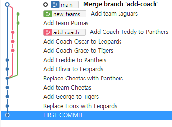
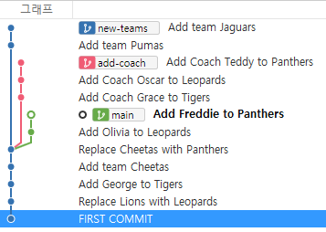
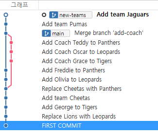

# branch 합치기 실습


## 1. **merge**로 합치기

`add-coach` 브랜치를 `main` 브랜치로 **merge**

- ⭐ `main` 브랜치로 이동
- 아래의 명령어로 병합

```
git merge add-coach
```

- `:wq`로 자동입력된 커밋 메시지 저장하여 마무리

- 소스트리에서 확인

  




## 💡 `merge`는 `reset`으로 되돌리기 가능

- `merge`도 하나의 커밋
- `merge`하기 전 해당 브랜치의 마지막 시점으로

> `git log --all --decorate --oneline --graph`로 main의 마지막 커밋이 어딘지 확인하는 게 좋을 것 같다. 단순히 git log로 봤을 때는 branch가 합쳐져서 구분이 불가능함. 아니면 소스트리를 활용해서 이동하기




## 병합된 브랜치는 삭제

삭제 전 소스트리에서 `add-coach` 위치 확인

```
git brach -d add-coach
```

> ✔ add-coach는 병합하기 전 마지막 커밋에 머물러 있어서 삭제가 필요!!!


---


## 2. **rebase**로 합치기

`new-teams` 브랜치를 `main` 브랜치로 **rebase**

- `new-teams` 브랜치로 이동
  - 🛑 `merge`때와는 반대!
- 아래의 명령어로 병합

```
git rebase main
```



- 소스트리에서 상태 확인
  - `main` 브랜치는 뒤쳐져 있는 상황


- `main` 브랜치로 이동 후 아래 명령어로 `new-teams`의 시점으로 ⭐ **fast-forward **⭐

```
git merge new-teams
```

- `new-teams` 브랜치 삭제