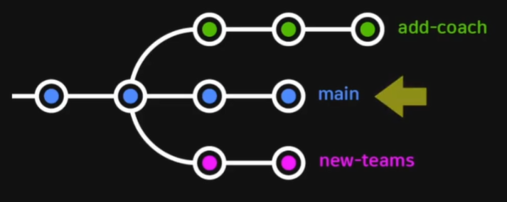
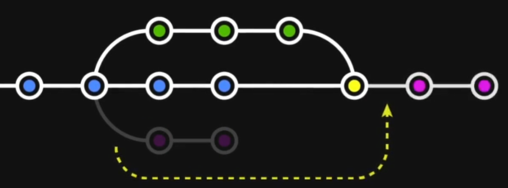

# branch를 합치는 두 가지 방법

- 프로젝트 메인 줄기는 위와 같이 표시됨

### merge

- 두 브랜치를 한 커밋에 이어붙입니다.
  - 브랜치 사용내역을 남길 필요가 있을 때 적합한 방식
  - 다른 형태의 merge에 대해서도 이후 다루게 될 예정

### rebase

- 브랜치를 다른 브랜치에 이어붙입니다.
  - 한 줄로 깔끔히 정리된 내역을 유지하기 원할 때 적합합니다.
  - 이미 팀원과 공유된 커밋들에 대해서는 사용하지 않는 것이 좋다.

