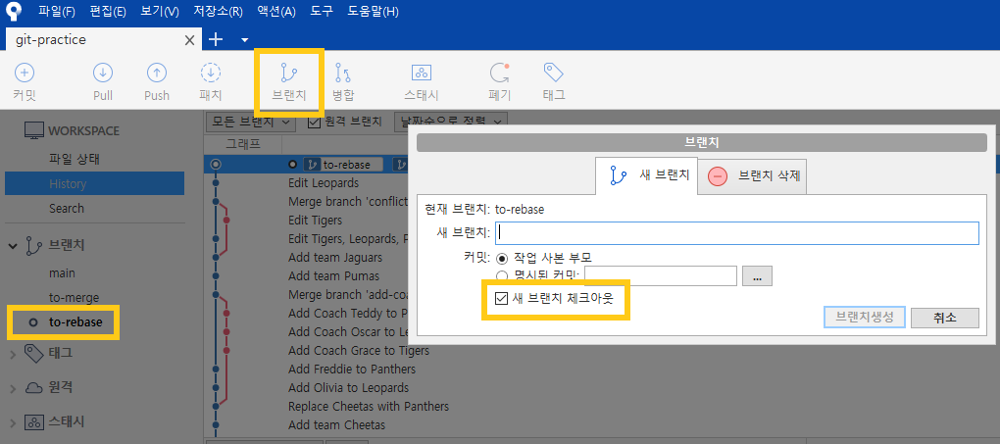
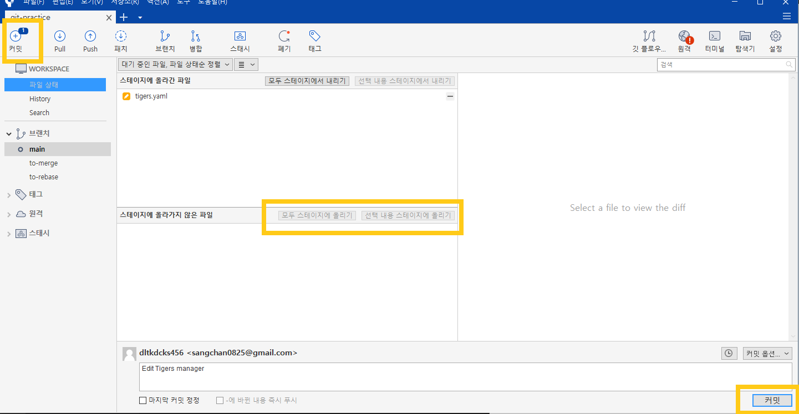
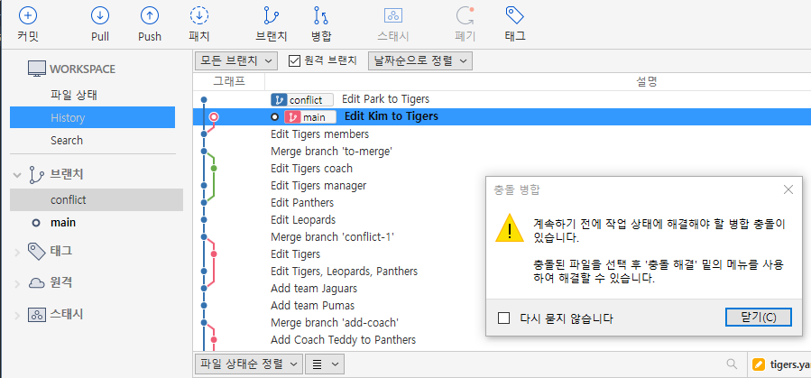
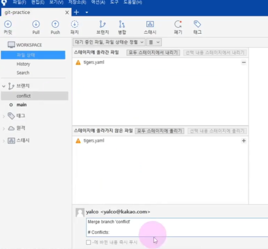

# 충돌 해결하기(소스 트리 ver.)

### 브랜치 생성

- 브랜치 버튼 클릭 후 생성
  - 새 브랜치 체크아웃은 switch와 같은 기능이다.
  - 생성 즉시 해당 브랜치로 이동된다. (✔더블 클릭으로 원하는 브랜치로 이동 가능!)

- 내용 변경 후 커밋 진행
  - 스테이지에 올리고 커밋 버튼 클릭!!

#### ⭐️ 브랜치를 이동하며 파일 살펴보기

1. `to-merge` 브랜치 `main`으로 `merge`
   - `main`에 위치한 뒤 `to-merge` 브랜치를 우클릭하여 `Merge ...` 클릭

2. `to-rebase` 브랜치 `main`으로 `rebase`

   - `to-rebase`에 위치한 뒤 `main` 브랜치를 우클릭하여 `... 재배치` 클릭

   - `main`에 위치한 뒤 `to-rebase` 브랜치를 우클릭하여 `Merge ...` 클릭

3. `main`으로 이동 후 `to-merge`와 `to-rebase` 우클릭하여 삭제
   - `merge`되지 않은 브랜치의 경우 `강제 삭제` 체크박스 선택

⛔ 필요한 `branch`를 실수로 삭제할 경우가 있기 때문에 경고문을 띄워준다!!! -> CLI인 경우에는 `git branch -D (브랜치명)`을 해주면 된다.

## 2. `merge` 충돌 해결해보기

💡 `rebase`는 충돌 가능시 CLI로 진행 권장!!

1. `conflict` 브랜치 생성

2. `main` 브랜치

- Tigers의 `members`에 `Kim` 추가
- 커밋 메시지: `Edit Kim to Tigers`

3. `conflict` 브랜치

- Tigers의 `members`에 `Park` 추가
- 커밋 메시지: `Edit Park to Tigers`

4. `merge`하여 충돌 해결해보기

> 충돌 해결 후 `commit` 진행

5. `conflict` 브랜치 삭제