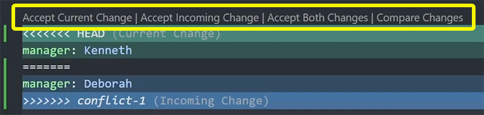
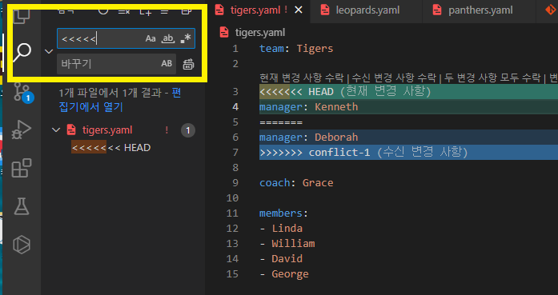
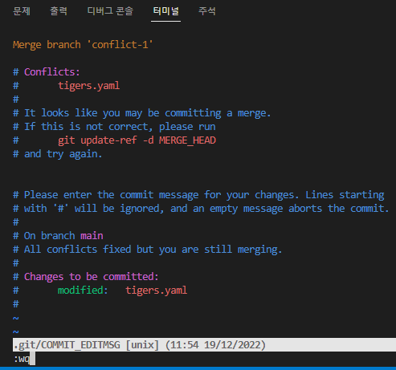
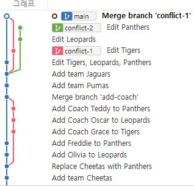
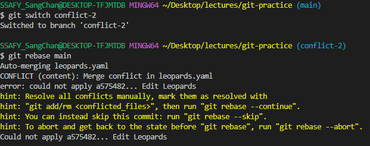
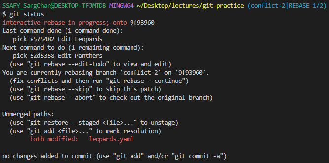
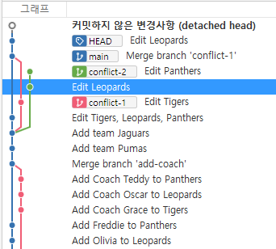
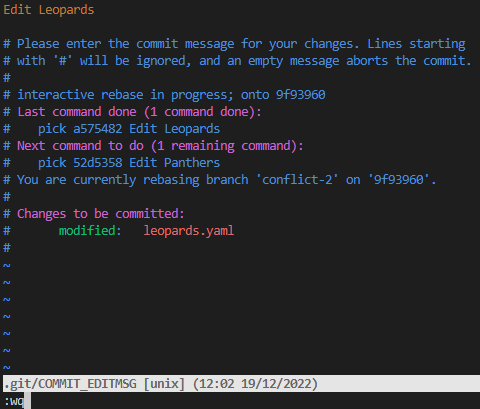
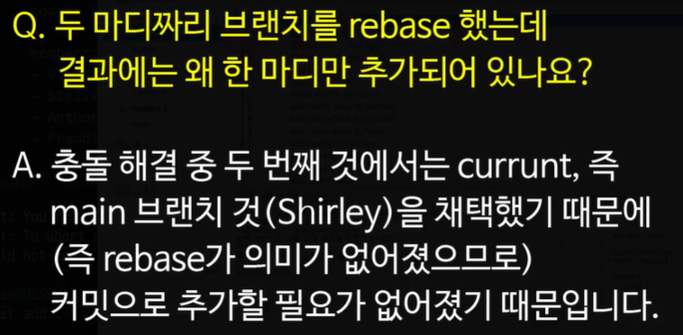
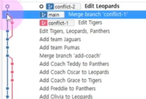

# 충돌 해결하기


## 브랜치 간 충돌

- 파일의 같은 위치에 다른 내용이 입력된 상황


## 1. `merge` 충돌 해결하기

`git merge conflict-1`로 병합을 시도하면 충돌 발생

- 오류 메시지와 `git status` 확인
- VS Code에서 해당 부분 확인



> 현재 branch / 병합하고자 하는 branch / 둘다 / 변경사항 비교 와 같은 기능을 제공함(VS Code)



> 검색 부분에 `<<<<<` 를 입력해서 충돌된 부분을 찾아갈 수 있다.


⛔ **당장 충돌 해결이 어려울 경우** 아래 명령어로 `merge` 중단

```
git merge --abort
```

해결 가능 시 충돌 부분을 수정한 뒤 `git add .`, `git commit`으로 병합 완료

- `git commit`을 하면 자동으로 commit 메세지가 생성되어 있다
- `:wq` 입력 후 `엔터`





> merge 완료!!!


## 2. `rebase` 충돌 해결하기

`conflict-2`에서 `git rebase main`로 리베이스 시도하면 충돌 발생

- 오류 메시지와 `git status` 확인
- VS Code에서 해당 부분 확인





> 양쪽에서 한 파일을 동시 수정하여서 충돌이 발생. rebase는 merge와 달리 커밋 하나, 하나를 떼어 옮기는 것이기 때문에 하나씩 충돌 수정이 필요!!!


⛔ **당장 충돌 해결이 어려울 경우** 아래 명령어로 `rebase` 중단

```
git rebase --abort
```


### 해결 가능 시

- 충돌 부분을 수정한 뒤 `git add .`
- 아래 명령어로 계속

```
git rebase --continue
```

- 충돌이 모두 해결될 때까지 반복



> `Edit Leopards`는 commit을 성공했는데 그 다음 `Edit Panthers`도 충돌을 확인해야함.



> 하나씩 commit을 진행해줘야 한다.



