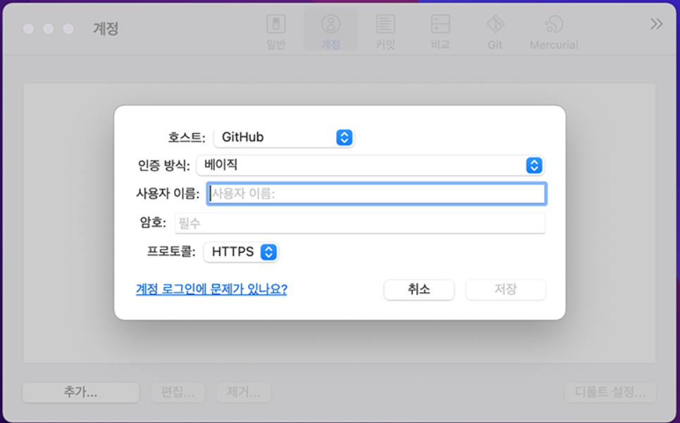

# GItHub 시작하기

## 1. [github.com](https://github.com/) 살펴보기

- Git으로 관리되는 프로젝트의 원격 저장소
- 👑 오픈소스의 성지
  - Git, VS Code, Tensorflow, React 등 살펴보기

- Git의 GitHub상 저장소는 배포용 미러 저장소이다.(참여 및 기여 불가)

## 2. 가입하고 토큰 만들기

1. `Sign Up`으로 가입 후 로그인

2. **Personal access token** 만들기

- 우측 상단의 프로필 - `Settings`
- `Developer Settings`
- `Personal access tokens` - `Generate new token`
- `repo` 및 원하는 기능에 체크, 기간 설정 뒤 `Generate token`
- 토큰 안전한 곳에 보관해 둘 것

---

#### ✅ 인증 방식 변경(2021.08.13)

- GitHub에서 ID/PW 기반의 Basic Authentication 인증을 금지하고, ID/Personal Access Token 방식의 **Token Authentication 인증**으로 변경
- Access Token 생성 후 다시 확인할 수 없으니 안전한 곳에 저장 필수!!!
- 앞으로 GitHub에 push 등의 작업을 수행할 때, PW를 입력하라고 뜨면, 방금 생성한 Personal Access Token을 입력하면 된다.

---

3. 토큰 컴퓨터에 저장하기

- 윈도우 가이드
  - `Windows 자격 증명 관리자`
  - `Windows 자격 증명` 선택
  - `git:https://github.com` 자격 정보 생성
  - 사용자명과 토큰 붙여넣기
- [맥 가이드 (링크)](https://docs.github.com/en/get-started/getting-started-with-git/updating-credentials-from-the-macos-keychain)
  - `Keychain Access` 앱 실행
  - `github`의 `인터넷 암호` 항목 선택
  - 사용자명(`계정` 칸)과 토큰(`암호 보기` 누른 뒤 오른쪽 칸) 붙여넣기
    - ⭐ **키체인** 관련 팝업이 먼저 뜨면 **맥 로그인 암호**를 입력해주세요.

4. 소스트리에도 추가
    **맥에서 소스트리에 계정 설정하기**

- `설정` > `계정` 탭 > `추가` 버튼
- 인증방식은 `베이직`, 프로토콜은 `HTTPS`로 설정
- 사용자명(GitHub 아이디)와 암호(토큰) 설정
- 아래의 두 스크린샷 참조

5. GitHub에 새 **Repository** 생성

- `Public`: 모두에게 보일 수 있는 프로젝트
- `Private`: 허용된 인원만 볼 수 있는 프로젝트

6. 협업할 팀원 추가

- 레포지토리의 `Settings` - `Collaborators`
  -  `Manage Access`가 `Collaborators`로 바뀌었습니다.
  - *(이러한 메뉴명은 이후로도 변경될 수 있습니다.)*
- `Add people`