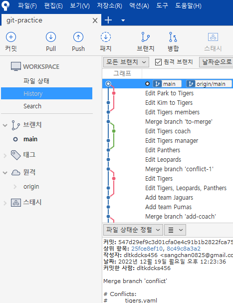
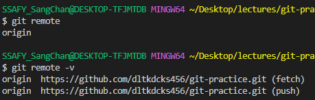

# GitHub - 원격 저장소 사용법


## 1. 로컬에 원격 저장소 추가 후 푸시

```
git remote add origin (원격 저장소 주소)
```

- 로컬의 Git 저장소에 원격 저장소로의 연결 추가
  - 원격 저장소 이름에 흔히 `origin` 사용. 다른 것으로 수정 가능
  - 원격 저장소 주소는 `gitlab`, `bitbucket` 혹은 임의의 커스텀 서버가 될 수도 있다.



> 소스트리 원격에도 origin 추가되어 있음

```
git branch -M main
```

- GitHub 권장 - 기본 브랜치명을 `main`으로

```
git push -u origin main
```

- 로컬 저장소의 커밋 내역들 원격으로 `push`(업로드)
  - 어느 원격에다가 그리고 그 원격의 어느 브랜치에다가 push -u는 기본으로 세팅해줌
    - 현재 브랜치가 기본값으로 어떤 원격의 어떤 브랜치와 연동이 될지 설정
    - 한 번 세팅해주면 그 뒤로는 `git push`만 입력해주면 된다
  - `-u` 또는 `--set-upstream` : 현재 브랜치와 명시된 원격 브랜치 기본 연결


### ⭐️ GitHub의 해당 레포지토리 페이지 새로고침하여 살펴보기

- 파일들 내용
- 커밋 내역들


원격 목록 보기

```
git remote
```

- 자세히 보기: `git remote -v`



#### 📌 원격 지우기 (로컬 프로젝트와의 연결만 없애는 것. GitHub의 레포지토리는 지워지지 않음)

```
git remote remove (origin 등 원격 이름)
```

---


## 2. GitHub에서 프로젝트 다운받기

- `Download ZIP`: 파일들만 다운받음, Git 관리내역 제외
- Git **clone**: Git 관리내역 포함 다운로드


### 터미널이나 Git Bash에서 대상 폴더 이동 후

```
git clone (원격 저장소 주소)
```

- 파일 뿐만 아니라 `git`의 관리 내역도 복사하여 보여줌
