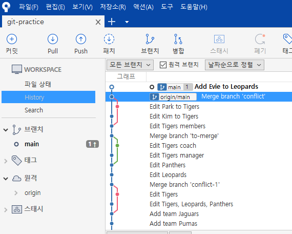
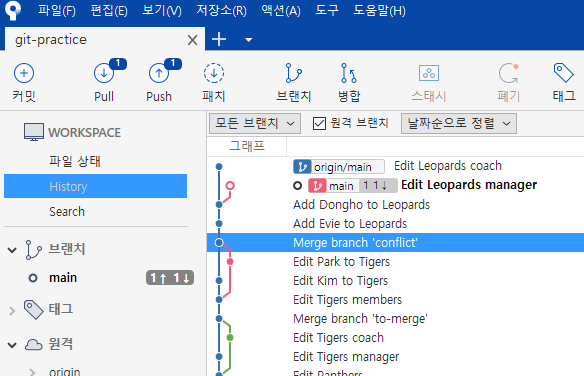
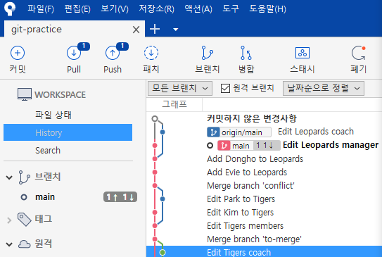
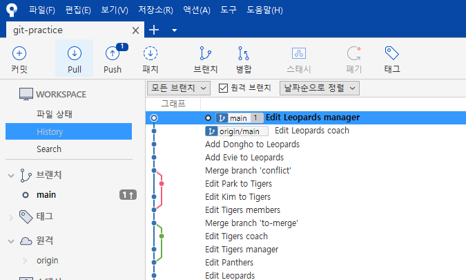

# push와 pull


## 1. 원격으로 커밋 밀어올리기(**push**)

1. Leopards의 `members`에 `Evie` 추가
   - 커밋 메시지: `Add Evie to Leopards`
   - 원격 `orgin`의 `main` 브랜치는 하나 뒤쳐져 있는 것을 알 수 있다.



2. 아래 명령어로 push

```
git push
```

- 이미 `git push -u origin main`으로 대상 원격 브랜치가 지정되었기 때문에 가능


3. GitHub 페이지에서 확인

- GitHub의 파일들과 커밋 내역 확인


---


## 2. 원격의 커밋 당겨오기(**pull**)

1. **GitHub에서** Leopards의 `members`에 `Dongho` 추가
   - 커밋 메시지: `Add Dongho to Leopards`


2. 아래 명령어로 pull

```
git pull
```


3. 로컬에서 파일과 로그 살펴보기


---


## 3. **pull** 할 것이 있을 때 **push**를 하면?

1. **로컬에서** Leopards의 `manager`를 `Dooli`로 수정
   - 커밋 메시지: `Edit Leopards manager`


2. **GitHub에서** Leopards의 `coach`를 `Lupi`로 수정

- 커밋 메시지: `Edit Leopards coach`


3. push 해보기

- 원격에 먼저 적용된 새 버전이 있으므로 적용 불가
- pull 해서 원격의 버전을 받아온 다음 push 가능
  - ⛔ 원격 저장소의 **최신 버전**으로 통일이 되어 있어야 함


4. push 할 것이 있을 시 pull 하는 두 가지 방법

- `git pull --no-rebase` - **merge** 방식
  - 소스트리에서 확인해보기
  - `reset`으로 되돌린 다음 아래 방식도 해보기



> 아래와 같이 local의 `main` 브랜치와 원격의 `main` 브랜치가 갈라진 다음 저 위에서 합쳐진다.



- `git pull --rebase` - **rebase** 방식

  - pull 상의 rebase는 다름 (협업시 사용 OK)

  

  > 원격 저장소의 내용을 먼저 붙인 다음에 로컬에 있는 내용을 이어준다

5. push하기


---


## 4. 협업상 충돌 발생 해결하기

1. **로컬에서** Panthers에 `Maruchi` 추가
   - 커밋 메시지: `Add Maruchi to Panthers`


2. **원격에서** Panthers에 `Arachi` 추가

- 커밋 메시지: `Add Arachi to Panthers`


3. pull 하여 충돌상황 마주하기

- `--no-rebase`와 `--rebase` 모두 해 볼 것


---


## 5. 로컬의 내역 강제 push해보기

1. 로컬의 내역 충돌 전으로 `reset`


2. 아래 명령어로 원격에 강제 적용

```
git push --force
```

