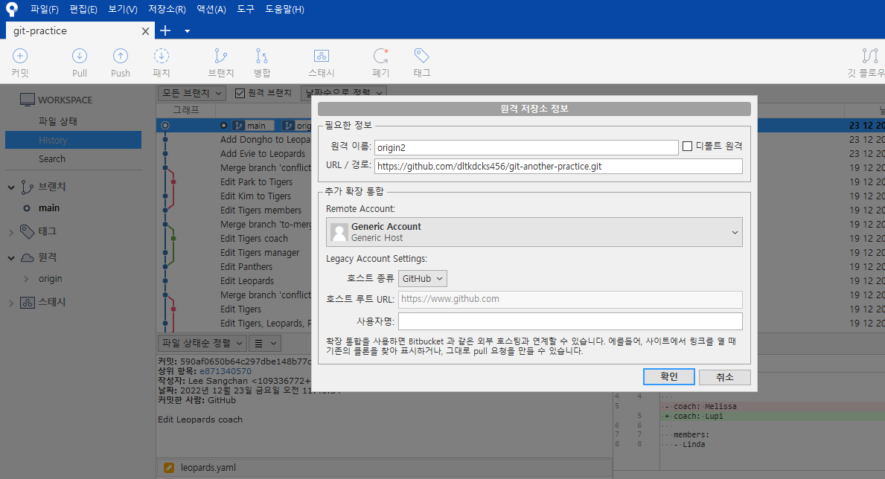
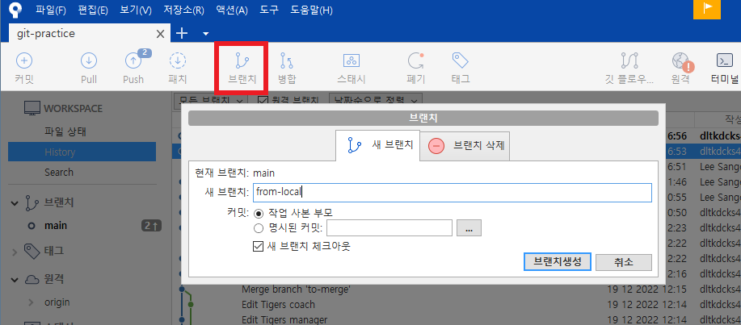

# 원격의 브랜치 다루기(소스 트리 ver.)

## 1. 원격 추가하기

- GitHub에 새 레포지토리 만들고 `origin2`로 추가
  - 새 레포지토리의 HTTPS URL 가져오기
  - 소스트리 -> 저장소 -> 원격 저장소 -> 추가 -> 원격이름, URL 설정 -> 확인

- `origin`의 내용은 `origin2`로 push 진행

> 이렇게 원격을 git-lab이나 bitbucket에 둘 수 있다.

## 2. push와 pull

1. 로컬의 Pumas의 `members`에 `Pororo` 추가
   - 커밋 메시지: `Add Pororo to Pumas`
   - 소스트리로 커밋과 동시에 푸시

> 아래 체크를 누르면 커밋과 동시에 `push`가 가능

- 소스트리에서 원격의 `origin2`를 지우더라도 로컬과 원격과의 연결이 끊어진 것일 뿐 원격 저장소의 레포지토리가 삭제된 것은 아니다

2. 원격의 Jaguars의 `members`에 `Pinkfong` 추가

- 커밋 메시지: `Add Pinkfong to Jaguars`
- 소스트리로 패치(fetch) 및 풀

> pull을 하면 기본적으로 fetch도 같이 해준다. 아래 체크 박스로 merge와 rebase방식을 선택할 수 있음

## 3. 브랜치 다루기

- 로컬에 `from-local` 만들어 원격에 푸시
- 원격에 `from-remote` 만들고 로컬로 가져와 이동

> 브랜치로 스위치한 후 push를 진행 -> `from-local`을 선택하고 `push`

> GitHub 상에서 branch를 만들고 그것을 소스트리에 반영하려면 패치를 눌러야함

- 원격 탭에서 `from-remote`를 우클릭한 후 체크아웃 ... 를 누르면 로컬로 가져올 수 있다.

